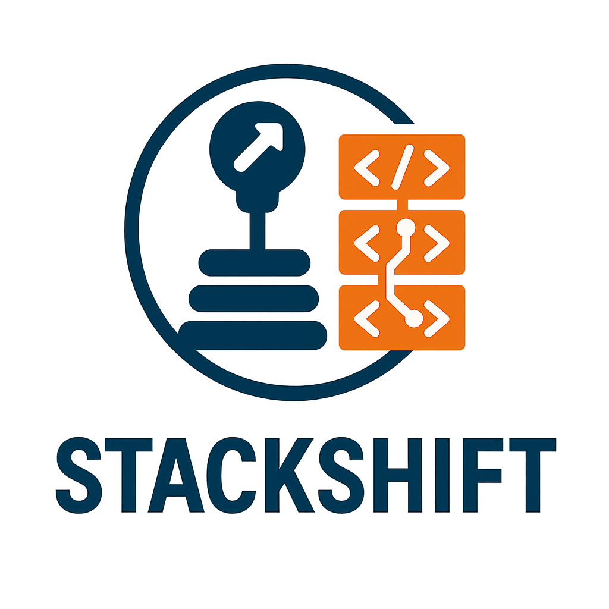

<div align="center">



# StackShift

**A reverse engineering toolkit that lets you shift gears in your codebase.**

Transform any application into a fully-specified, spec-driven project with complete control - whether you're shifting to a new tech stack or taking the wheel on existing code.

</div>

> Like a stick shift gives you manual control, StackShift gives you complete control over your codebase transformation. Start in reverse (engineering), shift through 6 gears, and cruise into spec-driven development.

---

## 📚 Documentation

- **[Quick Start](QUICKSTART.md)** - Get started in 5 minutes!
- **[Installation Guide](docs/guides/INSTALLATION.md)** - Detailed installation for all platforms
- **[Plugin Guide](docs/guides/PLUGIN_GUIDE.md)** - Claude Code plugin usage
- **[MCP Guide](mcp-server/README.md)** - MCP server for VSCode/Copilot
- **[Web Guide](web/README.md)** - Using in Claude Code Web (browser)
- **[Batch Processing](scripts/BATCH_PROCESSING_GUIDE.md)** - Process multiple projects efficiently

---

## 🎯 What StackShift Does

**Reverse Engineering Meets Manual Control** - StackShift provides a **systematic, 6-gear process** to:

1. **🔄 First Gear (Reverse):** Reverse-engineer existing codebases (even incomplete ones)
2. **📚 Second Gear:** Generate comprehensive documentation automatically
3. **📋 Third Gear:** Transform into formal specifications (GitHub Spec Kit format)
4. **🔍 Fourth Gear:** Identify feature gaps clearly
5. **✨ Fifth Gear:** Complete missing implementations systematically
6. **🚀 Sixth Gear:** Kick it into high gear - implement from specs and establish spec-driven development!

**Two Paths - Choose Your Route:**

### 🔀 Path A: Greenfield (Shift to New Stack)
**Use when:** Rebuilding in a different tech stack or platform

**Approach:** Extract business logic ONLY (tech-agnostic)
- Focus on WHAT the system does, not HOW
- Framework-agnostic specifications
- Can implement in any technology
- Perfect for platform migrations

**Example:** "Extract business logic from Rails app to rebuild in Next.js"

### ⚙️ Path B: Brownfield (Take the Wheel on Existing Code)
**Use when:** Managing existing codebase with GitHub Spec Kit

**Approach:** Extract business logic + technical implementation (tech-prescriptive)
- Document both WHAT and HOW
- Capture exact tech stack, versions, file paths
- Enables `/speckit.analyze` validation
- Perfect for ongoing spec-driven development

**Example:** "Add GitHub Spec Kit to existing Next.js app for spec-driven management"

**Result**: A fully-documented, specification-driven application ready for enterprise development.

---

## 🚗 6-Gear Process

```
┌─────────────────────────────────────────────────────────────┐
│                  Shift Through 6 Gears                       │
├─────────────────────────────────────────────────────────────┤
│                                                              │
│  Gear 1: Initial Analysis + Route Selection                 │
│  ├─ Detect technology stack                                 │
│  ├─ Identify application type                               │
│  ├─ Map directory structure                                 │
│  └─ Choose your route: Greenfield or Brownfield?            │
│         │                                                    │
│         ├─────────────────┬────────────────────┐            │
│         │                 │                    │            │
│    Greenfield         Brownfield               │            │
│  (Tech-Agnostic)   (Tech-Prescriptive)         │            │
│         │                 │                    │            │
│         ▼                 ▼                    │            │
│  Gear 2: Reverse Engineer (Reverse Gear! 🔄)                │
│  ├─ Extract business logic ONLY ◄── Greenfield              │
│  ├─ OR business logic + tech details ◄── Brownfield         │
│  └─ Generate 8 comprehensive docs                           │
│         │                                                    │
│         ▼                                                    │
│  Gear 3: Create Specifications                              │
│  ├─ Initialize .specify/ (GitHub Spec Kit)                  │
│  ├─ Agnostic constitution ◄── Greenfield                    │
│  ├─ OR prescriptive constitution ◄── Brownfield             │
│  └─ Generate feature specs, plans                           │
│         │                                                    │
│         ▼                                                    │
│  Gear 4: Gap Analysis                                       │
│  ├─ Run /speckit.analyze                                    │
│  ├─ Identify missing features                               │
│  ├─ Brownfield: ~100% match initially                       │
│  └─ Greenfield: All features marked MISSING                 │
│         │                                                    │
│         ▼                                                    │
│  Gear 5: Complete Specification                             │
│  ├─ Use /speckit.clarify                                    │
│  ├─ Answer clarifications                                   │
│  ├─ Define missing details                                  │
│  └─ Prioritize implementation                               │
│         │                                                    │
│         ▼                                                    │
│  Gear 6: Implement from Spec (Kick it into 6th! 🚀)         │
│  ├─ Use /speckit.tasks & /speckit.implement                 │
│  ├─ Greenfield: Build in new stack                          │
│  ├─ Brownfield: Fill gaps in existing                       │
│  ├─ Validate with /speckit.analyze                          │
│  └─ Achieve 100% completion - cruise into production!       │
│                                                              │
└─────────────────────────────────────────────────────────────┘
```

---

## 🚀 Quick Start

### Three Ways to Use StackShift

#### Option 1: Claude Code Plugin (Local - Best Experience)

**Recommended for:** Regular use, local development

Install as a Claude Code plugin for interactive skills and workflow tracking:

```bash
# In Claude Code
> /plugin marketplace add jschulte/stackshift
> /plugin install stackshift
```

Restart Claude Code. Skills will now be available:
- `analyze` - Initial Analysis
- `reverse-engineer` - Reverse Engineer
- `create-specs` - Create Specifications
- `gap-analysis` - Gap Analysis
- `complete-spec` - Complete Specification
- `implement` - Implement from Spec

**Usage:**

Skills auto-activate based on context, or invoke explicitly:

```
# Auto-activation
User: "I need to reverse engineer this codebase"
Claude: [analyze skill activates automatically]

# Explicit invocation
Just ask naturally: "Run initial analysis" or "Analyze this codebase"
```

### Prerequisites

- Claude Code with plugin support
- Git repository with existing codebase
- Node.js 18+ (for state management scripts)
- ~2-4 hours total time for complete process

### Run the Process

**With Plugin (Recommended):**

```bash
# Navigate to your project
cd /path/to/your/project

# Start Claude Code
# Skills will guide you through the process automatically
```

Simply say: "I want to reverse engineer this application" and Claude will guide you through all 6 steps.

**Initial Configuration:**

StackShift will ask a few questions upfront:
1. Route: Greenfield or Brownfield?
2. Transmission: Manual or Cruise Control?
3. (If Cruise Control) Clarifications strategy & implementation scope
4. (If Greenfield) Target tech stack

All answers saved to `.stackshift-state.json` - configure once, use throughout!

**Progress Tracking:**

```bash
# Check which gear you're in
node ~/.claude/plugins/stackshift/plugin/scripts/state-manager.js progress
```

**Without Plugin (Manual):**

If not using the plugin, you can still use the prompts directly:

```bash
# 1. Clone StackShift
git clone https://github.com/jschulte/stackshift.git

# 2. Copy prompts to your project
cp -r stackshift/prompts /path/to/your/project/

# 3. Choose your path
# Greenfield (business logic only):
cat prompts/greenfield/02-reverse-engineer-business-logic.md

# Brownfield (business + technical):
cat prompts/brownfield/02-reverse-engineer-full-stack.md
```

#### Option 2: Claude Code Web (Browser - No Install!)

**Recommended for:** Quick analysis, trying before installing, working on any device

```bash
# In Claude Code Web (https://claude.ai/code)
1. Upload your project folder
2. Copy-paste web/stackshift-web-orchestrator.md
3. Answer configuration questions
4. Shift through the gears! 🚗
```

See [`web/README.md`](web/README.md) for complete instructions.

**Benefits:**
- ☁️ Works in browser (any device)
- 🚀 No installation required
- 🔄 Full cruise control support
- 💾 Download specs when complete

#### Option 3: MCP Server (VSCode, Copilot)

**Recommended for:** VSCode users, GitHub Copilot users

```bash
# Configure in VSCode settings.json
{
  "mcp.servers": {
    "stackshift": {
      "command": "npx",
      "args": ["-y", "stackshift-mcp"]
    }
  }
}
```

See [`mcp-server/README.md`](mcp-server/README.md) for complete instructions.

---

## 🔀 Choose Your Route

**StackShift asks this question in Gear 1 (Initial Analysis):**

> Which path best aligns with your goals?
>
> **A) Greenfield:** Build new app based on business logic
>    - Extract business requirements only (tech-agnostic)
>    - Can implement in any stack
>    - Focus: WHAT the system does
>
> **B) Brownfield:** Manage this app with Spec Kit
>    - Extract business logic + technical details (prescriptive)
>    - Manage existing codebase with specs
>    - Focus: WHAT it does + HOW it's implemented

### When to Choose Greenfield (Path A)

**Perfect for:**
- 🔄 **Platform migrations** - Rails → Next.js, PHP → Python, Monolith → Microservices
- 🏗️ **Technology modernization** - Rebuild with modern stack
- 📱 **Cross-platform** - Web app → Mobile app using same business logic
- ♻️ **Clean slate** - Start fresh with better architecture
- 🎯 **Team flexibility** - Let new team choose their preferred stack

**Results in:**
- Specifications that describe business requirements only
- No framework or library mentions
- Can be implemented in ANY technology
- Example: "User authentication with email/password" (not "JWT via passport.js")

### When to Choose Brownfield (Path B)

**Perfect for:**
- 📋 **Spec-driven management** - Add GitHub Spec Kit to existing codebase
- 🔍 **Validation** - Use `/speckit.analyze` to ensure specs match code
- ⬆️ **Planned upgrades** - Manage framework/dependency upgrades via specs
- 🔧 **Gradual refactoring** - Spec-driven modernization of existing app
- 👥 **Team onboarding** - Use prescriptive specs as documentation

**Results in:**
- Specifications that describe business requirements + exact implementation
- Framework, library, version details included
- `/speckit.analyze` validates code matches specs
- Example: "User authentication using JWT via jose 5.1.0, bcrypt 5.1.1, stored in httpOnly cookies"

### Path Comparison

| Aspect | Greenfield (A) | Brownfield (B) |
|--------|----------------|----------------|
| **Focus** | WHAT only | WHAT + HOW |
| **Tech Stack** | Any (your choice) | Current (documented) |
| **Specifications** | Agnostic | Prescriptive |
| **Implementation** | Build new | Manage existing |
| **Flexibility** | High | Constrained to current stack |
| **Validation** | Manual | `/speckit.analyze` automated |
| **Use Case** | Platform migration | Ongoing development |

---

## 📁 StackShift Structure

### Plugin Structure (Recommended)

```
stackshift/
├── README.md                           ← You are here
├── .claude-plugin/
│   └── marketplace.json               ← Plugin marketplace config
├── plugin/
│   ├── .claude-plugin/
│   │   └── plugin.json                ← Plugin metadata
│   ├── skills/
│   │   ├── analyze/                   ← Step 1: Initial Analysis
│   │   │   ├── SKILL.md               ← Skill definition
│   │   │   └── operations/            ← Sub-operations
│   │   ├── reverse-engineer/          ← Step 2: Reverse Engineer
│   │   ├── create-specs/              ← Step 3: Create Specifications
│   │   ├── gap-analysis/              ← Step 4: Gap Analysis
│   │   ├── complete-spec/             ← Step 5: Complete Specification
│   │   └── implement/                 ← Step 6: Implement from Spec
│   ├── templates/                     ← Spec templates
│   │   ├── feature-spec-template.md
│   │   ├── constitution-template.md
│   │   └── implementation-status-template.md
│   └── scripts/
│       └── state-manager.js           ← Progress tracking
└── prompts/                           ← Original prompts (for manual use)
    ├── 01-initial-analysis.md
    ├── 02-reverse-engineer.md
    └── ...
```

### Plugin Benefits

**Why use the plugin over manual prompts?**

✅ **Auto-activation** - Skills activate based on context, no copy-paste needed
✅ **Progress tracking** - State management tracks where you are (which gear)
✅ **Resume capability** - Pick up where you left off if interrupted
✅ **Guided experience** - StackShift knows the full context and next steps
✅ **Templates included** - Access all templates without file operations
✅ **Updates** - Get improvements via plugin updates
✅ **Smooth shifting** - Seamless transitions between steps

---

## 📖 Detailed Process Guide

### Step 1: Initial Analysis (5 minutes)

**What it does:**
- Detects programming language and framework
- Identifies application type (web, mobile, API, etc.)
- Maps directory structure
- Finds configuration files
- Estimates codebase size and completeness

**Output:**
- `analysis-report.md` with tech stack summary
- Quick assessment of what exists

**Prompt:** `prompts/01-initial-analysis.md`

---

### Step 2: Reverse Engineer (30 minutes)

**What it does:**
- Deep codebase analysis using specialized agents
- Extracts all data models, API endpoints, components
- Documents configuration, infrastructure, operations
- Analyzes technical debt and test coverage
- Generates 8 comprehensive documents

**Output:**
```
docs/reverse-engineering/
├── functional-specification.md     (Business logic, requirements)
├── configuration-reference.md      (All config options)
├── data-architecture.md            (Data models, API contracts)
├── operations-guide.md             (Deployment, infrastructure)
├── technical-debt-analysis.md      (Issues, improvements)
├── observability-requirements.md   (Monitoring, logging)
├── visual-design-system.md         (UI/UX patterns)
└── test-documentation.md           (Testing requirements)
```

**Prompt:** `prompts/02-reverse-engineer.md`

---

### Step 3: Create Specifications (30 minutes)

**What it does:**
- Transforms reverse-eng docs into formal specifications
- Creates feature specs (F001-F0XX format)
- Marks implementation status (✅ COMPLETE, ⚠️ PARTIAL, ❌ MISSING)
- Generates OpenAPI specification for APIs
- Creates JSON Schemas for data models
- Sets up GitHub Spec Kit structure

**Output:**
```
specs/
├── features/
│   ├── F001-user-authentication.md     (✅ COMPLETE)
│   ├── F002-data-management.md         (⚠️ PARTIAL)
│   ├── F003-advanced-features.md       (❌ MISSING)
│   └── ...
├── api/
│   └── openapi.yaml                    (Complete API spec)
├── data/
│   └── schemas/                        (JSON Schemas)
├── implementation-status.md            (Gap summary)
└── constitution.md                     (Project principles)
```

**Prompt:** `prompts/03-create-specifications.md`

---

### Step 4: Gap Analysis (15 minutes)

**What it does:**
- Compares specifications against implementation
- Identifies incomplete features
- Lists missing UI components
- Highlights technical debt
- Creates `[NEEDS CLARIFICATION]` markers for ambiguities
- Generates prioritized gap list

**Output:**
```
specs/gap-analysis.md
├── Missing Features (not started)
├── Partial Features (backend done, UI missing)
├── Technical Debt (needs improvement)
├── Clarifications Needed (ambiguous requirements)
└── Prioritized Implementation Plan
```

**Prompt:** `prompts/04-gap-analysis.md`

---

### Step 5: Complete Specification (30-60 minutes, INTERACTIVE)

**What it does:**
- **Interactive conversation** to fill specification gaps
- Claude asks clarifying questions about missing features
- You provide details on UX, UI, behavior, priorities
- Specifications updated with your answers
- `[NEEDS CLARIFICATION]` markers resolved
- Final, complete specification created

**Example Questions:**
- "Analytics dashboard is missing - what charts do you want?"
- "Should offline sync be priority P0 or P2?"
- "For photo upload, drag-drop or click to browse?"
- "Species input: free-text or autocomplete dropdown?"

**Output:**
- Complete, unambiguous specifications
- No `[NEEDS CLARIFICATION]` markers remaining
- Clear implementation roadmap
- Prioritized feature list

**Prompt:** `prompts/05-complete-specification.md`

---

### Step 6: Implement from Spec (Hours to Days)

**What it does:**
- Systematically implements missing features from specs
- Works through prioritized list (P0 → P1 → P2)
- Checks off items as completed
- Validates implementation against specification
- Achieves 100% completion

**Approach:**
```bash
# For each missing feature:
1. Review specification
2. Implement according to spec
3. Test against acceptance criteria
4. Mark as complete
5. Move to next feature
```

**Output:**
- Fully implemented application
- All specs marked ✅ COMPLETE
- Test coverage at target levels
- Production-ready codebase

**Prompt:** `prompts/06-implement-from-spec.md`

---

## 🔄 Adapting for Different Application Types

This toolkit works for:

### Web Applications
- Frontend frameworks: React, Vue, Angular, Svelte
- Backend: Node.js, Python, Ruby, Go, Java
- Databases: SQL, NoSQL, any data store

### Mobile Applications
- React Native, Flutter, Swift, Kotlin
- Adapts documentation to mobile-specific patterns

### APIs / Microservices
- REST, GraphQL, gRPC
- Generates OpenAPI/AsyncAPI specs
- Documents service contracts

### Monoliths
- Breaks into logical modules
- Creates specifications per domain
- Identifies bounded contexts

### Legacy Systems
- Works even with minimal documentation
- Infers behavior from code
- Creates modernization roadmap

---

## 📋 Checklist: Is This Toolkit Right for You?

Use this toolkit if:

- ✅ You have an existing codebase (partial or complete)
- ✅ Documentation is lacking or outdated
- ✅ You want to establish spec-driven development
- ✅ You need to understand what's implemented vs. missing
- ✅ You want a systematic approach to completion
- ✅ You're using AI coding agents (Claude Code, Copilot, etc.)

**This toolkit is NOT for:**

- ❌ Brand new projects (use GitHub Spec Kit from the start)
- ❌ Throwaway prototypes
- ❌ Applications you plan to completely rewrite

---

## 💡 Best Practices

### Before Starting

1. **Commit current state** - Create a clean git state
2. **Create a branch** - Don't work on main
3. **Set aside time** - Steps 1-5 take ~2-4 hours
4. **Have context ready** - Know your app's purpose and users

### During Process

1. **Follow prompts in order** - Each step builds on previous
2. **Don't skip Step 5** - The interactive refinement is crucial
3. **Be thorough with clarifications** - Vague specs = buggy implementations
4. **Review generated specs** - Validate accuracy before implementing

### After Completion

1. **Keep specs updated** - Update specs when adding features
2. **Use spec-driven workflow** - New features start with specs
3. **Run periodically** - Re-run on major refactors or after acquisitions

---

## 🛠️ Troubleshooting

### "Claude can't find my configuration files"
- Make sure you're in the project root directory
- Check that config files aren't gitignored
- Explicitly mention unusual config locations

### "Generated specs are inaccurate"
- Step 5 is where you correct inaccuracies
- Use `[NEEDS CLARIFICATION]` to mark uncertain areas
- Review and refine before implementing

### "Too much output, can't process"
- Break large monoliths into modules
- Run toolkit per module/microservice
- Increase context window (use Claude Sonnet 4.5)

### "Missing important features in gap analysis"
- Manually add to `specs/features/`
- Use templates in `templates/` folder
- Re-run Step 4 with hints about what's missing

---

## 📈 Success Metrics

After running this toolkit, you should have:

- ✅ **100% documentation coverage** - Every feature documented
- ✅ **Clear implementation status** - Know exactly what exists
- ✅ **Formal specifications** - Unambiguous feature definitions
- ✅ **Identified gaps** - Complete list of missing pieces
- ✅ **Implementation roadmap** - Prioritized plan to completion
- ✅ **Spec-driven workflow** - Established for future development

---

## 🤝 Contributing

This toolkit is designed to be:
- **Generic** - Works for any application
- **Extensible** - Add your own prompts/templates
- **Shareable** - Use across teams and organizations

Improvements welcome:
1. Fork this toolkit
2. Add/improve prompts or templates
3. Share back with community
4. Help others achieve spec-driven development

---

## 📚 Additional Resources

- [GitHub Spec Kit](https://github.com/github/spec-kit) - Official spec-driven development toolkit
- [OpenAPI Specification](https://swagger.io/specification/) - API specification standard
- [JSON Schema](https://json-schema.org/) - Data validation standard
- [Architecture Decision Records](https://adr.github.io/) - Document key decisions

---

## 📝 License

This toolkit is provided as-is for use in any project. Adapt and modify as needed for your organization.

---

## ❓ Questions & Feedback

This toolkit was created to solve a real problem: **transforming partially-complete applications into fully-specified, enterprise-grade codebases**.

**Encountered an issue or have a suggestion?**

- 🐛 **Found a bug?** [Open an issue](https://github.com/jschulte/stackshift/issues/new)
- 💡 **Have an idea?** [Start a discussion](https://github.com/jschulte/stackshift/discussions)
- 🔧 **Want to contribute?** [Submit a pull request](https://github.com/jschulte/stackshift/pulls)

The toolkit improves with real-world usage and community feedback!

---

**Happy Shifting! 🚗💨**

*Start in reverse (engineering), shift through 6 gears, cruise into spec-driven development.*
