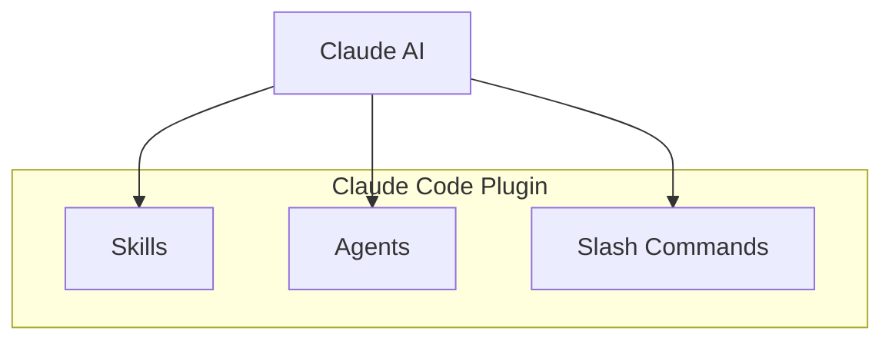

# System Architecture

## System Architecture

<!-- DIAGRAM: architecture-start -->
### Component Architecture

```mermaid
graph TB

    subgraph "Claude Code Plugin"
        plugin_skills[Skills]
        plugin_agents[Agents]
        plugin_commands[Slash Commands]
    end

    claude[Claude AI]

    claude --> plugin_skills
    claude --> plugin_agents
    claude --> plugin_commands
```

*Last generated: 2025-11-17T17:24:53.601Z*
<!-- DIAGRAM: architecture-end -->
