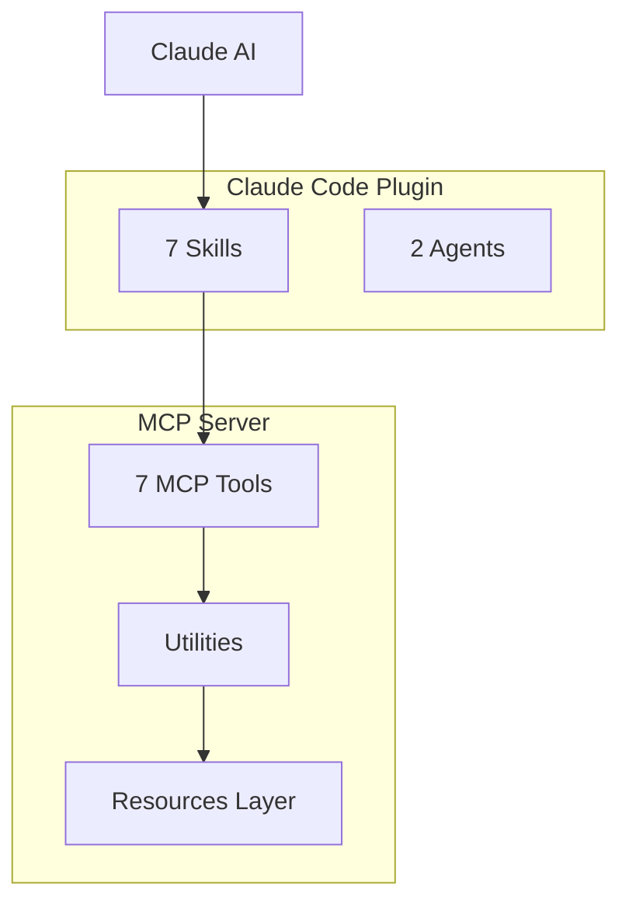

# System Architecture

## System Architecture

<!-- DIAGRAM: architecture-start -->
### Component Architecture

```mermaid
graph TB

    subgraph "MCP Server"
        mcp_tools[7 MCP Tools]
        mcp_resources[Resources Layer]
        mcp_utils[Utilities]
    end

    subgraph "Claude Code Plugin"
        plugin_skills[7 Skills]
        plugin_agents[2 Agents]
    end

    claude[Claude AI]

    claude --> plugin_skills
    plugin_skills --> mcp_tools
    mcp_tools --> mcp_utils
    mcp_utils --> mcp_resources
```

*Last generated: 2025-11-17T09:10:43.227Z*
<!-- DIAGRAM: architecture-end -->
