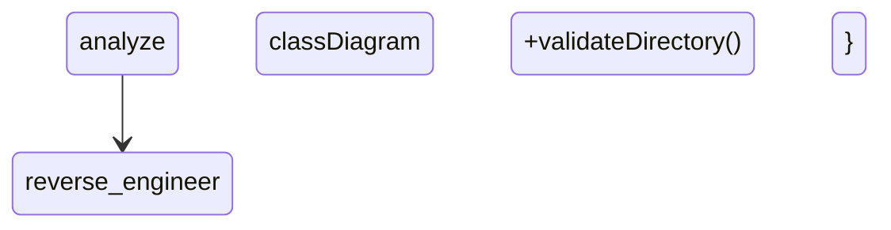

# Agent Context: F005-mermaid-diagrams

**Purpose:** Document technologies and patterns for AI agent context
**Date:** 2025-11-17
**Status:** ✅ Complete

---

## Technology Stack Used

### Core Technologies
- **TypeScript:** 5.3.0 (strict mode)
- **Node.js:** >=18.0.0
- **Testing:** Vitest 1.0+
- **Diagram Format:** Mermaid (markdown code blocks)

### TypeScript Compiler API
- **Package:** `typescript` (already a devDependency)
- **Version:** ^5.3.0
- **Purpose:** AST parsing for class diagram generation
- **API Used:** `ts.createSourceFile()`, `ts.forEachChild()`, node visitors

### Mermaid
- **Type:** Diagram syntax (not a dependency)
- **Rendering:** GitHub native support, VS Code Markdown Preview
- **Diagram Types:** stateDiagram-v2, graph, classDiagram, sequenceDiagram
- **Documentation:** https://mermaid.js.org/

---

## Patterns & Practices Added

### AST Parsing Pattern

**Pattern Name:** TypeScript Compiler API Visitor Pattern

**When to use:**
- Extracting class structures from TypeScript files
- Analyzing code for diagram generation
- Building code intelligence tools

**Implementation:**
```typescript
import ts from 'typescript';

const sourceFile = ts.createSourceFile(
  fileName,
  sourceCode,
  ts.ScriptTarget.Latest,
  true
);

const visit = (node: ts.Node) => {
  if (ts.isClassDeclaration(node)) {
    // Extract class information
  }
  ts.forEachChild(node, visit);
};

visit(sourceFile);
```

**Key Points:**
- Use `ts.createSourceFile()` to parse without full project context
- Visitor pattern for tree traversal
- Type guards (`ts.isClassDeclaration`) for node identification
- Graceful handling of anonymous/complex TypeScript features

---

### Mermaid Generation Pattern

**Pattern Name:** Model-to-Diagram Transformation

**When to use:**
- Converting data models to visual diagrams
- Generating documentation from code
- Creating consistent diagram formats

**Implementation:**
```typescript
interface DiagramModel {
  type: string;
  // ... model-specific fields
}

interface MermaidCode {
  diagramType: string;
  code: string;
  markdownCode: string;
  outputPath: string;
  generatedAt: Date;
}

function toMermaid(model: DiagramModel): MermaidCode {
  const lines: string[] = ['stateDiagram-v2'];

  // Build diagram syntax
  model.elements.forEach(element => {
    lines.push(`    ${element.format()}`);
  });

  const code = lines.join('\n');
  const markdownCode = `\`\`\`mermaid\n${code}\n\`\`\``;

  return {
    diagramType: 'stateDiagram-v2',
    code,
    markdownCode,
    outputPath: 'docs/diagrams/output.mmd',
    generatedAt: new Date()
  };
}
```

**Key Points:**
- Separate model construction from Mermaid generation
- Generate both raw code and markdown-wrapped versions
- Include metadata (output path, timestamp)
- Consistent indentation (4 spaces)

---

### Graceful Error Handling Pattern

**Pattern Name:** Non-Blocking Generation with Error Collection

**When to use:**
- Batch diagram generation
- CI/CD pipelines
- When partial results are valuable

**Implementation:**
```typescript
interface GenerationResult {
  workflow: MermaidCode | null;
  architecture: MermaidCode | null;
  classDiagrams: MermaidCode[];
  errors: GenerationError[];
}

async function generateAll(): Promise<GenerationResult> {
  const result = {
    workflow: null,
    architecture: null,
    classDiagrams: [],
    errors: []
  };

  // Workflow diagram
  try {
    result.workflow = await generateWorkflow();
  } catch (error) {
    result.errors.push({
      type: 'generate',
      message: error.message,
      sourceFile: 'workflow'
    });
  }

  // Continue with other diagrams...

  return result;
}
```

**Key Points:**
- Try/catch around each diagram generation
- Collect errors, don't throw
- Return partial results
- Log warnings for errors, fail only if ALL diagrams fail

---

## Testing Patterns Added

### Schema Validation Testing

**Pattern Name:** Semantic Diagram Validation

**When to use:**
- Testing diagram generation
- Validating Mermaid syntax
- Ensuring diagram completeness

**Implementation:**
```typescript
describe('WorkflowDiagramGenerator', () => {
  test('includes all gear states', () => {
    const diagram = generateWorkflowDiagram(mockState);

    // Schema validation (not snapshot)
    expect(diagram.code).toContain('stateDiagram-v2');

    const requiredStates = [
      'analyze',
      'reverse_engineer',
      'create_specs',
      'gap_analysis',
      'complete_spec',
      'implement',
      'cruise_control'
    ];

    requiredStates.forEach(state => {
      expect(diagram.code).toContain(state);
    });
  });

  test('includes state transitions', () => {
    const diagram = generateWorkflowDiagram(mockState);

    expect(diagram.code).toContain('analyze --> reverse_engineer');
    expect(diagram.code).toContain('[*] --> analyze');
  });
});
```

**Key Points:**
- Validate semantic content, not exact formatting
- Check for required elements (states, transitions)
- More flexible than snapshot tests
- Clear test failures (shows what's missing)

---

## Mermaid Best Practices

### Diagram Complexity Limits

**Guideline:** Limit diagrams to 15-20 nodes maximum

**Rationale:**
- Better readability
- GitHub renderer performance
- Easier to maintain

**Implementation:**
```typescript
function checkComplexity(diagram: MermaidCode): boolean {
  const nodeCount = (diagram.code.match(/class |--\[/g) || []).length;

  if (nodeCount > 20) {
    console.warn(`Diagram has ${nodeCount} nodes (max 20 recommended)`);
    return false;
  }

  return true;
}
```

**Application:**
- Workflow: 7 states ✅
- Architecture: ~10 components ✅
- Class diagrams: One per module (5-10 classes each) ✅

---

### Naming Conventions

**Mermaid Node IDs:**
- **States:** snake_case (`reverse_engineer`, `gap_analysis`)
- **Classes:** CamelCase (`SecurityValidator`, `StateManager`)
- **Components:** snake_case (`mcp_tools`, `plugin_skills`)

**Why:**
- States map to gear names (snake_case in state file)
- Classes match TypeScript naming
- Components use underscores for Mermaid compatibility

**Example:**


---

## Anti-Patterns to Avoid

### ❌ Hardcoded Diagram Content

**Don't:**
```typescript
const diagram = `stateDiagram-v2
    analyze --> reverse_engineer
    reverse_engineer --> create_specs`;
```

**Do:**
```typescript
const states = getGearStates();
const lines = ['stateDiagram-v2'];

states.forEach((state, i) => {
  if (i < states.length - 1) {
    lines.push(`    ${state} --> ${states[i + 1]}`);
  }
});

const diagram = lines.join('\n');
```

**Why:** Hardcoded diagrams drift from code, can't be updated

---

### ❌ Snapshot Testing for Diagrams

**Don't:**
```typescript
test('generates diagram', () => {
  const diagram = generate();
  expect(diagram.code).toMatchSnapshot();  // ❌ Brittle
});
```

**Do:**
```typescript
test('generates diagram', () => {
  const diagram = generate();
  expect(diagram.code).toContain('stateDiagram-v2');  // ✅ Flexible
  expect(diagram.code).toContain('analyze');  // ✅ Semantic
});
```

**Why:** Snapshots break on formatting changes, don't validate semantics

---

### ❌ Complex Diagrams (>20 nodes)

**Don't:**
```typescript
// Generate one diagram with all classes
const allClasses = [...securityClasses, ...stateClasses, ...fileClasses];
const diagram = generateClassDiagram('all-classes', allClasses);  // ❌ Cluttered
```

**Do:**
```typescript
// Generate one diagram per module
const securityDiagram = generateClassDiagram('security', securityClasses);  // ✅
const stateDiagram = generateClassDiagram('state', stateClasses);  // ✅
const fileDiagram = generateClassDiagram('files', fileClasses);  // ✅
```

**Why:** Complex diagrams are hard to read, split by logical module

---

## TypeScript Compiler API Patterns

### Visitor Pattern for AST Traversal

**Pattern:**
```typescript
function visit(node: ts.Node) {
  // Handle specific node types
  if (ts.isClassDeclaration(node)) {
    handleClass(node);
  }

  if (ts.isInterfaceDeclaration(node)) {
    handleInterface(node);
  }

  // Recursively visit children
  ts.forEachChild(node, visit);
}

visit(sourceFile);
```

**Key Points:**
- Type guards for node identification
- Recursive traversal with `forEachChild`
- Handle nodes in-order

---

### Extracting Class Information

**Pattern:**
```typescript
function extractClass(node: ts.ClassDeclaration): ClassNode {
  const name = node.name?.text || 'Anonymous';
  const isExported = node.modifiers?.some(
    m => m.kind === ts.SyntaxKind.ExportKeyword
  ) || false;

  const methods: MethodNode[] = [];
  const properties: PropertyNode[] = [];

  node.members.forEach(member => {
    if (ts.isMethodDeclaration(member)) {
      methods.push(extractMethod(member));
    }
    if (ts.isPropertyDeclaration(member)) {
      properties.push(extractProperty(member));
    }
  });

  return { name, isExported, methods, properties };
}
```

**Key Points:**
- Check for optional fields (`node.name?.text`)
- Use `node.modifiers` for export/visibility
- Iterate `node.members` for methods/properties
- Graceful defaults for anonymous classes

---

## CI/CD Integration Pattern

**Pattern Name:** Diagram Staleness Check

**When to use:**
- CI pipelines
- Pre-commit hooks
- Quality gates

**Implementation:**
```yaml
# .github/workflows/ci.yml
- name: Check diagrams are up-to-date
  run: |
    npm run generate-diagrams
    git diff --exit-code docs/diagrams/ || (
      echo "⚠️  Diagrams are stale. Run 'npm run generate-diagrams'" && exit 1
    )
```

**Key Points:**
- Regenerate diagrams in CI
- Check git diff (should be no changes)
- Fail if diagrams are stale
- Provide helpful error message

---

## Performance Characteristics

**Diagram Generation Performance:**
- Workflow diagram: ~50ms (read state file + generate)
- Architecture diagram: ~100ms (scan directories + generate)
- Class diagram (per module): ~200-500ms (AST parse + generate)
- Total generation: ~2-3 seconds for all diagrams

**Acceptable because:**
- Not in hot path (manual invocation or CI)
- StackShift codebase is small (<2000 lines)
- Diagrams change infrequently

**Optimization opportunities (future):**
- Cache AST results per file
- Only regenerate diagrams for changed files
- Parallel diagram generation

---

## Agent Learning Points

### For Future Diagram Features

**When adding new diagram types:**
1. ✅ Create model interface first (data-model.md)
2. ✅ Create generator interface (contracts/)
3. ✅ Implement parser/analyzer
4. ✅ Implement Mermaid generator
5. ✅ Add schema validation tests

**When parsing source code:**
1. ✅ Use TypeScript Compiler API (not regex)
2. ✅ Handle anonymous/complex constructs gracefully
3. ✅ Filter to exported items only
4. ✅ Test with actual StackShift source files

**When generating Mermaid:**
1. ✅ Follow naming conventions (snake_case for states, CamelCase for classes)
2. ✅ Limit complexity (15-20 nodes max)
3. ✅ Use deterministic ordering (alphabetical sorting)
4. ✅ Validate syntax before writing

---

## Dependencies

**Existing Dependencies Reused:** ✅
- `typescript` (already in devDependencies)
- No new production dependencies

**Why no new dependencies:**
- TypeScript Compiler API sufficient for AST parsing
- Mermaid is syntax (not a library)
- GitHub renders Mermaid natively
- Aligns with constitution (minimal dependencies)

---

## Configuration

**No new configuration required** ✅

**npm Scripts:**
```json
{
  "generate-diagrams": "tsx scripts/generate-diagrams/index.ts",
  "generate-diagrams:verbose": "tsx scripts/generate-diagrams/index.ts --verbose"
}
```

**Output Directory:**
- Diagrams: `docs/diagrams/*.mmd`
- Metadata: `docs/diagrams/diagram-metadata.json`

---

## References

**Internal:**
- `production-readiness-specs/F005-mermaid-diagrams/research.md` - Technology decisions
- `production-readiness-specs/F005-mermaid-diagrams/data-model.md` - Diagram schemas
- `production-readiness-specs/F005-mermaid-diagrams/contracts/` - API contracts

**External:**
- [Mermaid Documentation](https://mermaid.js.org/)
- [TypeScript Compiler API](https://github.com/microsoft/TypeScript/wiki/Using-the-Compiler-API)
- [GitHub Mermaid Support](https://github.blog/2022-02-14-include-diagrams-markdown-files-mermaid/)
- [Mermaid Live Editor](https://mermaid.live/) - Syntax validation

---

**Status:** ✅ Complete - Agent context documented
**Note:** This file serves as technology reference for future AI agents working on StackShift diagram generation features.
