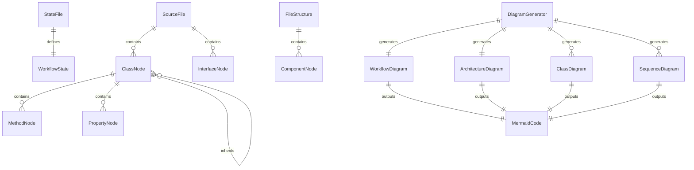
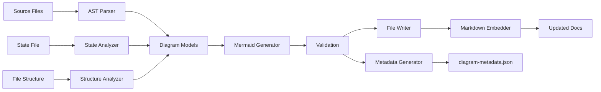

# Data Model: F005-mermaid-diagrams

**Feature:** Mermaid Diagram Generation
**Date:** 2025-11-17
**Status:** Design Complete

---

## Overview

This document defines the data structures, schemas, and entities involved in generating Mermaid diagrams for StackShift documentation. It covers input data (source code, state files), intermediate representations (AST nodes, diagram models), and output formats (Mermaid code).

---

## Entity Relationship Diagram



---

## Input Entities

### 1. SourceFile

Represents a TypeScript source file to be analyzed.

**Schema:**
```typescript
interface SourceFile {
  /** Absolute path to the file */
  path: string;

  /** File contents */
  content: string;

  /** File size in bytes */
  size: number;

  /** Module type (tools, utils, resources) */
  moduleType: 'tools' | 'utils' | 'resources' | 'other';

  /** Last modified timestamp */
  lastModified: Date;
}
```

**Validation Rules:**
- `path` must be within StackShift workspace
- `content` must be valid UTF-8
- `size` must be < 10MB (from SecurityValidator)
- `moduleType` determined from file path

**Example:**
```json
{
  "path": "/home/user/stackshift/mcp-server/src/utils/security.ts",
  "content": "export class SecurityValidator { ... }",
  "size": 5420,
  "moduleType": "utils",
  "lastModified": "2025-11-17T10:30:00Z"
}
```

### 2. StateFile

Represents StackShift's `.stackshift-state.json` file.

**Schema:**
```typescript
interface StateFile {
  /** Current gear state */
  current_gear: GearState;

  /** Route type */
  route: 'greenfield' | 'brownfield';

  /** Analysis results */
  analysis?: AnalysisResult;

  /** Completed gears */
  completed_gears: GearState[];

  /** Workflow start time */
  started_at?: string;
}

type GearState =
  | 'analyze'
  | 'reverse-engineer'
  | 'create-specs'
  | 'gap-analysis'
  | 'complete-spec'
  | 'implement'
  | 'cruise-control';
```

**Validation Rules:**
- `current_gear` must be valid GearState
- `route` must be 'greenfield' or 'brownfield'
- `completed_gears` must be subset of GearState values

**Example:**
```json
{
  "current_gear": "implement",
  "route": "brownfield",
  "completed_gears": ["analyze", "reverse-engineer", "create-specs"],
  "started_at": "2025-11-17T08:00:00Z"
}
```

### 3. FileStructure

Represents directory structure of StackShift.

**Schema:**
```typescript
interface FileStructure {
  /** Root directory */
  root: string;

  /** Component directories */
  components: ComponentDirectory[];

  /** Total file count */
  totalFiles: number;
}

interface ComponentDirectory {
  /** Component name */
  name: string;

  /** Directory path relative to root */
  path: string;

  /** Component type */
  type: 'mcp-server' | 'plugin' | 'docs' | 'specs';

  /** File count in this component */
  fileCount: number;

  /** Subdirectories */
  subdirectories: string[];
}
```

**Example:**
```json
{
  "root": "/home/user/stackshift",
  "components": [
    {
      "name": "MCP Server",
      "path": "mcp-server/src",
      "type": "mcp-server",
      "fileCount": 15,
      "subdirectories": ["tools", "utils", "resources"]
    },
    {
      "name": "Claude Code Plugin",
      "path": "plugin",
      "type": "plugin",
      "fileCount": 25,
      "subdirectories": ["skills", "agents"]
    }
  ],
  "totalFiles": 40
}
```

---

## Intermediate Entities (AST Representations)

### 4. ClassNode

Represents a TypeScript class extracted from AST.

**Schema:**
```typescript
interface ClassNode {
  /** Class name */
  name: string;

  /** Export status */
  isExported: boolean;

  /** Parent class (if extends) */
  extends?: string;

  /** Implemented interfaces */
  implements: string[];

  /** Class methods */
  methods: MethodNode[];

  /** Class properties */
  properties: PropertyNode[];

  /** Source file */
  sourceFile: string;

  /** JSDoc comment */
  documentation?: string;
}
```

**Example:**
```json
{
  "name": "SecurityValidator",
  "isExported": true,
  "extends": null,
  "implements": [],
  "methods": [
    {
      "name": "validateDirectory",
      "visibility": "public",
      "parameters": [{"name": "dir", "type": "string"}],
      "returnType": "string"
    }
  ],
  "properties": [
    {
      "name": "workingDirectory",
      "visibility": "private",
      "type": "string"
    }
  ],
  "sourceFile": "mcp-server/src/utils/security.ts",
  "documentation": "Validates file paths to prevent security vulnerabilities"
}
```

### 5. InterfaceNode

Represents a TypeScript interface.

**Schema:**
```typescript
interface InterfaceNode {
  /** Interface name */
  name: string;

  /** Export status */
  isExported: boolean;

  /** Extended interfaces */
  extends: string[];

  /** Interface properties */
  properties: PropertyNode[];

  /** Source file */
  sourceFile: string;
}
```

### 6. MethodNode

Represents a class method.

**Schema:**
```typescript
interface MethodNode {
  /** Method name */
  name: string;

  /** Visibility modifier */
  visibility: 'public' | 'private' | 'protected';

  /** Method parameters */
  parameters: ParameterNode[];

  /** Return type */
  returnType: string;

  /** Is async */
  isAsync: boolean;

  /** Is static */
  isStatic: boolean;
}
```

### 7. PropertyNode

Represents a class property or interface field.

**Schema:**
```typescript
interface PropertyNode {
  /** Property name */
  name: string;

  /** Visibility modifier (classes only) */
  visibility?: 'public' | 'private' | 'protected';

  /** Property type */
  type: string;

  /** Is readonly */
  isReadonly: boolean;

  /** Is optional */
  isOptional: boolean;
}
```

---

## Diagram Model Entities

### 8. WorkflowDiagram

Model for the 6-gear workflow state machine.

**Schema:**
```typescript
interface WorkflowDiagram {
  /** Diagram type */
  type: 'state-machine';

  /** All states in workflow */
  states: WorkflowStateNode[];

  /** State transitions */
  transitions: StateTransition[];

  /** Current state (if provided) */
  currentState?: GearState;
}

interface WorkflowStateNode {
  /** State identifier */
  id: GearState;

  /** Display name */
  label: string;

  /** Is initial state */
  isInitial: boolean;

  /** Is final state */
  isFinal: boolean;
}

interface StateTransition {
  /** Source state */
  from: GearState;

  /** Target state */
  to: GearState;

  /** Transition label (optional) */
  label?: string;
}
```

**Example:**
```json
{
  "type": "state-machine",
  "states": [
    {"id": "analyze", "label": "Analyze", "isInitial": true, "isFinal": false},
    {"id": "reverse-engineer", "label": "Reverse Engineer", "isInitial": false, "isFinal": false},
    {"id": "implement", "label": "Implement", "isInitial": false, "isFinal": true}
  ],
  "transitions": [
    {"from": "analyze", "to": "reverse-engineer"},
    {"from": "reverse-engineer", "to": "create-specs"}
  ],
  "currentState": "implement"
}
```

### 9. ArchitectureDiagram

Model for system architecture component diagram.

**Schema:**
```typescript
interface ArchitectureDiagram {
  /** Diagram type */
  type: 'architecture';

  /** Components in the system */
  components: ComponentNode[];

  /** Relationships between components */
  relationships: Relationship[];

  /** Subgraphs (logical groupings) */
  subgraphs: Subgraph[];
}

interface ComponentNode {
  /** Component identifier */
  id: string;

  /** Display name */
  label: string;

  /** Component type */
  componentType: 'server' | 'plugin' | 'agent' | 'utility';

  /** File count */
  fileCount?: number;
}

interface Relationship {
  /** Source component */
  from: string;

  /** Target component */
  to: string;

  /** Relationship type */
  relationType: 'uses' | 'depends-on' | 'communicates' | 'contains';

  /** Relationship label */
  label?: string;
}

interface Subgraph {
  /** Subgraph name */
  name: string;

  /** Components in this subgraph */
  componentIds: string[];
}
```

**Example:**
```json
{
  "type": "architecture",
  "components": [
    {"id": "mcp_tools", "label": "7 MCP Tools", "componentType": "server"},
    {"id": "security_validator", "label": "Security Validator", "componentType": "utility"}
  ],
  "relationships": [
    {"from": "mcp_tools", "to": "security_validator", "relationType": "uses"}
  ],
  "subgraphs": [
    {"name": "MCP Server", "componentIds": ["mcp_tools", "mcp_resources"]}
  ]
}
```

### 10. ClassDiagram

Model for class diagrams generated from TypeScript AST.

**Schema:**
```typescript
interface ClassDiagram {
  /** Diagram type */
  type: 'class';

  /** Module name */
  moduleName: string;

  /** Classes in diagram */
  classes: ClassNode[];

  /** Interfaces in diagram */
  interfaces: InterfaceNode[];

  /** Relationships between classes */
  relationships: ClassRelationship[];
}

interface ClassRelationship {
  /** Source class/interface */
  from: string;

  /** Target class/interface */
  to: string;

  /** Relationship type */
  relationType: 'inherits' | 'implements' | 'uses' | 'composes';
}
```

### 11. SequenceDiagram

Model for sequence diagrams showing tool interactions.

**Schema:**
```typescript
interface SequenceDiagram {
  /** Diagram type */
  type: 'sequence';

  /** Diagram title */
  title: string;

  /** Gear this sequence represents */
  gear: GearState;

  /** Participants in sequence */
  participants: Participant[];

  /** Sequence steps */
  steps: SequenceStep[];
}

interface Participant {
  /** Participant identifier */
  id: string;

  /** Display name */
  label: string;

  /** Participant type */
  type: 'user' | 'tool' | 'utility' | 'external';
}

interface SequenceStep {
  /** Source participant */
  from: string;

  /** Target participant */
  to: string;

  /** Message/action */
  message: string;

  /** Step order */
  order: number;
}
```

---

## Output Entities

### 12. MermaidCode

Represents generated Mermaid diagram code.

**Schema:**
```typescript
interface MermaidCode {
  /** Diagram type */
  diagramType: 'stateDiagram-v2' | 'graph' | 'classDiagram' | 'sequenceDiagram';

  /** Raw Mermaid code */
  code: string;

  /** Markdown-wrapped code (for embedding) */
  markdownCode: string;

  /** Output file path */
  outputPath: string;

  /** Generated timestamp */
  generatedAt: Date;
}
```

**Validation Rules:**
- `code` must be valid Mermaid syntax
- `markdownCode` must wrap code in ```mermaid ... ``` blocks
- `outputPath` must be in `docs/diagrams/` directory

**Example:**
```json
{
  "diagramType": "stateDiagram-v2",
  "code": "stateDiagram-v2\n    [*] --> analyze\n    analyze --> reverse_engineer",
  "markdownCode": "```mermaid\nstateDiagram-v2\n    [*] --> analyze\n    analyze --> reverse_engineer\n```",
  "outputPath": "docs/diagrams/workflow.mmd",
  "generatedAt": "2025-11-17T12:00:00Z"
}
```

### 13. DiagramMetadata

Metadata about generated diagrams for tracking and validation.

**Schema:**
```typescript
interface DiagramMetadata {
  /** All generated diagrams */
  diagrams: DiagramInfo[];

  /** Generation timestamp */
  generatedAt: Date;

  /** StackShift version */
  stackshiftVersion: string;

  /** Generation statistics */
  stats: GenerationStats;
}

interface DiagramInfo {
  /** Diagram name */
  name: string;

  /** Diagram type */
  type: string;

  /** File path */
  path: string;

  /** Line count */
  lines: number;

  /** Node count */
  nodes: number;
}

interface GenerationStats {
  /** Total diagrams generated */
  totalDiagrams: number;

  /** Total generation time (ms) */
  generationTimeMs: number;

  /** Source files parsed */
  sourceFilesParsed: number;

  /** Errors encountered */
  errors: number;
}
```

---

## Data Flow

### Diagram Generation Pipeline



### Data Transformations

1. **SourceFile → ClassNode[]**
   - Input: TypeScript file content
   - Process: Parse with TypeScript Compiler API
   - Output: Array of ClassNode objects

2. **StateFile → WorkflowDiagram**
   - Input: `.stackshift-state.json`
   - Process: Map state to workflow model
   - Output: WorkflowDiagram object

3. **FileStructure → ArchitectureDiagram**
   - Input: Directory tree
   - Process: Analyze component structure
   - Output: ArchitectureDiagram object

4. **DiagramModel → MermaidCode**
   - Input: Any diagram model
   - Process: Generate Mermaid syntax
   - Output: MermaidCode object

5. **MermaidCode → Documentation**
   - Input: MermaidCode with outputPath
   - Process: Embed in Markdown files
   - Output: Updated documentation files

---

## Constraints & Invariants

### Invariants

1. **Diagram Determinism:** Given the same input, generation produces identical output (no timestamps in diagrams)
2. **Complete State Coverage:** WorkflowDiagram includes all 7 gear states
3. **Valid Transitions:** State transitions match valid StackShift workflow
4. **Export-Only Classes:** ClassDiagram only includes exported classes
5. **Module Isolation:** One ClassDiagram per module

### Constraints

1. **Max Nodes:** Diagrams limited to 20 nodes (Mermaid best practice)
2. **Max Depth:** Class relationship depth limited to 3 levels
3. **File Size:** Generated `.mmd` files must be < 100KB
4. **Name Collision:** Class/state names must be unique within diagram

---

## Storage & Persistence

### File Storage

**Generated Diagrams:**
```
docs/diagrams/
├── workflow.mmd                 # Workflow state machine
├── architecture.mmd             # System architecture
├── class-security.mmd           # Security module classes
├── class-state-manager.mmd      # State manager classes
├── class-file-utils.mmd         # File utils classes
├── sequence-analyze.mmd         # Analyze gear sequence
├── sequence-reverse-engineer.mmd
├── sequence-create-specs.mmd
└── diagram-metadata.json        # Generation metadata
```

**Embedded in Documentation:**
```
docs/
├── architecture.md              # Includes architecture.mmd
├── workflows.md                 # Includes workflow.mmd
└── data-flow.md                # Includes sequence-*.mmd

README.md                        # Includes workflow.mmd
```

### Metadata Storage

**Format:** JSON (`diagram-metadata.json`)

**Location:** `docs/diagrams/diagram-metadata.json`

**Purpose:**
- Track what diagrams were generated
- Record generation timestamp
- Enable CI validation
- Support incremental regeneration (future)

---

## Version History

| Version | Date | Changes |
|---------|------|---------|
| 1.0.0 | 2025-11-17 | Initial data model design |

---

**Data Model Status:** ✅ Complete
**Ready for Implementation:** ✅ YES
