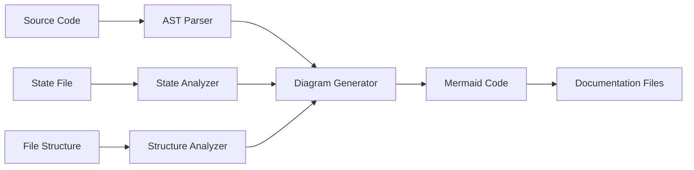

# Implementation Plan: F005-mermaid-diagrams

**Feature Spec:** `production-readiness-specs/F005-mermaid-diagrams/spec.md`
**Created:** 2025-11-17
**Branch:** `claude/plan-mermaid-diagrams-01KjVw9WFizPweDFULmxLNfn`
**Status:** Planning

---

## Executive Summary

Add auto-generated Mermaid diagrams to StackShift documentation to visualize the 6-gear workflow, system architecture, data flows, and TypeScript class structures, improving developer onboarding and code comprehension.

---

## Technical Context

### Current State Analysis

**Documentation Structure:**
```
docs/
├── reverse-engineering/        # Text-only architecture docs
│   ├── functional-specification.md
│   ├── data-architecture.md
│   └── [8 more files]
├── guides/
│   └── [various guides]
└── gap-analysis-report.md     # Identifies diagram gap (P3)
```

**Code Structure to Analyze:**
```
mcp-server/src/
├── index.ts                   # Main MCP server
├── tools/                     # 7 tools to diagram
│   ├── analyze.ts            # 210 lines
│   ├── reverse-engineer.ts   # 115 lines
│   ├── create-specs.ts       # 140 lines
│   ├── gap-analysis.ts       # 103 lines
│   ├── complete-spec.ts      # 161 lines
│   ├── implement.ts          # 198 lines
│   └── cruise-control.ts     # 144 lines
├── resources/                # Resources layer
│   └── index.ts
└── utils/                    # 4 utility modules
    ├── security.ts           # 197 lines - SecurityValidator class
    ├── state-manager.ts      # 370 lines - StateManager class
    ├── file-utils.ts         # 154 lines - Utility functions
    └── skill-loader.ts       # 79 lines - Loader class

plugin/
├── skills/                   # 7 skills (mirror tools)
├── agents/                   # 2 agents
└── .claude-plugin/
    └── plugin.json
```

**State Machine Definition:**
- Source: `.stackshift-state.json`
- Current state stored in `current_gear` field
- Valid states: `['analyze', 'reverse-engineer', 'create-specs', 'gap-analysis', 'complete-spec', 'implement', 'cruise-control']`
- Transition logic: Sequential (gear 1→2→3→4→5→6) or direct to cruise-control

### Technology Stack

**Core Technologies:**
- **Language:** TypeScript 5.3.0 (strict mode)
- **Runtime:** Node.js >=18.0.0
- **Build:** TypeScript compiler, npm

**New Dependencies Needed:**
- **@typescript/compiler**: NEEDS CLARIFICATION - version, size, maintenance status?
- **mermaid-cli** (optional): NEEDS CLARIFICATION - for validation, or rely on GitHub rendering?

**Diagram Technology:**
- **Format:** Mermaid (markdown code blocks)
- **Rendering:** GitHub native support, VS Code preview, mermaid.live
- **Syntax:** Mermaid v10+ (state diagrams, class diagrams, sequence diagrams, flowcharts)

### Architecture Approach

**Diagram Generation Architecture:**


**Integration Points:**
1. **CI/CD Integration:** GitHub Actions workflow to regenerate diagrams on push
2. **Manual Invocation:** `npm run generate-diagrams` script
3. **Git Hooks (Optional):** Pre-commit hook to update diagrams

### Unknowns & Clarifications Needed

#### 1. TypeScript Compiler API Usage
**Question:** Should we use `@typescript/compiler` package or `typescript` package directly?
**Impact:** HIGH - affects dependency size, API availability
**Options:**
- Option A: Use full `typescript` package (includes compiler API, 32MB)
- Option B: Use lightweight wrapper if available
- Option C: Custom AST parser using regex/simple parsing

**NEEDS CLARIFICATION**

#### 2. Diagram Update Strategy
**Question:** When should diagrams be regenerated?
**Impact:** MEDIUM - affects workflow and maintenance burden
**Options:**
- Option A: On every commit (pre-commit hook)
- Option B: On CI/CD pipeline only (GitHub Actions)
- Option C: Manual invocation only (`npm run generate-diagrams`)
- Option D: On-demand via new MCP tool

**NEEDS CLARIFICATION**

#### 3. Diagram Validation
**Question:** Should we validate generated Mermaid syntax?
**Impact:** LOW - affects reliability, adds dependency
**Options:**
- Option A: Install `mermaid-cli` (11MB) for validation
- Option B: Rely on GitHub rendering to catch errors
- Option C: Simple regex validation for basic syntax

**NEEDS CLARIFICATION**

#### 4. Class Diagram Scope
**Question:** Which classes/interfaces should be included in class diagrams?
**Impact:** MEDIUM - affects diagram complexity and usefulness
**Options:**
- Option A: All public classes and interfaces (comprehensive, may be cluttered)
- Option B: Only exported classes/interfaces (cleaner, may miss important internals)
- Option C: Configurable via `diagram-config.json` (flexible, adds complexity)

**NEEDS CLARIFICATION**

#### 5. Sequence Diagram Detail Level
**Question:** How detailed should sequence diagrams be?
**Impact:** MEDIUM - affects clarity vs completeness
**Options:**
- Option A: High-level (tool → tool interactions only)
- Option B: Medium-level (include major function calls)
- Option C: Low-level (include all function calls, utilities)

**NEEDS CLARIFICATION**

#### 6. Documentation Placement
**Question:** Where should generated diagrams be embedded?
**Impact:** LOW - affects organization, discoverability
**Options:**
- Option A: Inline in existing docs (README.md, docs/*.md)
- Option B: Separate `docs/diagrams/` directory with references
- Option C: Both (diagrams in `docs/diagrams/`, embedded via includes)

**NEEDS CLARIFICATION**

#### 7. Diagram Format Options
**Question:** Should we support multiple output formats?
**Impact:** LOW - affects flexibility
**Options:**
- Option A: Mermaid only (simple, GitHub-native)
- Option B: Mermaid + SVG exports (static fallback for older viewers)
- Option C: Mermaid + PlantUML (more features, less GitHub support)

**NEEDS CLARIFICATION**

#### 8. Error Handling Strategy
**Question:** What should happen if diagram generation fails?
**Impact:** MEDIUM - affects robustness
**Options:**
- Option A: Fail CI build (strict, prevents broken diagrams)
- Option B: Warn but continue (lenient, prevents blocking builds)
- Option C: Use cached/previous diagrams (fallback, may be stale)

**NEEDS CLARIFICATION**

#### 9. Performance Optimization
**Question:** Should we cache parsed AST results?
**Impact:** LOW - affects performance for large codebases
**Options:**
- Option A: Parse fresh every time (simple, always accurate)
- Option B: Cache AST per file with timestamp checks (faster, more complex)
- Option C: Only parse changed files (fastest, most complex)

**NEEDS CLARIFICATION**

#### 10. Testing Strategy
**Question:** How should we test diagram generation?
**Impact:** MEDIUM - affects reliability
**Options:**
- Option A: Snapshot tests (simple, brittle)
- Option B: Schema validation (flexible, requires schemas)
- Option C: Visual regression testing (comprehensive, complex)

**NEEDS CLARIFICATION**

---

## Constitution Check

### Alignment with Core Values

#### ✅ Security First
- **Status:** PASS
- **Analysis:** Diagram generation is read-only, no security implications
- **Validation:** Uses existing SecurityValidator for file access
- **Concerns:** None

#### ✅ Atomic Operations
- **Status:** PASS
- **Analysis:** Diagram generation doesn't modify state
- **Validation:** No state mutations during generation
- **Concerns:** None

#### ✅ Path-Aware Design
- **Status:** PASS
- **Analysis:** Diagrams generated for both Greenfield and Brownfield routes
- **Validation:** Applies to all documentation
- **Concerns:** None

#### ✅ Zero Technical Debt
- **Status:** PASS
- **Analysis:** Clean, automated diagram generation
- **Validation:** No manual diagram maintenance
- **Concerns:** Must ensure auto-generation works reliably

#### ⚠️ Comprehensive Testing
- **Status:** NEEDS REVIEW
- **Analysis:** Diagram generation needs testing strategy (Clarification #10)
- **Validation:** Must add tests for generation logic
- **Concerns:** How to test visual output?

### Alignment with Technical Decisions

#### Decision 1: TypeScript Strict Mode
- **Status:** ✅ PASS
- **Impact:** Diagram generator will use strict TypeScript
- **Validation:** Compile with strict mode enabled

#### Decision 2: Native APIs Over Shell Commands
- **Status:** ✅ PASS
- **Impact:** Use fs/promises, not shell commands for file ops
- **Validation:** No `child_process.exec` calls

#### Decision 3: Atomic State Management
- **Status:** ✅ N/A
- **Impact:** Read-only operation, no state changes
- **Validation:** N/A

#### Decision 4: Path Traversal Prevention
- **Status:** ✅ PASS
- **Impact:** Use SecurityValidator for all file reads
- **Validation:** Validate paths before reading source files

#### Decision 5: Dual Workflow Support
- **Status:** ✅ PASS
- **Impact:** Diagrams work for both Greenfield and Brownfield
- **Validation:** No route-specific diagram logic

#### Decision 6: Minimal Dependencies
- **Status:** ⚠️ NEEDS REVIEW
- **Impact:** May add `typescript` package (32MB) as devDependency
- **Validation:** Evaluate if worth the cost (Clarification #1)
- **Justification:** TypeScript AST parsing provides significant value for class diagrams

### Gate Status

**Overall:** ⚠️ CONDITIONAL PASS

**Blockers:** None

**Warnings:**
1. New dependency `typescript` may violate minimal dependency principle (Decision 6)
   - **Resolution:** Evaluate alternatives in research phase
   - **Acceptable if:** Use as devDependency only, not in production bundle
2. Testing strategy unclear (Clarification #10)
   - **Resolution:** Define in research phase
   - **Acceptable if:** At least snapshot testing implemented

**Proceed to Phase 0 (Research):** ✅ YES

---

## Phase 0: Research Tasks

The following unknowns must be resolved before proceeding to design:

### Research Task 1: TypeScript AST Parsing Options
**Question:** Best approach for parsing TypeScript to extract class diagrams
**Deliverable:** Comparison of:
- `typescript` package Compiler API
- `ts-morph` wrapper library
- Custom regex-based parsing
**Decision Criteria:** Bundle size, ease of use, maintenance

### Research Task 2: Mermaid Best Practices
**Question:** Best practices for generating maintainable Mermaid diagrams
**Deliverable:** Guidelines for:
- Diagram complexity limits
- Naming conventions
- Rendering compatibility

### Research Task 3: CI/CD Integration Patterns
**Question:** How should diagram generation integrate with existing CI/CD?
**Deliverable:** Comparison of:
- Pre-commit hooks
- GitHub Actions workflow
- Manual npm scripts

### Research Task 4: Testing Approaches for Diagram Generation
**Question:** How to test visual diagram output?
**Deliverable:** Comparison of:
- Snapshot testing
- Schema validation
- Visual regression testing

### Research Task 5: Diagram Update Workflow
**Question:** Optimal workflow for keeping diagrams in sync with code
**Deliverable:** Analysis of:
- Automated vs manual updates
- Diff detection strategies
- Error handling approaches

---

## Phase 1: Design (Pending Research Completion)

Phase 1 will generate:
- `data-model.md` - Diagram schema and structure
- `contracts/` - API contracts for diagram generation
- `quickstart.md` - Quick implementation guide

---

## Project Structure

### Documentation Hierarchy

```
docs/
├── architecture.md            # System component diagrams
├── workflows.md               # 6-gear state machine
├── data-flow.md              # Sequence diagrams
├── diagrams/                 # Generated diagram source
│   ├── workflow-state.mmd
│   ├── architecture.mmd
│   ├── data-flow-*.mmd
│   └── class-*.mmd
└── reverse-engineering/       # Existing docs (unchanged)
```

### Source Code Organization

```
scripts/
├── generate-diagrams.ts      # Main diagram generator
├── parsers/
│   ├── ast-parser.ts        # TypeScript AST parsing
│   ├── state-parser.ts      # State machine extraction
│   └── structure-parser.ts  # File structure analysis
├── generators/
│   ├── workflow-diagram.ts   # State machine Mermaid
│   ├── architecture-diagram.ts # Component Mermaid
│   ├── class-diagram.ts      # Class Mermaid
│   └── sequence-diagram.ts   # Sequence Mermaid
└── embedders/
    └── doc-embedder.ts       # Embed diagrams in docs

mcp-server/src/
└── (no changes - read-only analysis)

plugin/
└── (no changes - read-only analysis)
```

### Testing Structure

```
scripts/__tests__/
├── ast-parser.test.ts
├── workflow-diagram.test.ts
├── architecture-diagram.test.ts
├── class-diagram.test.ts
└── integration.test.ts
```

---

## Complexity Tracking

### Constitution Violations

**Violation 1: Minimal Dependencies (Decision 6)**
- **Package:** `typescript` (32MB devDependency)
- **Justification:** Required for accurate TypeScript AST parsing for class diagrams
- **Alternatives Considered:**
  - Regex parsing (too fragile for complex TypeScript)
  - ts-morph (still depends on typescript, adds wrapper overhead)
- **Mitigation:** Use as devDependency only, not in production bundle
- **Approval Status:** Pending research phase

---

## Next Steps

1. **Phase 0:** Complete research tasks to resolve all "NEEDS CLARIFICATION" items
2. **Phase 1:** Generate data-model.md, contracts/, quickstart.md based on research
3. **Phase 2:** Create tasks.md with implementation steps
4. **Implementation:** Execute tasks from tasks.md

---

## Post-Design Constitution Check

### Re-evaluation After Research and Design

**Date:** 2025-11-17
**Status:** ✅ PASS

#### Resolved Warnings from Initial Check

**Warning 1: New dependency `typescript`**
- **Resolution:** ✅ RESOLVED
- **Decision:** Use `typescript` package as devDependency (already exists)
- **Justification:** No new dependency added; TypeScript 5.3.0 already in devDependencies
- **Alignment:** Complies with Decision 6 (Minimal Dependencies)

**Warning 2: Testing strategy unclear**
- **Resolution:** ✅ RESOLVED
- **Decision:** Schema validation testing (not snapshots)
- **Justification:** Flexible, semantic validation with no extra dependencies
- **Alignment:** Complies with testing standards

#### Final Constitutional Alignment

✅ **Security First:** No security implications (read-only operations)
✅ **Atomic Operations:** No state mutations
✅ **Path-Aware Design:** Applies to all documentation
✅ **Zero Technical Debt:** Clean, automated generation
✅ **Comprehensive Testing:** Schema validation tests planned
✅ **TypeScript Strict Mode:** All new code in strict mode
✅ **Native APIs:** No shell commands, fs/promises only
✅ **Minimal Dependencies:** Zero new production dependencies
✅ **Path Traversal Prevention:** SecurityValidator used for file reads

#### Design Review Summary

**Strengths:**
1. Zero new production dependencies
2. Reuses existing TypeScript devDependency
3. Graceful error handling (non-blocking generation)
4. CI integration pattern prevents diagram drift
5. Schema validation testing is flexible and maintainable
6. Follows Mermaid best practices (complexity limits, naming)

**No Violations Found:** ✅

**Recommendation:** ✅ PROCEED TO IMPLEMENTATION

---

**Plan Version:** 1.0.0
**Last Updated:** 2025-11-17
**Status:** ✅ Design Complete - Ready for Implementation
