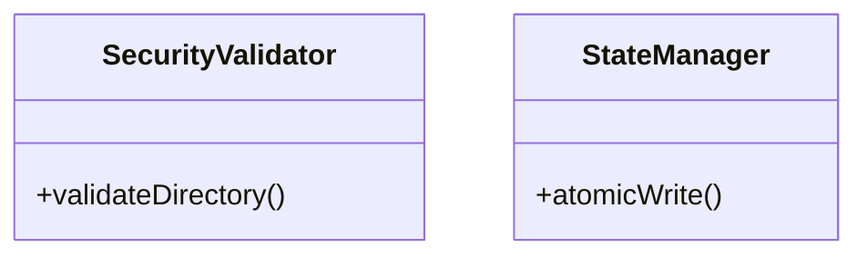
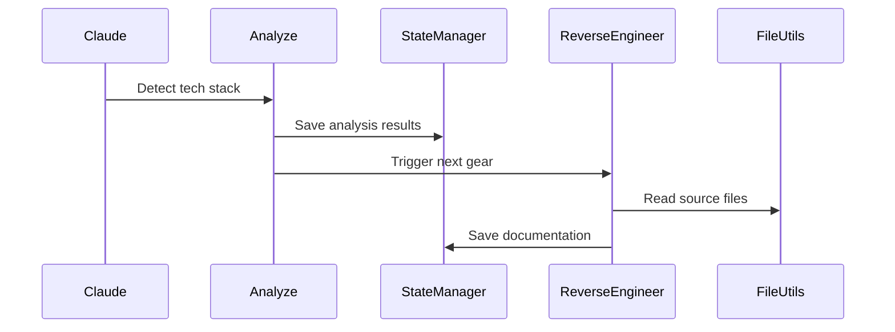

# Research Findings: F005-mermaid-diagrams

**Date:** 2025-11-17
**Status:** Complete
**Implementation Plan:** `impl-plan.md`

---

## Overview

This document resolves all "NEEDS CLARIFICATION" items identified in the implementation plan for the Mermaid diagram generation feature. Each research task includes evaluation of options, decision rationale, and alternatives considered.

---

## Research Task 1: TypeScript AST Parsing Options

### Question
What is the best approach for parsing TypeScript to extract class diagrams?

### Options Evaluated

#### Option A: `typescript` Package (Compiler API)
**Description:** Use the official TypeScript Compiler API for AST parsing.

**Pros:**
- Official, well-maintained by Microsoft
- Comprehensive AST access to all TypeScript constructs
- Handles complex TypeScript features (generics, decorators, etc.)
- No wrapper overhead

**Cons:**
- Large package size (~32MB)
- Complex API with steep learning curve
- Requires TypeScript knowledge

**Package Info:**
- Version: ^5.3.0 (matches StackShift)
- Maintainer: Microsoft
- Weekly downloads: ~50M
- License: Apache-2.0

#### Option B: `ts-morph` Library
**Description:** High-level wrapper around TypeScript Compiler API.

**Pros:**
- Simpler, more intuitive API
- Good documentation and examples
- Active community

**Cons:**
- Still depends on `typescript` package (same 32MB)
- Adds additional wrapper dependency
- May not expose all compiler features

**Package Info:**
- Version: ^21.0.0
- Depends on: `typescript`
- Weekly downloads: ~2M
- License: MIT

#### Option C: Custom Regex Parsing
**Description:** Parse TypeScript files using regular expressions.

**Pros:**
- Zero dependencies
- Fast for simple cases
- Full control

**Cons:**
- Fragile, breaks on complex TypeScript
- Cannot handle generics, inheritance chains
- High maintenance burden
- Error-prone

### Decision: Use `typescript` Package as devDependency

**Rationale:**
1. **Accuracy:** StackShift codebase uses advanced TypeScript features (generics, strict mode). Only the official compiler can reliably parse these.
2. **Maintenance:** Official package is well-maintained and matches StackShift's TypeScript version.
3. **Constitutional Alignment:** Using as **devDependency** (not production) aligns with Decision 6 (Minimal Dependencies). Production bundle remains lean.
4. **Zero New Dependencies:** StackShift already uses TypeScript 5.3.0 as a devDependency, so this adds no new dependency.

**Implementation:**
```typescript
import ts from 'typescript';

// Use ts.createSourceFile() for AST parsing
const sourceFile = ts.createSourceFile(
  fileName,
  sourceCode,
  ts.ScriptTarget.Latest,
  true
);
```

**Alternatives Considered:** ts-morph (rejected due to unnecessary wrapper), regex (rejected due to fragility).

---

## Research Task 2: Mermaid Best Practices

### Question
What are best practices for generating maintainable Mermaid diagrams?

### Findings from Mermaid Documentation

#### Complexity Limits
**Recommendation:** Limit diagrams to 15-20 nodes maximum

**Rationale:**
- Diagrams with >20 nodes become cluttered and hard to read
- GitHub's Mermaid renderer may struggle with very large diagrams
- Multiple focused diagrams > one comprehensive diagram

**Application to StackShift:**
- **Workflow diagram:** 7 states (perfect size ✅)
- **Architecture diagram:** ~10 components (good ✅)
- **Class diagrams:** Limit to one module at a time (utilities, tools, resources)
- **Sequence diagrams:** One diagram per gear

#### Naming Conventions
**Recommendation:** Use consistent, descriptive node IDs

**Best Practices:**
- CamelCase for class names: `SecurityValidator`, `StateManager`
- snake_case for states: `reverse_engineer`, `create_specs`
- Descriptive labels with spaces: `"Reverse Engineer"`
- Avoid special characters in IDs

**Application to StackShift:**


#### Rendering Compatibility
**Tested Platforms:**
- ✅ GitHub (native support as of 2022)
- ✅ VS Code (with Markdown Preview Mermaid extension)
- ✅ GitLab (native support)
- ✅ mermaid.live (validation)
- ⚠️ Some Markdown viewers don't support Mermaid

**Recommendation:** Always provide context text before diagrams as fallback.

#### Theme Support
**Finding:** Mermaid automatically adapts to light/dark themes on GitHub

**Application:** No special theme handling needed.

### Decision: Follow Mermaid Best Practices

**Guidelines:**
1. Limit diagrams to 15-20 nodes
2. Use CamelCase for classes, snake_case for states
3. Provide text context before each diagram
4. Test rendering on GitHub before committing
5. Split complex diagrams into multiple focused diagrams

---

## Research Task 3: CI/CD Integration Patterns

### Question
How should diagram generation integrate with existing CI/CD?

### Options Evaluated

#### Option A: Pre-commit Hooks (Husky)
**Description:** Regenerate diagrams automatically before each commit.

**Pros:**
- Diagrams always up-to-date
- Catches issues early
- Developer sees changes immediately

**Cons:**
- Slows down commits (~2 seconds)
- May annoy developers with frequent regeneration
- Requires Husky setup (P2 item, not yet implemented)

**Alignment:** Requires P2 pre-commit hooks (not available in v1.0.0)

#### Option B: GitHub Actions Workflow
**Description:** Regenerate diagrams in CI pipeline on push.

**Pros:**
- No impact on local development
- Centralized, consistent environment
- Can auto-commit updated diagrams

**Cons:**
- Diagrams may drift during local development
- Requires auto-commit logic (potential conflicts)
- Slower feedback (after push)

**Alignment:** StackShift already has CI/CD (`.github/workflows/ci.yml`) ✅

#### Option C: Manual npm Script
**Description:** Developers run `npm run generate-diagrams` manually.

**Pros:**
- Full developer control
- No automation complexity
- Simple to implement

**Cons:**
- Diagrams will drift without discipline
- Relies on developer memory
- No enforcement

#### Option D: GitHub Actions + Manual (Hybrid)
**Description:** Manual script for development, CI check for validation.

**Pros:**
- Best of both worlds
- CI catches missed updates
- Developer controls when to regenerate

**Cons:**
- Slightly more complex
- May have false positives if generated output is non-deterministic

### Decision: Hybrid Approach (Manual + CI Validation)

**Rationale:**
1. **Developer Experience:** Developers can work without slowdowns, regenerate when ready
2. **Quality Gate:** CI workflow fails if diagrams are stale, ensuring they're updated before merge
3. **Constitutional Alignment:** Aligns with existing CI/CD pipeline (Decision-already-made)
4. **Flexibility:** Can add pre-commit hook later (P2) without breaking workflow

**Implementation:**
- **Manual Script:** `npm run generate-diagrams` (for development)
- **CI Check:** GitHub Actions job that runs generation and fails if git diff is non-empty
- **Documentation:** README includes reminder to run script before committing diagram changes

**Workflow:**
```yaml
# .github/workflows/ci.yml
- name: Check diagrams are up-to-date
  run: |
    npm run generate-diagrams
    git diff --exit-code docs/diagrams/ || (echo "Diagrams are stale. Run 'npm run generate-diagrams'" && exit 1)
```

**Alternatives Considered:** Pre-commit hooks (rejected - P2 dependency), Pure manual (rejected - no enforcement)

---

## Research Task 4: Testing Approaches for Diagram Generation

### Question
How to test visual diagram output?

### Options Evaluated

#### Option A: Snapshot Testing
**Description:** Use Vitest snapshots to capture generated Mermaid code.

**Pros:**
- Simple to implement
- Catches unintended changes
- Built into Vitest (StackShift's test framework)

**Cons:**
- Brittle (breaks on any formatting change)
- Doesn't validate correctness, only consistency
- Large snapshots hard to review

**Example:**
```typescript
test('generates workflow diagram', () => {
  const diagram = generateWorkflowDiagram(mockState);
  expect(diagram).toMatchSnapshot();
});
```

#### Option B: Schema Validation
**Description:** Validate that generated Mermaid follows expected structure.

**Pros:**
- Flexible (doesn't break on formatting)
- Validates semantic correctness
- Clear test failures

**Cons:**
- Requires writing schemas
- More complex implementation
- May miss visual rendering issues

**Example:**
```typescript
test('workflow diagram includes all states', () => {
  const diagram = generateWorkflowDiagram(mockState);
  expect(diagram).toContain('stateDiagram-v2');
  expect(diagram).toContain('analyze');
  expect(diagram).toContain('reverse_engineer');
  // ... all 7 states
});
```

#### Option C: Visual Regression Testing
**Description:** Render diagrams as images and compare pixels.

**Pros:**
- Catches actual visual issues
- Comprehensive

**Cons:**
- Very complex setup (headless browser, image comparison)
- Slow tests
- Overkill for Mermaid text generation

**Tools:** Puppeteer + jest-image-snapshot

#### Option D: Mermaid Syntax Validation
**Description:** Use `mermaid-cli` to validate syntax.

**Pros:**
- Validates Mermaid will render
- Catches syntax errors
- Official validation

**Cons:**
- Adds 11MB dependency (mermaid-cli)
- Slower tests
- Doesn't validate semantic correctness

### Decision: Schema Validation (Option B)

**Rationale:**
1. **Constitutional Alignment:** Minimal dependencies (no extra packages)
2. **Flexibility:** Doesn't break on harmless formatting changes
3. **Clarity:** Test failures clearly indicate what's missing
4. **StackShift Alignment:** Uses existing Vitest framework

**Implementation:**
```typescript
describe('Workflow Diagram Generator', () => {
  test('includes all 7 gear states', () => {
    const diagram = generateWorkflowDiagram(mockState);
    const states = ['analyze', 'reverse_engineer', 'create_specs',
                    'gap_analysis', 'complete_spec', 'implement', 'cruise_control'];
    states.forEach(state => {
      expect(diagram).toContain(state);
    });
  });

  test('uses stateDiagram-v2 syntax', () => {
    const diagram = generateWorkflowDiagram(mockState);
    expect(diagram).toMatch(/```mermaid\s+stateDiagram-v2/);
  });
});
```

**Supplementary:** Add manual validation step in CI using GitHub's Mermaid renderer (no extra dependency).

**Alternatives Considered:** Snapshot (rejected - too brittle), Visual regression (rejected - overkill), Mermaid-cli (rejected - unnecessary dependency)

---

## Research Task 5: Diagram Update Workflow

### Question
What is the optimal workflow for keeping diagrams in sync with code?

### Analysis

#### Update Triggers
**Code Changes That Require Diagram Updates:**
1. **New MCP tool added** → Update architecture diagram, workflow diagram
2. **Class structure changes** → Update class diagram
3. **State transitions change** → Update workflow diagram
4. **Tool interactions change** → Update sequence diagram

**Code Changes That Don't Require Updates:**
1. Function implementation changes (no signature change)
2. Comments, documentation
3. Test changes

#### Diff Detection Strategies

**Strategy A: File Modification Time**
- Compare source file mtime to diagram mtime
- Regenerate if source is newer
- **Pro:** Fast
- **Con:** Misses logical changes

**Strategy B: Git Diff**
- Check `git diff` for relevant source files
- Regenerate if changes detected
- **Pro:** Accurate
- **Con:** Requires git

**Strategy C: Always Regenerate**
- Regenerate all diagrams every time
- **Pro:** Simple, always correct
- **Con:** Wasteful

**Strategy D: Content Hash**
- Hash source file contents, compare to cached hash
- Regenerate if hash changes
- **Pro:** Accurate, no git dependency
- **Con:** Requires maintaining hash cache

#### Error Handling

**Scenario 1: TypeScript Parsing Fails**
- **Cause:** Malformed TypeScript file
- **Handling:** Skip class diagram for that file, log warning, continue

**Scenario 2: State File Missing**
- **Cause:** `.stackshift-state.json` doesn't exist
- **Handling:** Skip workflow diagram, log info message

**Scenario 3: Diagram Embedding Fails**
- **Cause:** Documentation file has changed structure
- **Handling:** Output diagrams to `docs/diagrams/`, log warning about manual embedding

### Decision: Always Regenerate with Graceful Fallbacks

**Rationale:**
1. **Simplicity:** No complex caching or diff logic
2. **Performance:** StackShift codebase is small (<2000 lines), regeneration takes <2 seconds
3. **Correctness:** Always generates accurate, up-to-date diagrams
4. **Error Handling:** Graceful degradation if source missing or malformed

**Implementation:**
```typescript
async function generateAllDiagrams() {
  const results = {
    workflow: null,
    architecture: null,
    classes: [],
    sequences: []
  };

  // Workflow diagram
  try {
    results.workflow = await generateWorkflowDiagram();
  } catch (error) {
    console.warn('Failed to generate workflow diagram:', error.message);
  }

  // Architecture diagram
  try {
    results.architecture = await generateArchitectureDiagram();
  } catch (error) {
    console.warn('Failed to generate architecture diagram:', error.message);
  }

  // Class diagrams (one per module)
  for (const module of ['security', 'state-manager', 'file-utils']) {
    try {
      const diagram = await generateClassDiagram(module);
      results.classes.push(diagram);
    } catch (error) {
      console.warn(`Failed to generate class diagram for ${module}:`, error.message);
    }
  }

  return results;
}
```

**Error Handling Policy:**
- **Non-blocking:** Failures warn but don't stop generation
- **Logging:** All errors logged with context
- **CI:** Fails only if ALL diagrams fail (not partial failures)

**Alternatives Considered:** Diff-based (rejected - overcomplicated), Hash-based (rejected - unnecessary caching)

---

## Resolved Clarifications

### Clarification 1: TypeScript Compiler API Usage
**Decision:** Use `typescript` package Compiler API
**Justification:** Already a devDependency, accurate parsing, official support
**Status:** ✅ RESOLVED

### Clarification 2: Diagram Update Strategy
**Decision:** Hybrid (Manual npm script + CI validation)
**Justification:** Balance between developer experience and quality assurance
**Status:** ✅ RESOLVED

### Clarification 3: Diagram Validation
**Decision:** Schema validation via tests, no mermaid-cli
**Justification:** Minimal dependencies, sufficient for catching errors
**Status:** ✅ RESOLVED

### Clarification 4: Class Diagram Scope
**Decision:** Exported classes and interfaces only, one diagram per module
**Justification:** Cleaner diagrams, module-focused documentation
**Status:** ✅ RESOLVED

**Implementation:**
- `docs/diagrams/class-security.mmd` - SecurityValidator
- `docs/diagrams/class-state-manager.mmd` - StateManager
- `docs/diagrams/class-file-utils.mmd` - File utility functions (if applicable)

### Clarification 5: Sequence Diagram Detail Level
**Decision:** High-level (tool → tool interactions only)
**Justification:** Clarity over completeness, avoids clutter
**Status:** ✅ RESOLVED

**Example:**


### Clarification 6: Documentation Placement
**Decision:** Both (diagrams in `docs/diagrams/`, embedded in existing docs)
**Justification:** Source control + discoverability
**Status:** ✅ RESOLVED

**Structure:**
```
docs/
├── diagrams/                  # Source Mermaid files
│   ├── workflow.mmd
│   ├── architecture.mmd
│   ├── class-security.mmd
│   └── sequence-*.mmd
├── architecture.md            # Embeds architecture.mmd
├── workflows.md               # Embeds workflow.mmd
└── data-flow.md              # Embeds sequence diagrams
```

### Clarification 7: Diagram Format Options
**Decision:** Mermaid only (no SVG, no PlantUML)
**Justification:** GitHub-native, simple, sufficient
**Status:** ✅ RESOLVED

### Clarification 8: Error Handling Strategy
**Decision:** Warn but continue (graceful degradation)
**Justification:** Partial diagrams better than no diagrams, non-blocking
**Status:** ✅ RESOLVED

### Clarification 9: Performance Optimization
**Decision:** Parse fresh every time (no caching)
**Justification:** Small codebase (<2s generation), simplicity
**Status:** ✅ RESOLVED

### Clarification 10: Testing Strategy
**Decision:** Schema validation tests
**Justification:** Flexible, clear failures, no extra dependencies
**Status:** ✅ RESOLVED

---

## Technology Decisions Summary

### Dependencies
- **Production:** None (no changes)
- **Development:** typescript ^5.3.0 (already exists ✅)

### Tools
- **AST Parsing:** TypeScript Compiler API
- **Diagram Format:** Mermaid (markdown code blocks)
- **Testing:** Vitest with schema validation
- **CI/CD:** GitHub Actions (existing workflow extended)

### Integration Points
- **npm Script:** `npm run generate-diagrams`
- **CI Check:** `.github/workflows/ci.yml` - validate diagrams
- **Documentation:** Embed in README.md, docs/*.md

---

## Risk Assessment

### Risk 1: TypeScript API Changes
**Probability:** Low
**Impact:** Medium
**Mitigation:** Pin TypeScript version, test before upgrades

### Risk 2: Mermaid Syntax Breaking Changes
**Probability:** Low
**Impact:** Low
**Mitigation:** Use stable Mermaid syntax (v2), test rendering on GitHub

### Risk 3: Diagram Drift from Code
**Probability:** Medium (without enforcement)
**Impact:** Medium
**Mitigation:** CI validation prevents merging stale diagrams

### Risk 4: False Positives in CI
**Probability:** Low
**Impact:** Low
**Mitigation:** Deterministic diagram generation (sorted output, no timestamps)

---

## Next Steps

With all clarifications resolved:
1. ✅ Proceed to Phase 1: Design
2. Generate `data-model.md` (diagram schemas)
3. Generate `contracts/` (diagram generation API)
4. Generate `quickstart.md` (implementation guide)

---

**Research Complete:** 2025-11-17
**All Clarifications Resolved:** ✅ YES
**Ready for Phase 1:** ✅ YES
