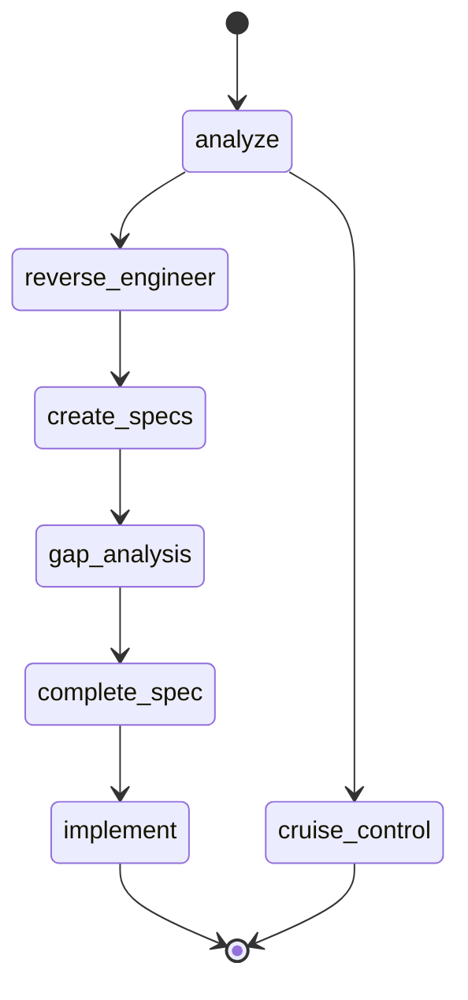
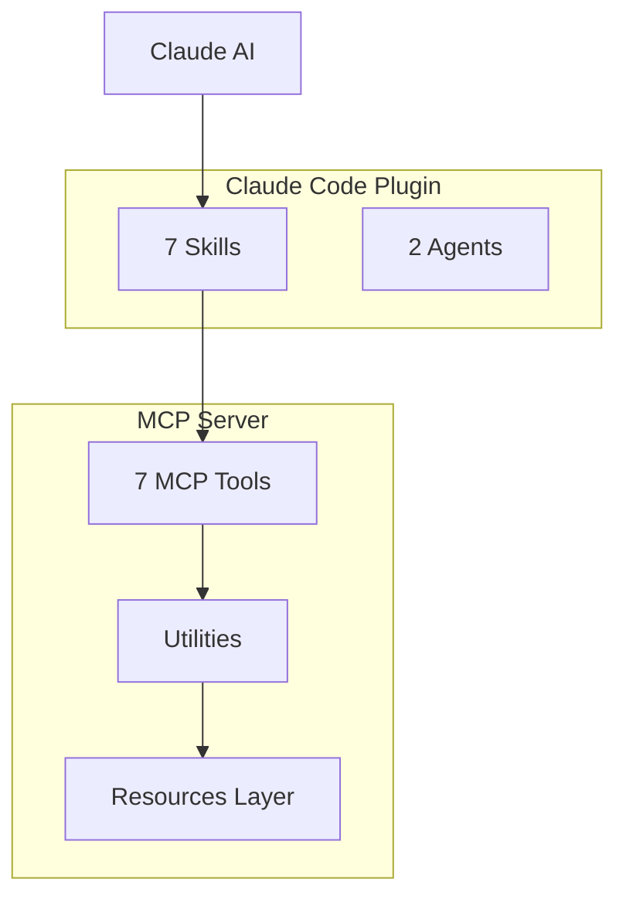
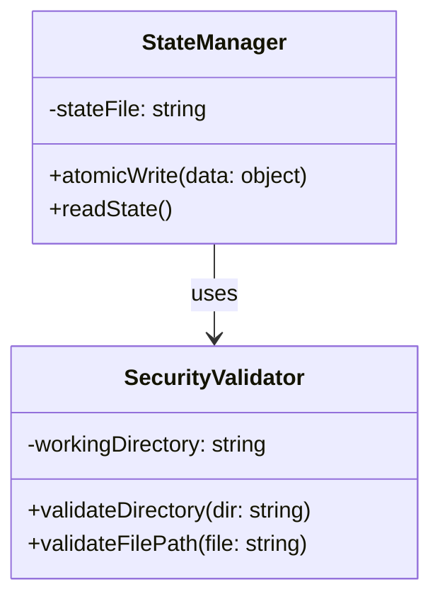

# F005: Mermaid Diagram Generation

## Overview

Enhance StackShift documentation with auto-generated Mermaid diagrams that visualize codebase architecture, workflows, and data flows. This addresses the P3 gap identified in the gap analysis for "Architectural Diagrams" and improves developer onboarding by providing visual representations alongside text-based documentation.

## Problem Statement

Current StackShift documentation is text-only, making it harder for developers to quickly understand:

1. **6-Gear Workflow**: Sequential process from analysis to implementation lacks visual state machine
2. **System Architecture**: Component relationships between MCP server, plugin, and agents unclear
3. **Data Flows**: How state propagates through the system not visualized
4. **API Interactions**: MCP tool communication patterns not documented visually

### Current Impact

- **Longer onboarding time**: New contributors need to read extensive text to understand architecture
- **Documentation drift**: No automated way to keep diagrams in sync with code
- **Limited accessibility**: Visual learners disadvantaged by text-only docs

## Requirements

### Functional Requirements

#### FR1: Workflow State Machine Diagram (Priority: P0)
Generate Mermaid state diagram showing 6-gear workflow transitions.

**Acceptance Criteria:**
- Shows all 7 states (analyze, reverse-engineer, create-specs, gap-analysis, complete-spec, implement, cruise-control)
- Shows valid state transitions based on `.stackshift-state.json`
- Highlights current state when embedded in interactive docs
- Auto-generated from state machine definition

**Example Output:**

#### FR2: Architecture Component Diagram (Priority: P0)
Generate Mermaid component diagram showing system architecture.

**Acceptance Criteria:**
- Shows MCP Server, Claude Code Plugin, Agents as components
- Shows tool dependencies and communication patterns
- Shows state management layer
- Auto-generated from `package.json` dependencies and file structure

**Example Output:**

#### FR3: Data Flow Diagram (Priority: P1)
Generate Mermaid sequence diagram showing data flow through StackShift gears.

**Acceptance Criteria:**
- Shows how analysis results flow to reverse engineering
- Shows how reverse engineering outputs feed into specs
- Shows state persistence points
- Auto-generated from tool implementations

#### FR4: Class Diagram from AST (Priority: P1)
Generate Mermaid class diagrams from TypeScript AST analysis.

**Acceptance Criteria:**
- Parses TypeScript files to extract classes, interfaces, types
- Shows inheritance relationships
- Shows composition relationships
- Embeds in generated documentation

**Example Output:**

#### FR5: Diagram Embedding in Documentation (Priority: P0)
Embed generated diagrams in existing StackShift documentation.

**Acceptance Criteria:**
- README.md contains workflow state machine
- docs/architecture.md contains component diagram
- Each tool's documentation contains relevant sequence diagrams
- Diagrams render in GitHub, VS Code, and other Markdown viewers

### Non-Functional Requirements

#### NFR1: Performance
- Diagram generation: <2 seconds per diagram
- AST parsing: <5 seconds for entire StackShift codebase
- No impact on normal StackShift operations

#### NFR2: Maintainability
- Diagrams auto-regenerated on code changes (via git hooks or CI)
- Clear separation between diagram generation logic and StackShift core
- Fallback to manual diagrams if auto-generation fails

#### NFR3: Compatibility
- Mermaid syntax compatible with GitHub, GitLab, VS Code
- Diagrams accessible (include alt text)
- Support both light and dark themes

### Implementation Details

#### Option 1: Standalone Diagram Generator Script (Recommended)
Create `scripts/generate-diagrams.sh` that:
1. Parses `.stackshift-state.json` for workflow diagram
2. Parses `mcp-server/src/` for class diagrams
3. Parses `plugin/` structure for architecture diagram
4. Outputs Mermaid code to `docs/diagrams/` directory
5. Updates documentation files with embedded diagrams

**Pros:**
- Clean separation of concerns
- Can run independently
- Easy to test
- No runtime dependencies

**Cons:**
- Requires separate invocation
- May drift from code if not automated

#### Option 2: MCP Tool Extension
Add `stackshift_generate_diagrams` MCP tool that generates diagrams on demand.

**Pros:**
- Integrated into StackShift workflow
- Can be called by Claude Code
- Ensures diagrams always current

**Cons:**
- Adds complexity to core tools
- Diagram generation not core to reverse engineering

**Recommendation:** Use Option 1 with git hook automation.

### Testing Requirements

#### TR1: Generation Tests
- Verify state machine diagram matches actual state transitions
- Verify architecture diagram includes all components
- Verify class diagram parsing handles complex TypeScript

#### TR2: Integration Tests
- Verify diagrams embed correctly in Markdown
- Verify diagrams render in GitHub
- Verify diagrams update when code changes

#### TR3: Edge Cases
- Handle missing state file gracefully
- Handle malformed TypeScript files
- Handle empty directories

## Success Criteria

1. ✅ README.md contains auto-generated 6-gear workflow state machine
2. ✅ docs/architecture.md contains system component diagram
3. ✅ docs/data-flow.md contains sequence diagrams for each gear
4. ✅ All diagrams render correctly on GitHub
5. ✅ Diagram generation script runs in <10 seconds
6. ✅ CI/CD pipeline regenerates diagrams on relevant changes
7. ✅ Documentation references diagrams with context

## Dependencies

### Internal Dependencies
- Existing StackShift file structure
- `.stackshift-state.json` format
- TypeScript codebase in `mcp-server/src/`

### External Dependencies
- **typescript**: For AST parsing (new dependency)
- **fs/promises**: For file operations (built-in)
- **path**: For path manipulation (built-in)

### Development Dependencies
- **vitest**: For testing diagram generation
- **markdown-it** (optional): For testing Markdown rendering

## Non-Goals

- Not replacing existing text documentation
- Not creating interactive diagrams (static Mermaid only)
- Not supporting diagram formats other than Mermaid
- Not documenting third-party dependencies
- Not creating UML diagrams beyond what Mermaid supports

## Timeline

- **Estimated Effort:** 12-16 hours
  - Workflow state machine generator: 2 hours
  - Architecture diagram generator: 3 hours
  - Class diagram from AST: 5-6 hours
  - Data flow diagrams: 3-4 hours
  - Documentation embedding: 2 hours
  - Testing: 2 hours
  - CI integration: 1 hour

- **Priority:** P3 (Low) - Improves documentation but not critical for core functionality
- **Target:** v1.2.0 release

## Rollback Plan

If diagram generation causes issues:
1. Remove auto-generation script
2. Keep manually created diagrams in docs/
3. Document manual diagram update process
4. Revisit automation in future release

## References

- Mermaid Documentation: https://mermaid.js.org/
- TypeScript Compiler API: https://github.com/microsoft/TypeScript/wiki/Using-the-Compiler-API
- GitHub Mermaid Support: https://github.blog/2022-02-14-include-diagrams-markdown-files-mermaid/
- Gap Analysis Report: `docs/gap-analysis-report.md` (line 305-327)
