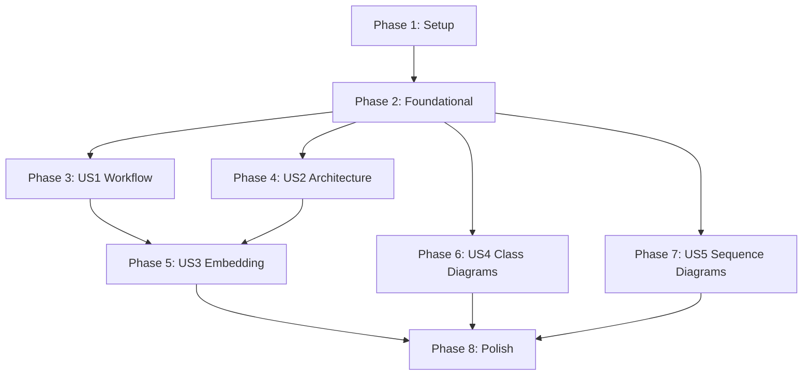

# Implementation Tasks: F005-mermaid-diagrams

**Feature:** Mermaid Diagram Generation
**Created:** 2025-11-17
**Status:** Ready for Implementation
**Estimated Effort:** 12-16 hours

---

## Overview

This document provides a dependency-ordered task list for implementing auto-generated Mermaid diagrams for StackShift documentation. Tasks are organized by user story to enable independent implementation and testing.

---

## User Stories Summary

| Story | Priority | Description | Estimated Effort |
|-------|----------|-------------|------------------|
| US1 | P0 | Workflow State Machine Diagram | 2 hours |
| US2 | P0 | Architecture Component Diagram | 3 hours |
| US3 | P0 | Diagram Embedding in Documentation | 2 hours |
| US4 | P1 | Class Diagrams from AST | 5-6 hours |
| US5 | P1 | Sequence Diagrams for Data Flow | 3-4 hours |

**Total Tasks:** 35
**MVP Scope:** US1 + US2 + US3 (7 hours, core documentation diagrams)

---

## Phase 1: Setup & Infrastructure

**Goal:** Initialize project structure and shared utilities

**Duration:** 30 minutes

### Tasks

- [ ] T001 Create diagram generation directory structure at scripts/generate-diagrams/
- [ ] T002 Create parsers subdirectory at scripts/generate-diagrams/parsers/
- [ ] T003 Create generators subdirectory at scripts/generate-diagrams/generators/
- [ ] T004 Create embedders subdirectory at scripts/generate-diagrams/embedders/
- [ ] T005 Create output directory at docs/diagrams/
- [ ] T006 Create tests directory at scripts/generate-diagrams/__tests__/
- [ ] T007 Add npm script "generate-diagrams" to package.json pointing to tsx scripts/generate-diagrams/index.ts
- [ ] T008 Add npm script "generate-diagrams:verbose" to package.json with --verbose flag

---

## Phase 2: Foundational Components

**Goal:** Build core infrastructure required by all user stories

**Duration:** 1 hour

**Must Complete Before:** Any user story implementation

### Tasks

- [ ] T009 [P] Create shared types file at scripts/generate-diagrams/types.ts with GearState, MermaidCode, and DiagramMetadata interfaces
- [ ] T010 [P] Create base diagram writer utility at scripts/generate-diagrams/diagram-writer.ts implementing IDiagramWriter interface
- [ ] T011 [P] Create diagram validator utility at scripts/generate-diagrams/diagram-validator.ts for Mermaid syntax validation
- [ ] T012 Create main DiagramGenerator class at scripts/generate-diagrams/diagram-generator.ts with generateAll() method
- [ ] T013 Create main entry point at scripts/generate-diagrams/index.ts that orchestrates diagram generation
- [ ] T014 Add test for diagram writer utility at scripts/generate-diagrams/__tests__/diagram-writer.test.ts

---

## Phase 3: User Story 1 - Workflow State Machine Diagram (P0)

**User Story:** As a developer, I want to see a visual workflow diagram showing the 6-gear process so I can understand StackShift's sequential workflow

**Acceptance Criteria:**
- ✅ Shows all 7 states (analyze, reverse-engineer, create-specs, gap-analysis, complete-spec, implement, cruise-control)
- ✅ Shows valid state transitions
- ✅ Auto-generated from .stackshift-state.json
- ✅ Outputs to docs/diagrams/workflow.mmd

**Independent Test:** Run `npm run generate-diagrams` and verify workflow.mmd contains all 7 states and transitions

**Duration:** 2 hours

### Tasks

- [ ] T015 [P] [US1] Create WorkflowDiagramGenerator class at scripts/generate-diagrams/generators/workflow-diagram.ts
- [ ] T016 [US1] Implement parse() method to read .stackshift-state.json and extract workflow states
- [ ] T017 [US1] Implement toMermaid() method to convert workflow model to stateDiagram-v2 syntax
- [ ] T018 [US1] Add workflow diagram generation to DiagramGenerator.generateAll() in scripts/generate-diagrams/diagram-generator.ts
- [ ] T019 [US1] Create test at scripts/generate-diagrams/__tests__/workflow-diagram.test.ts validating all 7 states are included
- [ ] T020 [US1] Add test validating state transitions (analyze→reverse_engineer, etc.)
- [ ] T021 [US1] Add test validating initial state ([*]→analyze) and final states (implement→[*], cruise_control→[*])

**Deliverable:** docs/diagrams/workflow.mmd with complete workflow state machine

---

## Phase 4: User Story 2 - Architecture Component Diagram (P0)

**User Story:** As a developer, I want to see a system architecture diagram showing MCP server, plugin, and agents so I can understand component relationships

**Acceptance Criteria:**
- ✅ Shows MCP Server, Claude Code Plugin, Agents as components
- ✅ Shows tool dependencies and communication patterns
- ✅ Auto-generated from file structure analysis
- ✅ Outputs to docs/diagrams/architecture.mmd

**Independent Test:** Run `npm run generate-diagrams` and verify architecture.mmd shows all components with correct relationships

**Duration:** 3 hours

### Tasks

- [ ] T022 [P] [US2] Create ArchitectureDiagramGenerator class at scripts/generate-diagrams/generators/architecture-diagram.ts
- [ ] T023 [US2] Implement analyze() method to scan mcp-server/src/ and plugin/ directories
- [ ] T024 [US2] Implement component extraction logic identifying tools, resources, utils, skills, agents
- [ ] T025 [US2] Implement toMermaid() method to generate graph TB with subgraphs for MCP Server and Plugin
- [ ] T026 [US2] Add architecture diagram generation to DiagramGenerator.generateAll() in scripts/generate-diagrams/diagram-generator.ts
- [ ] T027 [US2] Create test at scripts/generate-diagrams/__tests__/architecture-diagram.test.ts validating all components present
- [ ] T028 [US2] Add test validating subgraph structure (MCP Server and Claude Code Plugin subgraphs)
- [ ] T029 [US2] Add test validating relationships (Skills→Tools, Tools→Utils, etc.)

**Deliverable:** docs/diagrams/architecture.mmd with complete system architecture

---

## Phase 5: User Story 3 - Diagram Embedding (P0)

**User Story:** As a developer, I want diagrams automatically embedded in documentation so they're visible when reading docs on GitHub

**Acceptance Criteria:**
- ✅ README.md contains workflow state machine diagram
- ✅ docs/architecture.md contains component diagram
- ✅ Diagrams render correctly on GitHub
- ✅ Embedding preserves existing documentation content

**Independent Test:** View README.md and docs/architecture.md on GitHub and verify diagrams render correctly

**Duration:** 2 hours

**Dependencies:** Requires US1 and US2 (workflow and architecture diagrams generated)

### Tasks

- [ ] T030 [US3] Create DocumentationEmbedder class at scripts/generate-diagrams/embedders/doc-embedder.ts
- [ ] T031 [US3] Implement embedInReadme() method to insert workflow diagram after ## Overview section in README.md
- [ ] T032 [US3] Create docs/architecture.md file with ## System Architecture heading
- [ ] T033 [US3] Implement embedInArchitectureDocs() method to insert architecture diagram in docs/architecture.md
- [ ] T034 [US3] Add embedding logic to DiagramGenerator.generateAll() in scripts/generate-diagrams/diagram-generator.ts
- [ ] T035 [US3] Create test at scripts/generate-diagrams/__tests__/doc-embedder.test.ts validating diagram insertion
- [ ] T036 [US3] Add test validating existing content is preserved during embedding

**Deliverable:** README.md and docs/architecture.md with embedded diagrams

---

## Phase 6: User Story 4 - Class Diagrams from AST (P1)

**User Story:** As a developer, I want to see class diagrams showing TypeScript class structures so I can understand code organization

**Acceptance Criteria:**
- ✅ Parses TypeScript files using Compiler API
- ✅ Extracts classes, interfaces, methods, properties
- ✅ Shows inheritance and relationships
- ✅ Generates one diagram per module (security, state-manager, file-utils)
- ✅ Outputs to docs/diagrams/class-{module}.mmd

**Independent Test:** Run `npm run generate-diagrams` and verify class diagrams show SecurityValidator, StateManager with methods

**Duration:** 5-6 hours

### Tasks

- [ ] T037 [P] [US4] Create ASTParser class at scripts/generate-diagrams/parsers/ast-parser.ts
- [ ] T038 [US4] Implement parseFile() method using ts.createSourceFile() from typescript package
- [ ] T039 [US4] Implement extractClass() method to extract ClassNode from ts.ClassDeclaration
- [ ] T040 [US4] Implement extractInterface() method to extract InterfaceNode from ts.InterfaceDeclaration
- [ ] T041 [US4] Implement extractMethod() method to extract MethodNode with visibility and parameters
- [ ] T042 [US4] Implement extractProperty() method to extract PropertyNode with type information
- [ ] T043 [P] [US4] Create ClassDiagramGenerator class at scripts/generate-diagrams/generators/class-diagram.ts
- [ ] T044 [US4] Implement parse() method to use ASTParser for extracting class information from module files
- [ ] T045 [US4] Implement toMermaid() method to generate classDiagram syntax with classes, methods, properties
- [ ] T046 [US4] Add class diagram generation for security module (mcp-server/src/utils/security.ts) to DiagramGenerator.generateAll()
- [ ] T047 [US4] Add class diagram generation for state-manager module (mcp-server/src/utils/state-manager.ts)
- [ ] T048 [US4] Add class diagram generation for file-utils module (mcp-server/src/utils/file-utils.ts)
- [ ] T049 [US4] Create test at scripts/generate-diagrams/__tests__/ast-parser.test.ts validating class extraction
- [ ] T050 [US4] Create test at scripts/generate-diagrams/__tests__/class-diagram.test.ts validating Mermaid syntax
- [ ] T051 [US4] Add test validating method visibility markers (+, -, #)

**Deliverable:** docs/diagrams/class-security.mmd, class-state-manager.mmd, class-file-utils.mmd

---

## Phase 7: User Story 5 - Sequence Diagrams (P1)

**User Story:** As a developer, I want to see sequence diagrams showing how data flows through gears so I can understand tool interactions

**Acceptance Criteria:**
- ✅ Shows high-level tool→tool interactions
- ✅ Shows state persistence points
- ✅ One diagram per gear (analyze, reverse-engineer, etc.)
- ✅ Outputs to docs/diagrams/sequence-{gear}.mmd

**Independent Test:** Run `npm run generate-diagrams` and verify sequence diagrams show Claude→Tool→Utils interactions

**Duration:** 3-4 hours

### Tasks

- [ ] T052 [P] [US5] Create SequenceDiagramGenerator class at scripts/generate-diagrams/generators/sequence-diagram.ts
- [ ] T053 [US5] Implement analyze() method to identify participants (Claude, Tools, Utils, StateManager)
- [ ] T054 [US5] Implement extractSteps() method to identify high-level interactions from tool implementations
- [ ] T055 [US5] Implement toMermaid() method to generate sequenceDiagram syntax
- [ ] T056 [US5] Add sequence diagram generation for analyze gear to DiagramGenerator.generateAll()
- [ ] T057 [US5] Add sequence diagram generation for reverse-engineer gear
- [ ] T058 [US5] Add sequence diagram generation for create-specs gear
- [ ] T059 [US5] Create test at scripts/generate-diagrams/__tests__/sequence-diagram.test.ts validating participant extraction
- [ ] T060 [US5] Add test validating interaction steps

**Deliverable:** docs/diagrams/sequence-analyze.mmd, sequence-reverse-engineer.mmd, sequence-create-specs.mmd

---

## Phase 8: Polish & Cross-Cutting Concerns

**Goal:** Add CI integration, validation, and polish

**Duration:** 1-2 hours

### Tasks

- [ ] T061 [P] Add CI check to .github/workflows/ci.yml that runs npm run generate-diagrams and validates git diff is empty
- [ ] T062 [P] Create metadata file writer at scripts/generate-diagrams/metadata-writer.ts
- [ ] T063 Add metadata generation to DiagramGenerator.generateAll() outputting to docs/diagrams/diagram-metadata.json
- [ ] T064 [P] Add integration test at scripts/generate-diagrams/__tests__/integration.test.ts that runs full generation
- [ ] T065 Update README.md with section explaining diagram generation workflow
- [ ] T066 Add error handling for missing .stackshift-state.json with graceful fallback
- [ ] T067 Add error handling for TypeScript parse failures with warnings
- [ ] T068 Validate all generated diagrams are under 20 nodes complexity limit
- [ ] T069 Add performance logging showing generation time per diagram

**Deliverable:** Complete diagram generation system with CI integration

---

## Dependency Graph



**Story Completion Order:**
1. Setup → Foundational (required for all)
2. US1 + US2 (parallel, both P0)
3. US3 (depends on US1 + US2)
4. US4 + US5 (parallel, both P1)
5. Polish (final integration)

---

## Parallel Execution Strategy

### MVP-First Approach (Recommended)
**Goal:** Deliver core documentation diagrams quickly

**Week 1:**
- Day 1: Setup + Foundational (T001-T014)
- Day 2: US1 Workflow Diagram (T015-T021)
- Day 3: US2 Architecture Diagram (T022-T029)
- Day 4: US3 Embedding (T030-T036)
- Day 5: Polish & CI (T061, T065)

**Deliverable:** README and docs with workflow + architecture diagrams

### Incremental Delivery Approach
**Goal:** Complete one story at a time

**Sprint 1:** Setup + Foundational + US1 + US2 + US3 (7 hours)
**Sprint 2:** US4 Class Diagrams (5-6 hours)
**Sprint 3:** US5 Sequence Diagrams (3-4 hours)
**Sprint 4:** Polish (1-2 hours)

### Parallel Team Approach
**Developer A:**
- Setup + Foundational (shared)
- US1 Workflow Diagram
- US4 Class Diagrams

**Developer B:**
- Setup + Foundational (shared)
- US2 Architecture Diagram
- US5 Sequence Diagrams

**Both (together):**
- US3 Embedding (after US1 + US2 complete)
- Polish & CI

---

## Implementation Strategy

### Phase Execution

Each phase should be completed fully before moving to the next, except where parallel execution is marked with [P].

**Setup Phase:**
- Create all directories first (T001-T006)
- Add npm scripts (T007-T008)
- **Checkpoint:** Verify `npm run generate-diagrams` command exists

**Foundational Phase:**
- Create types and interfaces (T009)
- Build utilities in parallel (T010, T011 can run simultaneously)
- Create main generator class (T012-T013)
- **Checkpoint:** Verify DiagramGenerator class exists with generateAll() method

**User Story Phases:**
- Each story is independently testable
- Implement generator → integrate → test
- **Checkpoint per story:** Run `npm run generate-diagrams` and verify output

**Polish Phase:**
- Add CI integration
- Validate all diagrams
- **Final Checkpoint:** CI build passes with diagrams up-to-date

### Testing Strategy

Tests are organized per user story to enable independent validation:

**US1 Tests:** Validate workflow state machine syntax and completeness
**US2 Tests:** Validate architecture component extraction and relationships
**US3 Tests:** Validate embedding preserves documentation content
**US4 Tests:** Validate AST parsing and class diagram syntax
**US5 Tests:** Validate sequence diagram participants and interactions

All tests use **schema validation** (not snapshots) to check semantic correctness:
- Verify required elements are present
- Validate syntax structure
- Check relationships are correct
- More flexible than snapshot tests

### Validation Criteria

**Per User Story:**
- All acceptance criteria met
- Tests pass (`npm test scripts/generate-diagrams/__tests__`)
- Manual verification: Generated diagrams render on GitHub
- Independent deliverable works without other stories

**Overall:**
- Total generation time < 10 seconds
- All diagrams under 20 nodes complexity
- CI check passes
- Documentation updated

---

## Risk Mitigation

### Technical Risks

**Risk 1: TypeScript parsing failures**
- **Mitigation:** Graceful error handling (T066, T067)
- **Fallback:** Skip diagram for failed files, log warnings

**Risk 2: Diagram complexity**
- **Mitigation:** Validation check for 20-node limit (T068)
- **Fallback:** Split complex diagrams into multiple files

**Risk 3: CI performance**
- **Mitigation:** Performance logging (T069)
- **Fallback:** Cache diagram generation results

### Process Risks

**Risk 1: Diagram drift**
- **Mitigation:** CI check fails if diagrams stale (T061)
- **Fallback:** Developer must run `npm run generate-diagrams` before commit

**Risk 2: Breaking changes to source files**
- **Mitigation:** Graceful error handling with warnings
- **Fallback:** Manual diagram updates if generation fails

---

## Checkpoints & Reviews

### After Phase 2 (Foundational)
**Validate:**
- Directory structure created correctly
- npm scripts work
- Types and utilities compile without errors
- DiagramGenerator class skeleton complete

**Review Question:** Can we call `generateAll()` without errors?

### After Phase 3 (US1)
**Validate:**
- workflow.mmd file generated
- Contains all 7 states
- State transitions are correct
- Tests pass

**Review Question:** Does the workflow diagram accurately represent the 6-gear process?

### After Phase 5 (US3)
**Validate:**
- README.md contains workflow diagram
- docs/architecture.md contains architecture diagram
- Diagrams render on GitHub
- Existing content preserved

**Review Question:** Are diagrams visible and helpful in documentation?

### After Phase 8 (Polish)
**Validate:**
- CI check passes
- All diagrams generated successfully
- Performance acceptable (<10 seconds)
- Documentation complete

**Review Question:** Is the feature production-ready?

---

## Task Format Reference

All tasks follow this format:
```
- [ ] [TaskID] [P?] [Story?] Description with file path
```

**Legend:**
- `[P]` = Parallelizable (can run simultaneously with other [P] tasks)
- `[US#]` = User Story label (US1, US2, etc.)
- No label = Sequential task or setup/polish task

**Example:**
- `- [ ] T015 [P] [US1] Create WorkflowDiagramGenerator class at scripts/generate-diagrams/generators/workflow-diagram.ts`

---

## Summary

**Total Tasks:** 69
**Total Effort:** 12-16 hours
**MVP Tasks:** T001-T036 + T061 + T065 (39 tasks, 7 hours)
**P1 Tasks:** T037-T060 (24 tasks, 8-10 hours)
**Polish Tasks:** T061-T069 (9 tasks, 1-2 hours)

**Independent Stories:**
- US1: Can be tested independently ✅
- US2: Can be tested independently ✅
- US3: Depends on US1 + US2 ⚠️
- US4: Can be tested independently ✅
- US5: Can be tested independently ✅

**Parallel Opportunities:**
- US1 + US2 can run in parallel
- US4 + US5 can run in parallel
- Foundational utilities (T010, T011) can be built in parallel
- Class diagram generation for different modules (T046-T048) can run in parallel

**Recommended MVP:** US1 + US2 + US3 (Phases 1-5) delivers core documentation value

---

**Status:** Ready for Implementation
**Next Step:** Begin Phase 1 (Setup)
