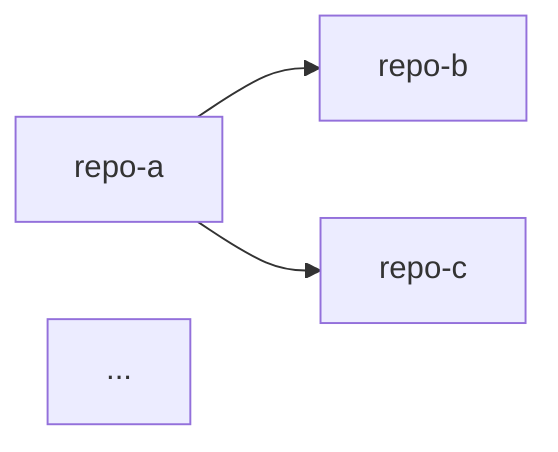

# Ecosystem Discovery

**Start with one repo. Discover the entire ecosystem.**

**Estimated Time:** 10-30 minutes (depending on ecosystem size and GitHub search)
**Prerequisites:** A starting repo with real code (not empty scaffolding)
**Output:** `ecosystem-map.md` in the starting repo's `.stackshift/` directory, optional `.stackshift-batch-session.json` for handoff

---

## When to Use This Skill

Use this skill when:
- You have one repo and want to find everything it connects to
- You're starting a large-scale reverse-engineering project and don't know all the repos yet
- You want to map an entire platform before running batch analysis
- You need to understand the dependency graph between multiple repos/services

**Trigger Phrases:**
- "Discover the ecosystem for this repo"
- "What other repos does this project depend on?"
- "Map all the related services"
- "Find all the repos in this platform"
- "What's connected to this service?"

---

## What This Skill Does

```
   Starting Repo           Signal Scan            Ecosystem Map
   ┌─────────────┐                               ┌──────────────────┐
   │ user-service │──Scan──→ 10 signal types      │ 12 repos found   │
   │              │         ┌─────────────────┐   │                  │
   │ package.json │         │ @org/shared-utils│   │ CONFIRMED: 3     │
   │ docker-comp  │         │ auth-service     │   │ HIGH: 4          │
   │ .env.example │         │ inventory-api    │   │ MEDIUM: 3        │
   │ k8s/         │         │ redis            │   │ LOW: 2           │
   │ src/         │         └─────────────────┘   │                  │
   └─────────────┘              │                 │ Mermaid graph    │
                                ├── GitHub Search │ Signal details   │
                                ├── Local Scan    │                  │
                                └── User Hints    │ → /batch handoff │
                                                  └──────────────────┘
```

1. **Scans** the starting repo for 10 categories of integration signals
2. **Asks** the user for hints (known repos, GitHub org)
3. **Searches** GitHub for related repos (if org provided)
4. **Scans** local filesystem for matching repos
5. **Merges** all sources, deduplicates, and scores confidence
6. **Presents** an ecosystem map with dependency graph
7. **Hands off** confirmed repos to `/stackshift.batch` or `/stackshift.reimagine`

---

## Process

### Step 1: Pre-flight

Verify the starting repo exists and detect basic characteristics:

```bash
# Verify we're in a repo with code
if [ ! -d ".git" ] && [ ! -f "package.json" ] && [ ! -f "go.mod" ] && [ ! -f "requirements.txt" ]; then
  echo "WARNING: This doesn't look like a code repository"
fi

# Detect if monorepo
MONOREPO="false"
if [ -f "pnpm-workspace.yaml" ] || [ -f "turbo.json" ] || [ -f "nx.json" ] || [ -f "lerna.json" ]; then
  MONOREPO="true"
fi

# Get repo name
REPO_NAME=$(basename $(pwd))

# Auto-discover GitHub org from git remote
REMOTE_URL=$(git remote get-url origin 2>/dev/null || echo "")
GITHUB_ORG=""
if [[ "$REMOTE_URL" =~ github\.com[:/]([^/]+)/ ]]; then
  GITHUB_ORG="${BASH_REMATCH[1]}"
  echo "Auto-detected GitHub org: $GITHUB_ORG"
elif [[ "$REMOTE_URL" =~ gitlab\.com[:/]([^/]+)/ ]]; then
  GITHUB_ORG="${BASH_REMATCH[1]}"
  echo "Auto-detected GitLab group: $GITHUB_ORG"
fi
```

If this is a monorepo, note that packages/services within it are automatically **CONFIRMED** — no need to search for them externally.

**Monorepo handling:** If workspace config is detected (`pnpm-workspace.yaml`, `turbo.json`, `nx.json`, `lerna.json`):
1. Resolve all workspace globs to actual package directories
2. Mark every discovered package as **CONFIRMED**
3. Still scan each package for outbound signals to find external dependencies
4. The Mermaid graph should show intra-monorepo dependencies

### Step 2: User Input

The GitHub org is auto-detected from the git remote URL. Only ask for confirmation or override if needed.

**Show auto-detected org:**
```
I auto-detected the GitHub org from your git remote: {GITHUB_ORG}

Is this correct? (Y/n, or enter a different org)
```

If no remote URL or not a GitHub/GitLab repo, ask:
```
I couldn't detect a GitHub org from the git remote.
What GitHub org should I search? (optional, press enter to skip)
```

**Question: Known repos**
```
Do you know of any related repos? (optional)

List paths or org/repo names, one per line:
- ~/git/auth-service
- ~/git/shared-libs
- myorg/inventory-api
- (or press enter to skip)
```

Mark user-provided repos as **CONFIRMED** confidence.

### Step 3: Scan Starting Repo

Run all 10 signal scanners on the starting repo. Use the operations file `scan-integration-signals.md` for detailed instructions.

**Signal categories:**
1. Scoped npm packages (`@org/*` in package.json)
2. Docker Compose services (`docker-compose*.yml`)
3. Environment variables (`.env*`, config files)
4. API client calls (source code URLs, gRPC protos)
5. Shared databases (connection strings, schema refs)
6. CI/CD triggers (`.github/workflows/*.yml`)
7. Workspace configs (`pnpm-workspace.yaml`, `turbo.json`, `nx.json`, `lerna.json`)
8. Message queues/events (SQS, SNS, Kafka topic names)
9. Infrastructure refs (`terraform/`, `cloudformation/`, `k8s/`)
10. Import paths / go.mod / requirements.txt (language-specific deps)

**Output:** A list of discovered service/package names with their signal sources.

### Step 4: Scan User-Provided Repos

For each repo the user listed:
- Verify it exists (local path or clone from GitHub)
- Run the same 10 signal scanners
- Cross-reference signals with the starting repo to build connections

**Output:** Extended signal list with cross-references.

### Step 5: GitHub Search (if org provided)

Use the operations file `github-ecosystem-search.md` for detailed instructions.

Search the GitHub org for repos matching discovered signal names:
- Package names (`@org/shared-utils` → search for `shared-utils` repo)
- Service names from Docker Compose or env vars
- Repository naming patterns (same prefix, similar conventions)

Use `gh api search/repositories` and `gh api search/code` to find matches.

**Output:** List of GitHub repos with relevance scores.

### Step 6: Local Filesystem Scan

Search common development directories for matching repos:

```bash
# Common locations to check
SEARCH_DIRS=(
  "$(dirname $(pwd))"      # Sibling directories
  "$HOME/git"
  "$HOME/code"
  "$HOME/src"
  "$HOME/projects"
  "$HOME/repos"
  "$HOME/dev"
  "$HOME/workspace"
)

# For each discovered package/service name, look for matching directories
for name in "${DISCOVERED_NAMES[@]}"; do
  for dir in "${SEARCH_DIRS[@]}"; do
    if [ -d "$dir/$name" ]; then
      echo "FOUND: $dir/$name"
    fi
  done
done
```

**Output:** Local paths for discovered repos.

### Step 7: Merge & Deduplicate

Use the operations file `merge-and-score.md` for detailed instructions.

Combine all discovery sources:
- Starting repo signals
- User-provided repos
- GitHub search results
- Local filesystem matches

Deduplicate by repo identity (same repo may be found via multiple signals).

Score confidence for each discovered repo:
- **CONFIRMED** — User explicitly listed it, or found in workspace config
- **HIGH** — Multiple independent signals (e.g., env var + docker compose + import)
- **MEDIUM** — Single strong signal (e.g., scoped package dependency)
- **LOW** — Inferred from naming patterns or GitHub search alone

Build the dependency graph (who calls whom, based on signal direction).

### Step 8: Present Ecosystem Map

Use the operations file `present-ecosystem-map.md` for detailed instructions.

Generate `ecosystem-map.md` in `.stackshift/` directory:

```markdown
# Ecosystem Map

## Starting Point
- **Repo:** {repo_name}
- **Org:** {org_name}
- **Scanned:** {date}

## Discovered Repos ({total} total)

| Repo | Location | Confidence | Signals |
|------|----------|------------|---------|
| {name} | {path} | {confidence} | {signals} |
...

## Dependency Graph



## Signal Details
[Per-repo breakdown of what signals were found]
```

Display the map to the user with a summary:
```
Found X repos (Y confirmed, Z high confidence, W medium, V low)
```

### Step 9: User Confirmation

Ask the user to review and adjust:

```
Does this ecosystem map look right?

Options:
A) Looks good — proceed to handoff
B) Add repos — I'll add more to the list
C) Remove repos — Take some off the list
D) Rescan — Run discovery again with adjustments
```

Allow the user to:
- Add repos they know about (mark as CONFIRMED)
- Remove false positives
- Adjust confidence levels
- Provide additional hints for re-scanning

### Step 10: Handoff

Create `.stackshift-batch-session.json` with the confirmed repo list:

```json
{
  "sessionId": "discover-{timestamp}",
  "startedAt": "{iso_date}",
  "batchRootDirectory": "{starting_repo_path}",
  "totalRepos": {count},
  "batchSize": 5,
  "answers": {},
  "processedRepos": [],
  "discoveredRepos": [
    {
      "name": "{repo_name}",
      "path": "{local_path}",
      "confidence": "CONFIRMED|HIGH|MEDIUM|LOW",
      "signals": ["{signal1}", "{signal2}"]
    }
  ]
}
```

Offer the user next steps:

```
What would you like to do with these {X} repos?

A) Run /stackshift.batch on all repos
   → Analyze each repo in parallel, generate specs
B) Run /stackshift.reimagine
   → Load all repos, extract capability map, brainstorm new system
C) Export ecosystem map only
   → Save the map and exit (come back later)
D) Analyze a specific subset
   → Pick which repos to process
```

---

## 10 Signal Categories

| # | Signal | Where to Look | Example |
|---|--------|--------------|---------|
| 1 | Scoped npm packages | `package.json` dependencies | `@myorg/shared-utils` |
| 2 | Docker Compose services | `docker-compose*.yml` | `depends_on: [user-api, redis]` |
| 3 | Environment variables | `.env*`, config files | `USER_SERVICE_URL`, `INVENTORY_API_HOST` |
| 4 | API client calls | Source code imports/URLs | `fetch('/api/v2/users')`, gRPC protos |
| 5 | Shared databases | Connection strings, schema refs | Same DB name in multiple configs |
| 6 | CI/CD triggers | `.github/workflows/*.yml` | `paths:`, `repository_dispatch`, cross-repo triggers |
| 7 | Workspace configs | `pnpm-workspace.yaml`, `turbo.json`, `nx.json`, `lerna.json` | Monorepo package lists |
| 8 | Message queues/events | Source code, config | `SQS queue names`, `SNS topics`, `Kafka topics` |
| 9 | Infrastructure refs | `terraform/`, `cloudformation/`, `k8s/` | Shared VPCs, service meshes, ALBs |
| 10 | Import paths / go.mod / requirements.txt | Language-specific dependency files | `replace github.com/myorg/shared => ../shared` |

---

## Confidence Levels

| Level | Criteria | Example |
|-------|----------|---------|
| **CONFIRMED** | User explicitly listed, or workspace config | User said "add auth-service", or found in `pnpm-workspace.yaml` |
| **HIGH** | 2+ independent signals | Docker Compose service + env var + API import |
| **MEDIUM** | 1 strong signal | Scoped npm package dependency |
| **LOW** | Naming pattern or GitHub search only | Repo name matches `{org}-{service}` pattern |

---

## Integration with Other Skills

### With Batch Processing (`/stackshift.batch`)
- Discovery finds repos → batch processes them in parallel
- Natural workflow: discover → batch → reimagine
- Batch session file is pre-populated with discovered repos

### With Reimagine (`/stackshift.reimagine`)
- Discovery finds repos → reimagine synthesizes them
- Skip batch if you just want the big picture
- Ecosystem map informs the capability extraction

### With Analyze (`/stackshift.analyze`)
- Discovery is a pre-step before analyze
- Discovery answers "which repos?" → analyze answers "what's in each?"

---

## Edge Cases

### Monorepo as Starting Point
When the starting repo is a monorepo (workspace config detected):
- All packages resolved from workspace globs are **CONFIRMED** automatically
- Still scan each package for outbound signals (external deps, APIs, databases)
- The ecosystem map shows both intra-monorepo and external dependencies
- The Mermaid graph uses `subgraph` to group monorepo packages together
- Handoff to batch can process each package as a separate "repo"

### Standalone Repo (No Signals Found)
When signal scanning finds no references to other repos:
```
I scanned {repo_name} but didn't find signals pointing to other repos.

This could mean:
- It's a standalone application with no ecosystem
- Dependencies are managed differently than expected
- The repo uses conventions I didn't recognize

Options:
A) List repos manually — I'll scan them and build the map
B) Try a different starting repo
C) Skip discovery — run /stackshift.analyze on this repo only
```

Don't treat this as a failure — many repos are legitimately standalone.

### No GitHub Org Detected
When the git remote doesn't point to GitHub/GitLab, or there's no remote:
- Skip GitHub search entirely (Steps 5 is skipped)
- Rely on local filesystem scan and signal analysis only
- Tell the user: "GitHub search skipped (no org detected). Results based on local scan only."
- Still produce a valid ecosystem map from local signals

### GitHub Search Rate Limited or Auth Failed
- Fall back gracefully — local scan + signal analysis still work
- Note in the ecosystem map: "GitHub search was skipped (rate limited / not authenticated)"
- Suggest re-running later for more complete results

### Large Ecosystem (20+ Repos)
When discovery finds 20+ repos:
- Mermaid graph: show only CONFIRMED + HIGH repos in the main diagram
- Add a note: "Full graph with all {N} repos in .stackshift/ecosystem-map.md"
- Group repos by domain using `subgraph` if clear clusters exist
- Consider offering to filter: "Found {N} repos. Analyze all, or filter to HIGH+ confidence?"
- Batch handoff should suggest a conservative batch size (3 at a time)

### Only LOW Confidence Repos
When all discovered repos (beyond the starting point) are LOW confidence:
```
I found {X} potential repos, but all have LOW confidence.
This means they were found via naming patterns or loose matches only.

Options:
A) Review each one — I'll show details so you can confirm or reject
B) Provide repo paths manually — I'll cross-reference with signals
C) Skip uncertain repos — proceed with just the starting repo
```

### Mixed Local/Remote Repos
When some repos are found locally and others only on GitHub:
- Prefer local paths when available (faster to scan)
- For GitHub-only repos, note them as "remote only" in the ecosystem map
- Batch processing will need to clone remote-only repos before analyzing
- Ask user: "Some repos are only on GitHub. Clone them locally for analysis?"

---

## Success Criteria

- All 10 signal categories scanned on starting repo
- GitHub org auto-detected from git remote (or user-provided)
- User-provided repos scanned and cross-referenced
- GitHub search performed (if org available)
- Local filesystem scanned for matching repos
- Confidence scores assigned to all discovered repos
- `ecosystem-map.md` generated with Mermaid dependency graph
- User confirmed or adjusted the map
- Handoff to batch/reimagine is ready (batch session file created)

---

## Technical Notes

- Use parallel Task agents to scan user-provided repos simultaneously
- GitHub org is auto-detected from `git remote get-url origin` (supports SSH and HTTPS URLs)
- GitHub API rate limits: use `gh api` with pagination, limit to 100 results per query
- Local filesystem scan should be fast — just check directory existence, don't read files
- For monorepos, workspace config is the most reliable signal (CONFIRMED confidence)
- Environment variable patterns: look for `_URL`, `_HOST`, `_API`, `_SERVICE` suffixes
- Docker Compose `depends_on` and `links` are strong signals for service dependencies
- Mermaid diagrams: use `subgraph` grouping for 10-20 repos, show only HIGH+ for 20+ repos
- When no GitHub org is available, the skill still works via local filesystem scan only
