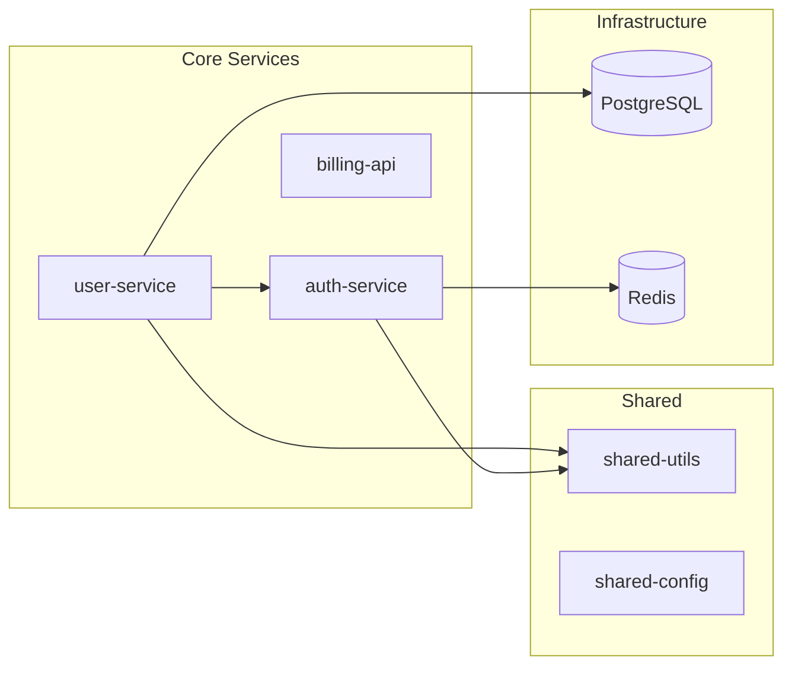

# Present Ecosystem Map

How to present the ecosystem discovery results and get user confirmation.

---

## Overview

Generate a readable ecosystem map, display it to the user, and offer next steps. The map is saved as `ecosystem-map.md` in the starting repo's `.stackshift/` directory.

---

## Step 1: Create `.stackshift/` Directory

```bash
mkdir -p .stackshift
```

---

## Step 2: Generate `ecosystem-map.md`

Write the following structure to `.stackshift/ecosystem-map.md`:

```markdown
# Ecosystem Map

## Starting Point
- **Repo:** {repo_name}
- **Org:** {org_name or "N/A"} {" (auto-detected from git remote)" if auto-detected}
- **Scanned:** {YYYY-MM-DD}
- **Method:** Signal scan{" + GitHub search" if org available}{" + local filesystem scan"}

## Summary

| Metric | Count |
|--------|-------|
| Total repos discovered | {total} |
| CONFIRMED | {confirmed_count} |
| HIGH confidence | {high_count} |
| MEDIUM confidence | {medium_count} |
| LOW confidence | {low_count} |
| Services | {service_count} |
| Libraries | {library_count} |
| Infrastructure | {infra_count} |

## Discovered Repos

| # | Repo | Location | Type | Confidence | Signals |
|---|------|----------|------|------------|---------|
| 1 | {name} | {path or github_url} | {type} | {confidence} | {comma-separated signals} |
| 2 | ... | ... | ... | ... | ... |
...

## Dependency Graph

```mermaid
graph LR
  {for each edge in dependency_graph:}
  {from} --> {to}
```

## Signal Details

### {repo_name_1} ({confidence})
- **Location:** {path}
- **Type:** {service/library/infrastructure}
- **Signals:**
  - {signal_category}: {raw_value} (found in {source_file})
  - ...
- **Dependencies:** calls {list}, imports {list}
- **Depended on by:** {list}

### {repo_name_2} ({confidence})
...

## Discovery Metadata
- **Started:** {timestamp}
- **Duration:** {duration}
- **Signal scanners run:** 10
- **GitHub searches performed:** {count or "N/A"}
- **Local directories scanned:** {count}
```

---

## Step 3: Display Summary to User

Show a concise summary (not the full file):

```
Ecosystem Discovery Complete

Found {total} repos ({confirmed} confirmed, {high} high confidence, {medium} medium, {low} low)

 CONFIRMED:
  {name} — {location}
  ...

 HIGH Confidence:
  {name} — {location} — {top signals}
  ...

 MEDIUM Confidence:
  {name} — {location} — {signals}
  ...

 LOW Confidence:
  {name} — {location} — {signals}
  ...

Dependency graph saved to .stackshift/ecosystem-map.md
```

---

## Step 4: Show Mermaid Diagram

Render the Mermaid dependency graph inline. For readability:

**For < 10 repos:** Show all nodes and edges.

**For 10-20 repos:** Group infrastructure nodes. Use subgraphs for domains if clear groupings exist:



**For 20+ repos:** Show only HIGH and CONFIRMED repos in the main graph. Add a note: "Full graph in .stackshift/ecosystem-map.md"

---

## Step 5: User Confirmation

Present options using AskUserQuestion:

```
Does this ecosystem map look right?

A) Looks good — proceed to handoff
   → I'll set up batch processing for all confirmed repos

B) Add repos — I know of more
   → Tell me repo paths or names to add (CONFIRMED confidence)

C) Remove repos — Some are wrong
   → Tell me which to remove from the list

D) Adjust confidence — Change levels
   → Promote LOW→MEDIUM or MEDIUM→HIGH for specific repos

E) Rescan — Try again with adjustments
   → I'll re-run discovery with your feedback
```

**If user adds repos:** Mark as CONFIRMED confidence, re-merge and update map.

**If user removes repos:** Remove from list, update map and graph.

**If user adjusts confidence:** Update scores, regenerate map.

---

## Step 6: Handoff

After user confirms, create the batch session file and offer next steps.

### Create Batch Session

Write `.stackshift-batch-session.json` in the starting repo's parent directory (or the starting repo itself if it's the root):

```json
{
  "sessionId": "discover-{timestamp}",
  "startedAt": "{iso_date}",
  "batchRootDirectory": "{parent_directory_of_all_repos}",
  "totalRepos": {confirmed_repo_count},
  "batchSize": 5,
  "answers": {},
  "processedRepos": [],
  "discoveredRepos": [
    {
      "name": "{repo_name}",
      "path": "{absolute_local_path}",
      "githubUrl": "{github_url_or_null}",
      "confidence": "{CONFIRMED|HIGH|MEDIUM|LOW}",
      "type": "{service|library|infrastructure|config|tool}",
      "signals": ["{signal1}", "{signal2}"]
    }
  ],
  "ecosystemMapPath": "{path_to_ecosystem-map.md}"
}
```

### Present Next Steps

```
Ecosystem map confirmed with {X} repos. What's next?

A) Run /stackshift.batch on all {X} repos (Recommended)
   → Analyze each repo in parallel, generate specs for each
   → Batch session pre-configured with discovered repos
   → Estimated time: ~{X * 15} minutes

B) Run /stackshift.reimagine
   → Synthesize all repos into a unified capability map
   → Brainstorm a reimagined system architecture
   → Requires reverse-engineering docs (run batch first, or manually)

C) Export ecosystem map only
   → Map saved to .stackshift/ecosystem-map.md
   → Batch session saved for later use
   → Come back anytime with /stackshift.batch

D) Analyze a subset
   → Pick specific repos to process now
   → Save the rest for later
```

**If user chooses A (batch):**
- Confirm the batch session file exists
- Tell the user to run `/stackshift.batch` which will auto-detect the batch session
- The batch session's `discoveredRepos` list will be used as the repo list

**If user chooses B (reimagine):**
- Note that reimagine needs reverse-engineering docs
- Suggest running batch first (Gears 1-2 at minimum)
- Or if docs already exist, proceed directly

**If user chooses C (export only):**
- Confirm map is saved
- Remind user where to find it
- Session file preserved for later

**If user chooses D (subset):**
- Let user pick repos from the confirmed list
- Update batch session with selected subset
- Proceed as with option A

---

## Error Cases

### No repos discovered
```
I scanned {repo_name} but didn't find signals pointing to other repos.

This could mean:
- It's a standalone application with no ecosystem
- Dependencies are managed differently than expected
- The repo uses conventions I didn't recognize

Would you like to:
A) List repos manually — I'll scan them and build the map
B) Try a different starting repo
C) Skip discovery and run /stackshift.analyze on this repo only
```

### Only LOW confidence repos
```
I found {X} potential repos, but all have LOW confidence.
This means they were found via naming patterns or loose matches only.

I'd recommend:
A) Review each one — I'll show details so you can confirm or reject
B) Provide some repo paths manually — I'll cross-reference with signals
C) Skip uncertain repos — proceed with just the starting repo
```

### GitHub search failed (rate limit or auth)
```
GitHub search was skipped (rate limited / not authenticated).

I still found {X} repos via local scan and signal analysis.
Results may be incomplete — re-run later for full discovery.
```
