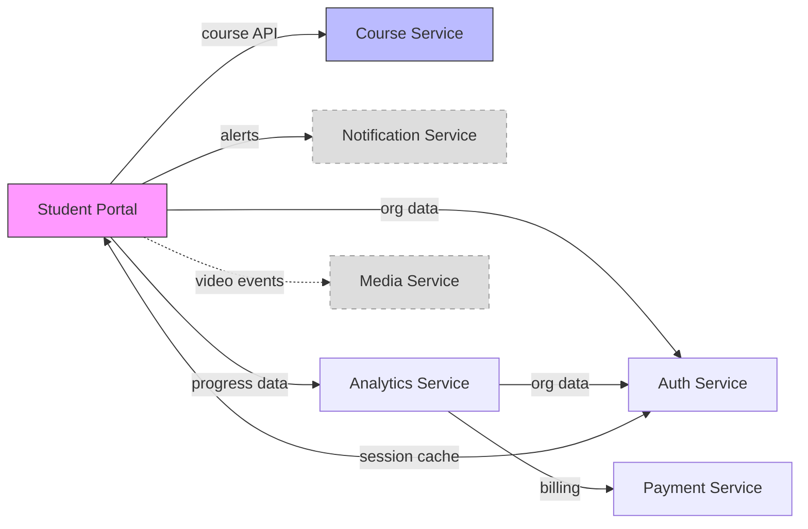

# Integration Analysis

**Discover everything. Analyze how it all fits together. Plan what to build and in what order.**

Give it a few starting points — repos, config dirs, system names. It discovers the full ecosystem by tracing integration surfaces in code and docs, clones repos it doesn't have locally, then thoroughly analyzes how every system works and connects. The output: a phased implementation plan where each layer builds on the last — MVP first, then progressively more capability.

**Estimated Time:** 30-90 minutes (depending on system count, mode, and available inputs)
**Prerequisites:** At least one starting-point repo or config directory
**Output:** Analysis artifacts + dependency-ordered epics in `_integration-analysis/`

---

## When to Use This Skill

Use this skill when:
- You're integrating multiple legacy or new systems into a unified platform
- You need to understand the integration surface between systems (not just individual codebases)
- You want a layered implementation plan instead of a big-bang rewrite
- You need to identify shared data models, API contracts, and dependency chains across systems
- You want to triage capabilities into must-have vs. nice-to-have tiers
- Previous integration attempts failed because context was incomplete

**When NOT to use this skill:**
- Analyzing a single codebase in isolation (use `/stackshift.reverse-engineer` instead)
- Reimagining architecture from scratch (use `/stackshift.reimagine` after this)
- Migrating a single widget (use `/stackshift.widget-migrate` instead)
- Just finding repos without analyzing integration (use `/stackshift.discover` instead)

**Trigger Phrases:**
- "Analyze the integration between these systems"
- "Map the integration surface"
- "How do these systems connect?"
- "Build an integration analysis"
- "Create a layered implementation plan for these systems"
- "What's the dependency chain between these services?"

---

## What This Skill Does

```
  Starting Points         Discover              Analyze                Plan
  ┌──────────────┐       ┌──────────────┐      ┌──────────────┐      ┌──────────────┐
  │ ~/git/my-app │       │ Trace APIs,  │      │ Profile each │      │ L0: Foundation│
  │ ~/.config/   │──────→│ follow deps, │─────→│ system, map  │─────→│ L1: MVP       │
  │ "Auth, API"  │       │ clone repos, │      │ how they fit │      │ L2: Production│
  └──────────────┘       │ build graph  │      │ together     │      │ L3: Complete  │
   You provide a         └──────────────┘      └──────────────┘      └──────────────┘
   few seeds              It finds everything   It understands        You get a phased
                          (in-band + off-band)  the full picture      build plan
```

1. **Discovers** the ecosystem from starting points — traces API clients, config references, event contracts, and documented integration points in code and docs. Clones repos it finds on GitHub but doesn't have locally.
2. **Confirms** the discovered ecosystem with the user — add, remove, or annotate systems
3. **Profiles** each system: capabilities, APIs, data models, config, constraints, pain points
4. **Maps** integration surfaces: shared data, API contracts, capability overlap, end-to-end flows
5. **Registers** pain points at system boundaries and within systems
6. **Tiers** functionality: T1 (day 1) / T2 (production) / T3 (enhancement) / PRUNE
7. **Layers** the implementation plan: L0 Foundation → L1 MVP → L2 Production → L3 Complete — each phase builds on the last, with a dependency matrix showing what's needed at each step

---

## Pipeline Position

```
Discover → integration-analysis → Reimagine
```

- **Discover** answers: "What systems exist?"
- **Integration Analysis** answers: "How do they connect, and what should we build first?"
- **Reimagine** answers: "What should the new system look like?"

This skill bridges the gap between knowing what repos exist and designing a new architecture. It produces the integration intelligence that makes Reimagine dramatically more effective.

---

## Three Modes

### Mode 1: YOLO (Fully Automatic)

**Time:** ~30-45 minutes
**User input:** None after initial system list

- Auto-extracts everything from available sources (code, docs, configs)
- Infers pain points from code patterns and technical debt signals
- Auto-assigns tiers based on dependency analysis and usage patterns
- Marks uncertain items with `[AUTO - review recommended]`
- Generates all 7 artifacts in one shot

**Best for:** Quick assessment, batch processing, when you plan to refine later.

### Mode 2: Guided (Recommended)

**Time:** ~45-60 minutes
**User input:** 5-10 targeted questions

- Auto-extracts high-confidence items from all available sources
- Asks targeted questions about:
  - Ambiguous system boundaries ("Does Course Service own lesson structure or just course metadata?")
  - Pain points ("What's the worst part of integrating with Payment Service?")
  - Tier assignments ("Is real-time progress tracking critical for day 1?")
  - Data ownership conflicts ("Both Auth Service and Course Service have organization metadata — which is authoritative?")
  - Missing context ("I can't find the Notification Service API contract — do you have docs?")
- Generates all 7 artifacts with user input incorporated

**Best for:** Most integration analyses. Good balance of speed and accuracy.

### Mode 3: Interactive

**Time:** ~60-90 minutes
**User input:** Full walkthrough

- Walks through each phase with review and approval
- Presents system inventory for confirmation before profiling
- Shows each system profile for approval before cross-system analysis
- Reviews capability map and contracts interactively
- Collaborates on tier assignments and pain point prioritization
- Most thorough, but slowest

**Best for:** Critical platform migrations, when stakeholder alignment matters, maximum precision.

---

## Process

### Phase 0: KICKOFF

The user provides **starting points**, not a complete system list. The skill discovers the ecosystem from those starting points, then the user confirms or corrects before deep analysis begins.

#### 0.1 Mode Selection

```
How should I run the integration analysis?

A) YOLO — Fully automatic, no questions after setup (~30-45 min)
B) Guided — Auto-extract + 5-10 targeted questions (recommended) (~45-60 min)
C) Interactive — Full walkthrough with review at each phase (~60-90 min)
```

Save selection to state.

#### 0.2 Collect Starting Points

Ask the user for one or more entry points into the ecosystem. These are seeds — the skill will discover the rest.

```
Give me one or more starting points and I'll figure out the ecosystem.
Anything helps — repos, config dirs, system names, docs, context packs.

Examples:
  ~/git/my-app                           (code repo)
  ~/.config/my-platform/                 (config data directory)
  ~/git/my-platform/docs/context/        (context pack docs)
  "Auth, Users, Payments, Notifications" (system names I should look for)
  .stackshift/ecosystem-map.md           (Discover output)
```

Accept any combination of:
- **Code paths** — repos to scan for integration signals
- **Config directories** — config data to parse for system references
- **Context pack paths** — pre-written system summaries
- **Discover output** — ecosystem map from `/stackshift.discover`
- **System names** — names the user knows about (skill will search for repos/docs)
- **Reverse Engineer docs** — existing `docs/reverse-engineering/` directories

#### 0.3 Discover the Ecosystem

From the starting points, discover the full system landscape. This is **integration-aware discovery** — it traces actual API contracts, data flows, and consumer/provider relationships, not just naming patterns.

Discovery works in two bands:

- **In-band:** Deep analysis of locally available codebases and docs. This is the high-confidence path — we can read actual code, trace actual calls, parse actual contracts.
- **Off-band:** GitHub/GitLab searches for systems we've heard of but don't have locally. Lower confidence, but fills gaps and finds repos we can then clone or request access to.

**Step 1: In-band — Analyze integration surfaces in starting-point repos**

For each starting-point repo with local code access, use Task agents in parallel to extract:

| What to Find | Where to Look | What It Reveals |
|--------------|---------------|-----------------|
| **API clients & HTTP calls** | `src/`, service classes, client libraries, `fetch()`/`HttpClient`/`RestTemplate` calls | Systems this repo **consumes** — follow the URLs to find provider systems |
| **API contracts exposed** | Controller classes, route definitions, OpenAPI/Swagger specs, GraphQL schemas | Systems that **consume this repo** — the callers |
| **Service interfaces & SDKs** | Imported client packages, typed API clients, gRPC proto imports | Formalized dependencies on other systems |
| **Config referencing external systems** | `.env*`, `application.yml`, `web.xml`, property files — keys like `*.api.url`, `*.endpoint`, `*.host` | External systems this repo knows about |
| **Database & cache connections** | Connection strings, data source configs, Redis/Memcached config | Shared data stores (if multiple repos point to the same DB/cache) |
| **Event/message contracts** | Queue names, topic ARNs, event payload types, publisher/subscriber setup | Async integration partners — both producers and consumers |
| **Documented integration points** | `docs/`, `README.md`, `integration-points.md`, architecture diagrams, ADRs | Explicitly documented dependencies and consumers |
| **Reverse Engineer docs** (if available) | `docs/reverse-engineering/integration-points.md`, `data-architecture.md` | Pre-analyzed integration surface — highest quality source |

**The key output from this step is a list of discovered systems with their relationship to the starting point:**

```
From Student Portal (starting point), discovered:
  → CONSUMES: Course Service (course API at /api/v2/courses/{courseId})
  → CONSUMES: Auth Service (org data at /api/org/{orgId})
  → CONSUMES: Notification Service (alerts at /api/notifications/{userId})
  → CONSUMES: Analytics Service (progress dashboard data)
  → PUBLISHES TO: Event tracking queue
  → SHARES: session-cache (Redis) with Auth Service
```

**Step 2: In-band — Locate discovered systems locally**

For each newly discovered system name, search for it locally:

```bash
# Check common development directories
SEARCH_DIRS=(
  "$(dirname $STARTING_REPO)"   # Sibling directories
  "$HOME/git"
  "$HOME/code"
  "$HOME/src"
  "$HOME/repos"
)

# Also check Discover output if available
# Also check user-provided config directories
```

**If found locally:** The discovered system becomes a new starting point — repeat Step 1 on it. This is **recursive discovery**: Student Portal → finds Analytics Service → Analytics Service's code reveals Media Service → Media Service's code reveals CDN config.

**Recursion depth:** Max 2 hops from user-provided starting points. Beyond that, present what was found and ask the user if they want to go deeper.

**Step 3: In-band — Analyze config data directories**

For user-provided config directories (e.g., `~/.config/my-platform/`):

- Parse config files (XML, YAML, JSON, properties) for:
  - Service endpoint references (URLs, hostnames, ports)
  - Data source references (DB connection strings, cache endpoints)
  - Feature flags referencing external system capabilities
  - Override keys that imply a configuration hierarchy or external data model
- Cross-reference discovered service names with config keys

**Step 4: In-band — Analyze context packs and existing docs**

For user-provided context packs or reverse-engineering docs:

- Extract explicitly mentioned systems from integration sections
- Note API contracts described (endpoints, payloads, auth)
- Extract data flow descriptions (which system sends what to whom)
- Identify consumers and providers mentioned in the docs

**Step 5: Off-band — GitHub/GitLab search for unfound systems**

For systems discovered in Steps 1-4 that have **no local code access**:

- Auto-detect GitHub org from starting-point repos' git remotes
- Search GitHub for matching repo names:
  ```
  gh api search/repositories -f q="org:{org} {system-name}"
  gh api search/code -f q="org:{org} {system-name} filename:pom.xml OR filename:package.json"
  ```
- Search for API contract artifacts:
  ```
  gh api search/code -f q="org:{org} {system-name} filename:swagger OR filename:openapi"
  ```
- Check if discovered API URLs appear in other repos (reveals additional consumers)

**Auto-clone for deeper analysis:**

When off-band search finds a repo, clone it locally so it becomes available for full in-band analysis:

```bash
# Clone to a workspace directory alongside the starting-point repos
CLONE_DIR="$(dirname $STARTING_REPO)"
gh repo clone "{org}/{repo-name}" "$CLONE_DIR/{repo-name}"
```

- **In YOLO mode:** Auto-clone all discovered repos, then re-run Step 1 on them.
- **In Guided mode:** List discovered repos and ask: "I found these on GitHub. Clone them for full analysis? (Y/n per repo)"
- **In Interactive mode:** Present each repo and ask before cloning.

After cloning, the system upgrades from off-band (LOW/MEDIUM confidence) to in-band (HIGH confidence) — the newly cloned repo becomes another starting point for recursive discovery in Step 2.

**If cloning fails** (permissions, private repo, archived): Note the system as `[NO CODE ACCESS - clone failed]` and continue with whatever was discoverable from consumer-side code and off-band search results.

**Step 6: Build the ecosystem graph**

Merge all discovery results into a single ecosystem graph:

- **Nodes:** Each discovered system
- **Edges:** Consumer/provider relationships with protocol and data type
- **Confidence per node:** Based on how it was discovered and what inputs are available
- **Confidence per edge:** Based on evidence (traced API call = HIGH, env var = MEDIUM, naming pattern = LOW)

**Confidence scoring:**

| Level | Criteria |
|-------|----------|
| **CONFIRMED** | User-provided starting point, or user explicitly added it |
| **HIGH** | Found via in-band integration tracing from 2+ independent sources (e.g., API client code + config endpoint + documented dependency) |
| **MEDIUM** | Found via single in-band source (e.g., one env var referencing it, or one import) OR found locally after off-band hint |
| **LOW** | Found only via off-band search (GitHub name match) or naming pattern, no integration evidence |

#### 0.4 Present Discovered Ecosystem

Present the discovered ecosystem as a graph of systems and their relationships:

```
Starting from {N} starting points, I traced integration surfaces and discovered {M} systems:

| # | System | Confidence | Local Code | Config | Docs | Relationship |
|---|--------|-----------|-----------|--------|------|--------------|
| 1 | Student Portal | CONFIRMED | ~/git/student-portal | - | - | Starting point |
| 2 | Course Service | HIGH | ~/git/course-service | ~/.config/edu-platform/ | - | Student Portal consumes course API |
| 3 | Auth Service | HIGH | ~/git/auth-service | - | - | Student Portal + Payment Service consume auth data |
| 4 | Analytics Service | HIGH | ~/git/analytics-service | - | - | Student Portal consumes aggregated data |
| 5 | Notification Svc | MEDIUM | - | - | - | Student Portal triggers notifications (no local code found) |
| 6 | Payment Svc | MEDIUM | ~/git/payment-service | - | - | Analytics Service consumes billing data |
| 7 | Media Service | LOW | - | - | - | GitHub search only — Student Portal streams video from it |

Integration edges discovered:
  Student Portal →(REST)→ Course Service: course catalog delivery
  Student Portal →(REST)→ Auth Service: org settings and roles
  Student Portal →(REST)→ Notification Svc: push notifications
  Student Portal →(REST)→ Analytics Service: progress dashboard
  Analytics Service →(REST)→ Auth Service: org metadata
  Analytics Service →(REST)→ Payment Svc: subscription data
  Student Portal →(event)→ Media Service: video playback events
  Student Portal ↔(Redis)↔ Auth Service: session cache
```



```
Dashed = no local code access

Does this ecosystem look right?
A) Looks good — proceed with all {M} systems
B) Add systems — I'm missing some
C) Remove systems — some aren't relevant (e.g., Media Service is out of scope)
D) Add context — I have more info for some of these (code path, docs, notes)
E) Go deeper — discover from the newly found repos too
```

**Correction loop:** The user can add, remove, or annotate systems. Option E re-runs discovery from newly found repos (expands the frontier). Each round re-presents the graph until the user confirms.

**In YOLO mode:** Auto-include CONFIRMED + HIGH, include MEDIUM with `[AUTO - review recommended]`, drop LOW. Skip confirmation.

**For confirmed systems, collect notes if offered:**
```
Any context about these systems I should know? (optional, press enter to skip)

For example:
- "Course Service owns the curriculum hierarchy, 4 levels of content nesting"
- "Notification Service has no code access, but here's the API doc: ~/docs/notification-api.md"
- "Media Service is out of scope, remove it"
- "You're missing the Payment Service — it's at ~/git/payment-service/"
```

#### 0.5 Save State and Proceed

Save the confirmed system list and all available inputs to `.stackshift-state.json`:

```json
{
  "integration-analysis": {
    "status": "in_progress",
    "phase": 0,
    "mode": "guided",
    "systems": [
      {
        "name": "Course Service",
        "confidence": "CONFIRMED",
        "code_path": "~/git/course-service",
        "config_path": "~/.config/edu-platform/",
        "re_docs_path": null,
        "context_pack_path": null,
        "notes": "Owns curriculum hierarchy, 4-level content nesting model",
        "discovered_via": "user_provided"
      },
      {
        "name": "Auth Service",
        "confidence": "HIGH",
        "code_path": "~/git/auth-service",
        "config_path": null,
        "re_docs_path": null,
        "context_pack_path": null,
        "notes": "Organization metadata and SSO",
        "discovered_via": "course_service_refs + portal_imports"
      }
    ],
    "systems_total": 6,
    "started_at": "2026-02-19T10:00:00Z"
  }
}
```

---

### Phase 1: INVENTORY

**Input:** System list from Phase 0
**Output:** `system-inventory.md`

Phase 1 enriches the raw system list from Phase 0 into a structured inventory with metadata, roles, and relationships.

1. **Auto-detect metadata** for systems with code access:
   - Technology stack (scan `package.json`, `pom.xml`, `go.mod`, etc.)
   - Repo status (check git activity — recent commits = active, years old = legacy)
   - Monorepo detection (workspace configs)
   - Brief description (from README or package description)

2. **Import metadata** for systems from Discover output:
   - Confidence scores and signal details
   - Dependency hints from ecosystem map

3. **Enrich with user-provided notes** from Phase 0 (e.g., "Owns curriculum catalog hierarchy")

4. **Classify system roles:**
   - **Source of truth**: Owns canonical data (e.g., Course Service owns curriculum catalog)
   - **Consumer**: Reads data from other systems
   - **Transformer**: Takes input, produces different output
   - **Orchestrator**: Coordinates between other systems
   - **Gateway**: External-facing API surface

5. **Generate `_integration-analysis/system-inventory.md`** with:
   - Per-system metadata table (name, tech stack, status, owner, role)
   - Available inputs summary (what we have to work with per system)
   - Initial dependency hints (from imports, config references, or Discover signals)

**In Guided/Interactive mode:** Present enriched inventory and ask:
```
Here's the enriched inventory for {N} systems:

[table with name, tech stack, status, role, available inputs]

Does this look right?
A) Looks good — proceed to profiling
B) Add systems — I'm missing some
C) Remove systems — some aren't relevant
D) Adjust roles/metadata — correct something
```

### Phase 2: SYSTEM PROFILING

**Input:** Per-system code repos, config data, Reverse Engineer docs (optional)
**Output:** `system-profiles/{name}.md` (one per system)

**This phase is parallelizable** — use Task agents to profile multiple systems concurrently.

Follow the detailed process in `operations/system-profiling.md`.

For each system, extract:
- **Capabilities**: What business functions does this system provide?
- **API surface**: REST endpoints, GraphQL schemas, event topics, gRPC services
- **Data models**: Types, schemas, entities, enums, and their relationships
- **Config structures**: What's configurable, override patterns, hierarchy
- **Integration points**: Outbound calls, event publishing, shared data stores
- **Override/inheritance patterns**: How config cascades, what's overridable
- **Auth model**: How the system authenticates and authorizes
- **Constraints**: Rate limits, data size limits, latency requirements, known limitations
- **Pain points**: Technical debt, known issues, developer frustrations

**Input flexibility — uses what's available:**

| Input | How to Use |
|-------|-----------|
| Code repository | Direct extraction: scan routes, models, config, imports |
| Reverse Engineer docs | Read `integration-points.md`, `data-architecture.md`, `functional-specification.md`, `technical-debt-analysis.md` |
| Platform config data | Parse XML configs for override patterns, field inventories, hierarchy |
| API documentation | Extract endpoints, contracts, auth requirements |
| Developer knowledge | Guided/Interactive mode questions fill gaps |

**Generate `_integration-analysis/system-profiles/{name}.md`** for each system.

### Phase 3: CROSS-SYSTEM ANALYSIS

**Input:** All system profiles from Phase 2
**Output:** `capability-map.md`, `integration-contracts.md`, `data-architecture.md`

Follow the detailed process in `operations/cross-system-mapping.md`.

#### 3.1 Capability Mapping

Map business capabilities across system boundaries:
- Which systems participate in each capability?
- Where is the primary logic? Where are secondary participants?
- What capabilities span 3+ systems (high integration complexity)?
- What capabilities exist in only one system (low risk)?

#### 3.2 Integration Contract Documentation

For each system-to-system integration:
- Protocol (REST, GraphQL, event, shared DB, file, SDK)
- Data format (JSON, XML, protobuf, CSV)
- Authentication method
- Request/response schemas
- Error handling patterns
- Known issues and workarounds

#### 3.3 Shared Data Model Analysis

Identify data that appears in multiple systems:
- Same entity, different representations (e.g., "organization" in Course Service vs Auth Service)
- Field-level mapping between representations
- Conflicts (different types, different constraints, different defaults)
- Source of truth for each field
- Transformation rules between representations

#### 3.4 End-to-End Flow Tracing

Trace key user journeys across system boundaries:
- Course page flow: request → course data → lesson layout → media → progress → response
- Curriculum update flow: admin change → course update → cache invalidation → portal refresh
- Integration flow: external event → system A → system B → user-visible result

#### 3.5 Dependency Matrix

Build a matrix showing which systems depend on which:
- Direct dependencies (API calls, imports)
- Data dependencies (shared databases, config)
- Implicit dependencies (assumptions about data format, timing)

**Generate three artifacts:**
- `_integration-analysis/capability-map.md`
- `_integration-analysis/integration-contracts.md`
- `_integration-analysis/data-architecture.md`

### Phase 4: PAIN & FUNCTIONALITY TIERING

**Input:** Cross-system analysis + user/developer input
**Output:** `pain-registry.md`, `functionality-tiers.md`

Follow the detailed process in `operations/functionality-tiering.md`.

#### 4.1 Pain Registry

Catalog pain points from two sources:
- **Per-system pain**: Extracted from tech debt analysis, code patterns, developer input
- **Integration boundary pain**: Identified from cross-system analysis — data mismatches, contract violations, missing error handling, tight coupling, workarounds

For each pain point:
- Description and evidence
- Systems affected
- Severity (critical / major / minor)
- Current workaround (if any)
- Innovation opportunity (could the new platform solve this elegantly?)

#### 4.2 Functionality Tiering

For each capability identified in the capability map:

| Tier | Criteria | Examples |
|------|----------|---------|
| **T1** (must have day 1) | Core functionality, no viable workaround, blocks other tiers | Course browsing, org settings, basic lesson display |
| **T2** (needed for production) | Required for real users, but can launch without temporarily | Advanced search, analytics, progress tracking |
| **T3** (enhancement) | Nice to have, improves experience, not blocking | A/B testing, advanced caching, admin tools |
| **PRUNE** | Deprecated, unused, or superseded by new platform capabilities | Legacy workarounds, dead code paths, obsolete integrations |

**In Guided mode:** Present auto-assigned tiers and ask targeted questions:
```
I've auto-assigned tiers based on dependency analysis. Here are the ones I'm least confident about:

1. [Capability X] — I assigned T2 but it might be T1. Is this needed for day 1?
2. [Capability Y] — This looks unused but I'm not sure. PRUNE or T3?
3. [Capability Z] — Used by 2 systems but has a workaround. T1 or T2?
```

**Generate two artifacts:**
- `_integration-analysis/pain-registry.md`
- `_integration-analysis/functionality-tiers.md`

### Phase 5: IMPLEMENTATION LAYERS

**Input:** Tiered capabilities + dependency matrix
**Output:** `implementation-layers.md`

#### 5.1 Layer Assembly

Build implementation layers from tiered capabilities and dependencies:

| Layer | Purpose | Contents |
|-------|---------|----------|
| **L0: Foundation** | Shared infrastructure and core contracts | Type system, course service, auth, shared data models, API contracts |
| **L1: Proof** | Minimum viable integration — proves the architecture works | T1 capabilities for 1-2 key flows, end-to-end through all systems |
| **L2: Production** | Full T1 + T2 — ready for real users | All must-have and production-required capabilities |
| **L3: Complete** | T3 enhancements + optimization | Enhancement capabilities, performance optimization, admin tools |

#### 5.2 Dependency Matrix

For each layer, show:
- What capabilities are included
- What capabilities from previous layers are prerequisites
- What system integrations are activated
- Coverage percentage (capabilities implemented / total capabilities)

#### 5.3 Critical Path Analysis

Identify the critical path through the dependency matrix:
- Which capabilities must be built first (most things depend on them)?
- Which integrations are highest risk (most complex, least documented)?
- Where are the "pinch points" where one team's work blocks many others?

**Generate `_integration-analysis/implementation-layers.md`**

### Phase 6: EPIC/STORY GENERATION (Optional)

**Input:** Implementation layers + system profiles + capability map
**Output:** `_integration-analysis/epics/` directory with technology-agnostic epics and stories

This phase bridges integration analysis into actionable development work. It uses the same technology-agnostic extraction approach as `/stackshift.portable-extract` — but instead of extracting from a single codebase, it generates epics from the **layered implementation plan** across the entire ecosystem.

#### 6.1 Layer → Epic Mapping

Each implementation layer becomes one or more epics:

| Layer | Epic Pattern |
|-------|-------------|
| **L0: Foundation** | Epic per shared concern: "Establish shared type system", "Implement course service", "Set up auth infrastructure" |
| **L1: MVP** | Epic per end-to-end flow: "Basic course page flow (Student Portal → Course Service → content)", "Core progress display (Analytics Service → Course Service)" |
| **L2: Production** | Epic per capability cluster: "Full org settings", "Complete payment integration", "Search and filtering" |
| **L3: Complete** | Epic per enhancement area: "Analytics integration", "Admin tooling", "Performance optimization" |

#### 6.2 Story Generation

For each epic, generate stories that are:

- **Technology-agnostic** — no framework names, no implementation details, just business capability and integration behavior
- **Dependency-ordered** — stories within an epic are ordered by the dependency matrix (build the thing other things depend on first)
- **Cross-system aware** — stories that span system boundaries explicitly state which systems participate and what data flows between them
- **Testable** — each story has acceptance criteria that can be verified at the integration level

**Story template:**
```markdown
### STORY-{layer}-{number}: {Title}

**Systems:** {list of systems involved}
**Depends on:** {STORY IDs that must be complete first}
**Tier:** {T1/T2/T3}

**As a** [User/Admin/System]
**I need** {capability}
**So that** {business value}

**Acceptance Criteria:**
- [ ] {System A} provides {data/capability} to {System B} via {contract from integration-contracts.md}
- [ ] {Business rule from capability map}
- [ ] {Data flows correctly per data-architecture.md}
- [ ] {Pain point PAIN-NNN is addressed}

**Integration notes:**
- Data: {which shared entities are involved, from data-architecture.md}
- Contract: {which integration contract governs this, from integration-contracts.md}
- Risk: {any pain points or known issues from pain-registry.md}
```

#### 6.3 Cross-Referencing

Every story references artifacts from earlier phases:
- **Capability IDs** from `capability-map.md`
- **Contract IDs** from `integration-contracts.md`
- **Pain point IDs** from `pain-registry.md`
- **Data entity references** from `data-architecture.md`

This traceability means a developer can follow any story back to the integration analysis that motivated it.

#### 6.4 Output Structure

```
_integration-analysis/epics/
  L0-foundation/
    epic-shared-types.md
    epic-course-service.md
    epic-auth-infrastructure.md
  L1-mvp/
    epic-basic-course-page.md
    epic-core-progress.md
  L2-production/
    epic-full-org-settings.md
    epic-complete-payments.md
    epic-search-filtering.md
  L3-complete/
    epic-analytics.md
    epic-admin-tools.md
    epic-performance.md
  story-dependency-graph.md    # Mermaid graph showing story ordering across all layers
  coverage-matrix.md           # Which capabilities are covered by which stories
```

#### 6.5 BMAD Handoff

The generated epics and stories are designed to feed directly into BMAD:
- Copy `_integration-analysis/epics/` into `_bmad-output/planning-artifacts/`
- Epics map to BMAD epics, stories map to BMAD user stories
- Layer ordering maps to sprint/phase planning
- The dependency graph informs sprint sequencing — never schedule a story before its dependencies

**Alternatively**, use `/stackshift.bmad-synthesize` with the integration analysis artifacts as input for a more automated BMAD artifact generation.

**In Guided mode:** Ask before generating:
```
The implementation layers are ready. Want me to generate technology-agnostic epics and stories from them?

A) Yes — generate epics/stories for all layers
B) Yes, but only L0 + L1 — I'll plan L2/L3 later
C) No — I'll use the implementation layers to plan manually
```

**In YOLO mode:** Auto-generate for all layers.

### Phase 7: RECONCILIATION

**Input:** Tech-agnostic epics from Phase 6 + target project's existing planning artifacts
**Output:** `_integration-analysis/reconciliation-report.md`, `_integration-analysis/open-questions.md`

This is the critical thinking phase. The target project already has a plan — a PRD, architecture, maybe epics and stories. The integration analysis has just produced a ground-truth picture of what the existing platform actually does, how systems actually connect, and what it actually takes to build. These two pictures will disagree. Phase 7 confronts the plan with reality, surfaces every gap and conflict, and works through the hard questions with the team.

#### 7.1 Read the Target Project's Existing Plan

Ask for the target project path:

```
Where is the target project we're planning for?

Target: ~/git/my-platform
```

Read all available planning artifacts:
- `_bmad-output/planning-artifacts/prd.md` — product requirements, personas, business goals
- `_bmad-output/planning-artifacts/architecture.md` — tech stack, service boundaries, ADRs, design decisions
- `_bmad-output/planning-artifacts/ux-design-specification.md` — design system, UI patterns, component library
- `_bmad-output/planning-artifacts/epics.md` — existing epics and stories
- `_bmad-output/implementation-artifacts/sprint-status.yaml` — what's already been built
- `.specify/memory/constitution.md` — Spec Kit constitution (if using Spec Kit)
- `CLAUDE.md`, `README.md` — project conventions, coding standards
- `docs/reference/` — any reference documentation already written

Also detect the actual tech stack from code:
- `package.json`, `tsconfig.json`, framework configs
- Existing type definitions, shared packages, implemented services
- What's already been built vs. what's just planned

#### 7.2 Compare: Existing Plan vs. Discovered Reality

Systematically compare the two pictures across every dimension:

**Scope comparison:**
| Question | Existing Plan Says | Integration Analysis Says | Gap |
|----------|-------------------|--------------------------|-----|
| How many systems are in play? | {from PRD/arch} | {from system inventory} | Missing systems? Extra systems? |
| What capabilities are in scope? | {from epics} | {from capability map} | Capabilities the plan missed? Capabilities the plan assumed that don't exist? |
| What data models are needed? | {from architecture} | {from data-architecture.md} | Models the plan got wrong? Fields missing? Conflicts not addressed? |
| What integrations are required? | {from architecture} | {from integration-contracts.md} | Integrations the plan didn't account for? Assumed integrations that don't exist? |

**Assumption validation:**
- Does the architecture assume a data model that doesn't match reality?
- Does the PRD assume capabilities that require systems not in the plan?
- Do the epics assume integration patterns that don't exist in the legacy platform?
- Does the plan account for the override/inheritance patterns discovered in Phase 2?
- Does the plan address the pain points discovered in Phase 4?

**Coverage gaps:**
- Capabilities discovered in the integration analysis that have NO corresponding epic in the existing plan
- Integration contracts that have NO corresponding story (who builds the adapter?)
- Data model conflicts that have NO resolution strategy in the architecture
- Pain points that have NO mitigation in any existing epic

**Over-planning:**
- Epics/stories in the existing plan for capabilities that should be PRUNED
- Architecture decisions that assume systems work differently than they actually do
- Unnecessary abstractions planned for things that are simpler in reality

**Sequencing conflicts:**
- Does the existing plan build things in an order that respects the dependency matrix?
- Are there epics planned early that depend on integrations planned later?
- Does the plan's phasing align with the L0→L1→L2→L3 layers from Phase 5?

#### 7.3 Surface Open Questions

For every gap, conflict, and incorrect assumption — formulate a clear question that needs a team decision:

```markdown
### Category: Scope

Q1: The plan doesn't account for Notification Service integration.
    Discovery found Student Portal calls Notification Service for all user alerts.
    - Option A: Add Notification Service integration to L1 (it's on the critical path for engagement)
    - Option B: Skip notifications in L1, add Notification Service in L2
    - Option C: The new platform handles notifications differently — explain how

Q2: The plan includes an "Analytics Dashboard" epic but the legacy platform
    has no analytics system — this is a net-new capability.
    - Option A: Keep it, but move to L3 (not needed for MVP)
    - Option B: Remove it entirely — out of scope for platform migration
    - Option C: Keep it in L2 — it's a key differentiator

### Category: Data Model

Q3: The architecture assumes a single canonical Organization type, but Course Service and Auth Service
    have fundamentally different org models (string ID vs numeric ID,
    different field sets). The plan has no story for reconciling them.
    - Option A: Build an adapter layer that maps both to a canonical type
    - Option B: Pick one as authoritative, migrate the other
    - Option C: Keep both, with a mapping table

### Category: Sequencing

Q4: Epic 3 (Course Page Layout) depends on Course Service delivery, but Epic 2
    (Course Service) doesn't include real course data integration — it only has stub data.
    When does real course data integration happen?
    - Option A: Add course data integration to Epic 2 (expand scope)
    - Option B: Add a new Epic 2.5 for course data integration between Course Service and Layout
    - Option C: Epic 3 uses stub data too, real course data integration comes in Epic 4

### Category: Pain Points

Q5: PAIN-001 (org ID type mismatch) causes ~0.1% silent failures today.
    The architecture doesn't address this. When should it be fixed?
    - Option A: L0 Foundation — fix it in the type system from day 1
    - Option B: L1 MVP — handle it in the BFF adapter
    - Option C: Accept the same workaround the legacy platform uses (try/catch)
```

**In YOLO mode:** Generate all questions with recommended answers (Option A/B/C with rationale), mark as `[AUTO - team review required]`. Proceed to Phase 8 using the recommended answers.

**In Guided mode:** Present the most critical questions (top 5-10) and ask the team. Auto-answer lower-priority ones with `[AUTO]` markers.

**In Interactive mode:** Walk through every question with the team. Don't proceed until all are resolved.

#### 7.4 Output

**`_integration-analysis/reconciliation-report.md`:**
```markdown
# Reconciliation Report

## Target Project
- **Path:** ~/git/my-platform
- **Planning docs found:** PRD, Architecture, UX Spec, Epics (7 epics, 34 stories)
- **Already implemented:** Epic 1 (complete), Epic 2 (in progress)

## Comparison Summary
| Dimension | Plan | Reality | Delta |
|-----------|------|---------|-------|
| Systems in scope | 4 | 7 | +3 missing from plan |
| Capabilities planned | 28 | 42 | +14 unplanned capabilities |
| Integration contracts | 5 | 12 | +7 unaccounted integrations |
| Data model conflicts | 0 acknowledged | 4 found | 4 need resolution |
| Pain points addressed | 2 | 11 | 9 unaddressed |

## Detailed Findings

### What the plan gets right
{List of things that align well}

### What the plan is missing
{Capabilities, integrations, data model issues not in the plan}

### What the plan gets wrong
{Incorrect assumptions about how systems work}

### What the plan over-plans
{Things that should be pruned or simplified based on reality}

### Sequencing issues
{Dependency violations in the current epic ordering}
```

**`_integration-analysis/open-questions.md`:**
```markdown
# Open Questions for Team Review

## Critical (must answer before proceeding)
{Questions that block the go-forward plan}

## Important (should answer for L1/L2 planning)
{Questions that affect scope and sequencing}

## Deferrable (can answer later)
{Questions that only affect L3 or can be resolved during implementation}
```

### Phase 8: GO-FORWARD PLAN

**Input:** Reconciliation answers + tech-agnostic epics + target project context
**Output:** `_integration-analysis/go-forward-plan/` — the actual, holistic, implementation-ready plan

This is the final output. It merges everything: the integration analysis findings, the reconciliation decisions, the target project's tech stack and conventions, and the existing work already done. The result is a complete, phased, implementation-ready plan with epics and stories.

#### 8.1 Merge All Inputs

Combine:
- **Tech-agnostic epics** from Phase 6 — the ground-truth capabilities needed
- **Reconciliation decisions** from Phase 7 — team answers to scope, sequencing, and data model questions
- **Target project context** — PRD, architecture, UX spec, tech stack, conventions
- **Existing work** — what's already built, what epics/stories already exist
- **PRUNE list** — capabilities explicitly excluded

#### 8.2 Produce Holistic Epic/Story Plan

For each implementation layer, generate targeted epics that:

- **Respect the target's tech stack** — React Router 7 loaders, GraphQL resolvers, design system components, Zod schemas (whatever the target uses)
- **Follow the target's architecture** — which service handles what, where types live, how data flows per the architecture doc
- **Match the target's UX spec** — design system components, patterns, and tokens
- **Incorporate reconciliation decisions** — the team's answers to Phase 7 questions are baked in
- **Build on existing work** — reference already-implemented epics, extend existing stories, don't duplicate
- **Respect the dependency matrix** — stories are ordered so prerequisites come first
- **Address pain points** — stories that resolve specific PAIN-NNN items are tagged

**Story template (implementation-ready):**
```markdown
### STORY-{layer}-{number}: {Title}

**Epic:** {epic name}
**Systems:** {list of systems involved}
**Depends on:** {STORY IDs that must be complete first}
**Addresses:** {PAIN-NNN if applicable}
**Reconciliation:** {Q-NNN decision that informed this story, if applicable}

**As a** {persona from PRD}
**I need** {capability}
**So that** {business value from PRD}

**Acceptance Criteria:**
- [ ] {Specific to target tech stack — e.g., "GraphQL query returns OrgSettings type"}
- [ ] {Specific to target architecture — e.g., "course-service caches in Redis with 5min TTL"}
- [ ] {Specific to target UX — e.g., "Renders using CoursePage with org theme tokens"}
- [ ] {Integration assertion — e.g., "Course endpoint returns valid response for test org 12345"}

**Implementation notes:**
- Service: {which service in the target monorepo}
- Types: {which shared-types to use/create}
- Tests: {what to test, per target's testing conventions}
```

#### 8.3 Integrate with Existing Plan

If the target project already has epics:

- **Merge, don't replace** — keep existing epic IDs and structure where they still make sense
- **Extend** — add new stories to existing epics for integration capabilities the original plan missed
- **Reorder** — adjust epic/story sequencing based on the dependency matrix
- **Remove** — mark stories that should be pruned (with rationale from reconciliation)
- **Add** — create new epics for capabilities the original plan didn't account for
- **Annotate** — add integration context to existing stories (e.g., "this story also needs to handle the Course Service string-vs-numeric ID conflict per Q3 decision")

#### 8.4 Output

```
_integration-analysis/go-forward-plan/
  plan-summary.md                     # Executive summary: what changed, what's new, phasing overview
  L0-foundation/
    epic-shared-types.md              # Zod schemas, shared-types package, canonical data models
    epic-course-service.md            # GraphQL schema, Redis cache, course data integration
    epic-auth-infrastructure.md       # OAuth, JWT, service-to-service auth
  L1-mvp/
    epic-basic-course-page.md         # React Router 7, layout components, Student Portal→Course Service→content flow
    epic-core-progress.md             # ProgressBar component, Analytics Service→Course Service integration
  L2-production/
    epic-full-org-settings.md         # Complete org settings hierarchy, all override patterns
    epic-complete-payments.md         # Search, filtering, all subscription features
    epic-notification-integration.md  # Notification Service, alerts and engagement
  L3-complete/
    epic-analytics.md                 # If kept per reconciliation decision
    epic-admin-tools.md
    epic-performance.md
  dependency-graph.md                 # Mermaid graph: full story ordering across all layers
  coverage-matrix.md                  # Capabilities → stories mapping, 100% coverage verification
  reconciliation-decisions.md         # Record of all team decisions from Phase 7 (for posterity)
  delta-from-existing-plan.md         # What changed from the original plan: added, removed, reordered, modified
```

**`plan-summary.md` includes:**
```markdown
# Go-Forward Plan Summary

## What Changed from the Original Plan
- **Added:** {N} new epics, {M} new stories (for capabilities the original plan missed)
- **Modified:** {N} existing stories (integration context added)
- **Reordered:** {N} stories moved earlier/later based on dependency analysis
- **Removed:** {N} stories pruned (with rationale)
- **New phase structure:** L0 → L1 → L2 → L3 (was: Epic 1-7 linear)

## Phasing Overview
| Phase | Epics | Stories | Coverage | Milestone |
|-------|-------|---------|----------|-----------|
| L0: Foundation | 3 | 12 | 15% | Shared infra works, types defined, auth functional |
| L1: MVP | 2 | 18 | 40% | Basic course page renders end-to-end |
| L2: Production | 4 | 28 | 80% | Full feature set, ready for real organizations |
| L3: Complete | 3 | 14 | 100% | Enhancements, optimization, admin tools |

## Key Decisions Made (from Reconciliation)
{Summary of team decisions from Phase 7, linked to Q-NNN IDs}

## Known Risks
{From pain registry + reconciliation, things the team should watch for}
```

**In Guided mode:** Present the plan summary and ask:
```
Here's the go-forward plan. It modifies the existing plan based on what we
discovered about the real platform:

{summary}

Does this look right?
A) Looks good — write the full plan to _integration-analysis/go-forward-plan/
B) Adjust — let's discuss specific changes before finalizing
C) Re-reconcile — I have new information that changes some Phase 7 answers
```

---

## Output Artifacts

All artifacts written to `_integration-analysis/` directory:

| # | File | Phase | Description |
|---|------|-------|-------------|
| 1 | `system-inventory.md` | 1 | Master list of all systems with metadata, ownership, locations, roles |
| 2 | `system-profiles/{name}.md` | 2 | Per-system profile: capabilities, APIs, data models, config, constraints, pain points |
| 3 | `capability-map.md` | 3 | Business capabilities mapped across systems — which systems participate in each |
| 4 | `integration-contracts.md` | 3 | API surfaces between systems, data flows, shared models, protocol details |
| 5 | `data-architecture.md` | 3 | Cross-system data model analysis: shared entities, conflicts, source of truth, transformations |
| 6 | `pain-registry.md` | 4 | Developer pain points per system AND at integration boundaries, with innovation opportunities |
| 7 | `functionality-tiers.md` | 4 | Per-capability triage: T1/T2/T3/PRUNE with rationale and dependency info |
| 8 | `implementation-layers.md` | 5 | Layered build plan: L0 → L1 → L2 → L3 with dependency matrix and coverage percentages |
| 9 | `epics/{layer}/*.md` | 6 | Technology-agnostic epics and stories per layer, dependency-ordered, cross-system aware |
| 10 | `epics/story-dependency-graph.md` | 6 | Mermaid graph showing story ordering across all layers |
| 11 | `epics/coverage-matrix.md` | 6 | Which capabilities are covered by which stories |
| 12 | `reconciliation-report.md` | 7 | Plan vs. reality comparison: gaps, conflicts, incorrect assumptions, over-planning |
| 13 | `open-questions.md` | 7 | Prioritized questions for the team to resolve before finalizing the plan |
| 14 | `go-forward-plan/plan-summary.md` | 8 | Executive summary: phasing, what changed, key decisions, risks |
| 15 | `go-forward-plan/{layer}/*.md` | 8 | Implementation-ready epics/stories in target tech stack, incorporating all reconciliation decisions |
| 16 | `go-forward-plan/delta-from-existing-plan.md` | 8 | What changed from the original plan and why |

---

## Input Flexibility — Uses What's Available

This skill is designed to work with whatever context is available. More input = better output, but it gracefully degrades:

| Input | Source | Benefit |
|-------|--------|---------|
| Ecosystem map | `/stackshift.discover` output | Pre-built system inventory with repo locations |
| Reverse engineering docs | `/stackshift.reverse-engineer` (11 docs per system) | Deep per-system context: APIs, data models, integration points, tech debt |
| Real config data | User-provided paths (e.g., `~/.config/my-platform/`) | Ground truth for data models, override patterns, field inventories |
| Code repositories | User-provided paths | Direct API/model/config extraction |
| API documentation | User-provided docs, OpenAPI specs, wiki pages | Contract details, auth requirements |
| Developer pain points | User-provided or interactive mode | Pain registry input, tier validation |

**Minimum viable input:** System names + code paths for at least 2 systems.

**Ideal input:** Discover output + Reverse Engineer docs per system + real config data + developer knowledge.

---

## Integration with Other Skills

### Consumes from Discover (`/stackshift.discover`)
- Ecosystem map with repo locations and dependency graph
- System list with confidence scores
- Pre-built signal analysis

### Consumes from Reverse Engineer (`/stackshift.reverse-engineer`)
- `integration-points.md` — external services, APIs, data flows (feeds Phase 2 profiling)
- `data-architecture.md` — data models, API contracts, domain boundaries (feeds Phase 2 + 3)
- `functional-specification.md` — business logic, requirements (feeds Phase 2 capabilities)
- `technical-debt-analysis.md` — pain points, migration priorities (feeds Phase 4 pain registry)
- `configuration-reference.md` — config patterns (feeds Phase 2 config structures)

### Feeds into Reimagine (`/stackshift.reimagine`)
- Capability map = premium input for Reimagine's capability extraction (Step 3)
- Integration contracts = pre-built dependency graph (Step 3.4)
- Pain registry = pre-built pain points (Step 3.3)
- Functionality tiers = informed consolidation decisions (Step 5)

### Feeds into BMAD (two paths)

**Path A: Direct epic generation (Phase 6)**
- Phase 6 generates technology-agnostic epics and stories directly from the layered plan
- Each implementation layer (L0-L3) becomes a set of epics with dependency-ordered stories
- Stories reference integration contracts, data models, and pain points from earlier phases
- Copy `_integration-analysis/epics/` into BMAD planning artifacts and start implementing

**Path B: Via BMAD Synthesize**
- Feed all integration analysis artifacts into `/stackshift.bmad-synthesize` for automated BMAD artifact generation
- The synthesizer uses capability map + tiers + layers to produce PRD, architecture, and epics
- More opinionated than Path A — synthesize makes architectural decisions, Path A stays agnostic

**Either way:**
- Layer ordering maps to sprint/phase planning (L0 first, L3 last)
- Tier assignments inform story prioritization (T1 = P0, T2 = P1, T3 = P2)
- Dependency graph prevents scheduling stories before their prerequisites

### Optionally Consumes Domain Contextualizer
- Domain knowledge skills (if installed) provide curated context during profiling
- e.g., a domain contextualizer plugin provides field semantics, override rules, hierarchy logic

---

## State Management

Updates `.stackshift-state.json` with:

```json
{
  "integration-analysis": {
    "status": "in_progress",
    "phase": 3,
    "mode": "guided",
    "systems_total": 8,
    "systems_profiled": 5,
    "artifacts_generated": [
      "system-inventory.md",
      "system-profiles/course-service.md",
      "system-profiles/auth-service.md",
      "system-profiles/analytics-service.md",
      "system-profiles/notification-service.md",
      "system-profiles/payment-service.md"
    ],
    "started_at": "2026-02-19T10:00:00Z",
    "last_updated": "2026-02-19T10:35:00Z"
  }
}
```

Phase values: `1` (inventory), `2` (profiling), `3` (cross-system), `4` (tiering), `5` (layers), `complete`.

---

## Edge Cases

### Only 2 Systems
When analyzing just 2 systems:
- Capability map is a simple side-by-side comparison
- Integration contracts focus on the single boundary between them
- Dependency matrix is trivial — skip the matrix visualization
- Still valuable: identifies shared data models and contract details

### System With No Code Access
When a system has no accessible code repository:
- Profile from available sources: API docs, config data, developer knowledge
- Mark the profile as `[PARTIAL - no code access]`
- In Guided mode, ask targeted questions to fill gaps
- Still include in cross-system analysis — integration contracts can be built from consumer-side code

### Extremely Large System Count (15+)
When analyzing 15+ systems:
- Phase 2 profiling: batch into groups of 5 for parallel processing
- Capability map: group by domain (e.g., "Inventory", "Configuration", "Content")
- Implementation layers: may need sub-layers within L2 and L3
- Suggest focusing on the critical path first: "15 systems found. Want to analyze all, or focus on the 5 most interconnected?"

### Conflicting Data Models
When the same entity has incompatible representations across systems:
- Document both representations in `data-architecture.md`
- Flag the conflict with severity: BLOCKING (prevents integration), DEGRADING (loses data), COSMETIC (naming only)
- Recommend resolution strategy: canonical model, adapter pattern, or migration

### Pre-existing Reverse Engineer Docs Are Stale
When reverse-engineer docs exist but are outdated:
- Check `.stackshift-docs-meta.json` for commit hash
- Compare against current HEAD
- If stale: warn user, suggest `/stackshift.refresh-docs` first
- If refresh not possible: use stale docs but mark profile as `[STALE DOCS - generated at commit {hash}]`

---

## Success Criteria

- All systems in inventory have a profile (or are marked `[PARTIAL]` with reason)
- System profiles cover: capabilities, APIs, data models, config, constraints
- Capability map identifies all cross-system capabilities with participating systems
- Integration contracts document protocol, format, auth, and schemas for each boundary
- Data architecture identifies shared entities, conflicts, and source of truth
- Pain registry includes both per-system and integration boundary pain points
- Functionality tiers assign T1/T2/T3/PRUNE to every identified capability with rationale
- Implementation layers build incrementally: L0 → L1 → L2 → L3
- Dependency matrix shows critical path and coverage percentages per layer
- State file updated with phase progress and artifact list

---

## Technical Notes

- Use parallel Task agents to profile multiple systems concurrently (Phase 2)
- For systems with Reverse Engineer docs, prefer reading those over re-analyzing code
- Config data (XML, YAML, JSON) is often the most reliable source for data model extraction
- Cross-system analysis is the most context-intensive phase — do it in main context, not subagents
- Mermaid diagrams in capability map and implementation layers should be kept under 30 nodes for readability
- When profiling config-heavy systems, check `~/.config/my-platform/` for real config data
- Pain points from developer input (Guided/Interactive mode) are often more valuable than auto-detected ones
- Implementation layers should be testable — each layer should produce a verifiable milestone
