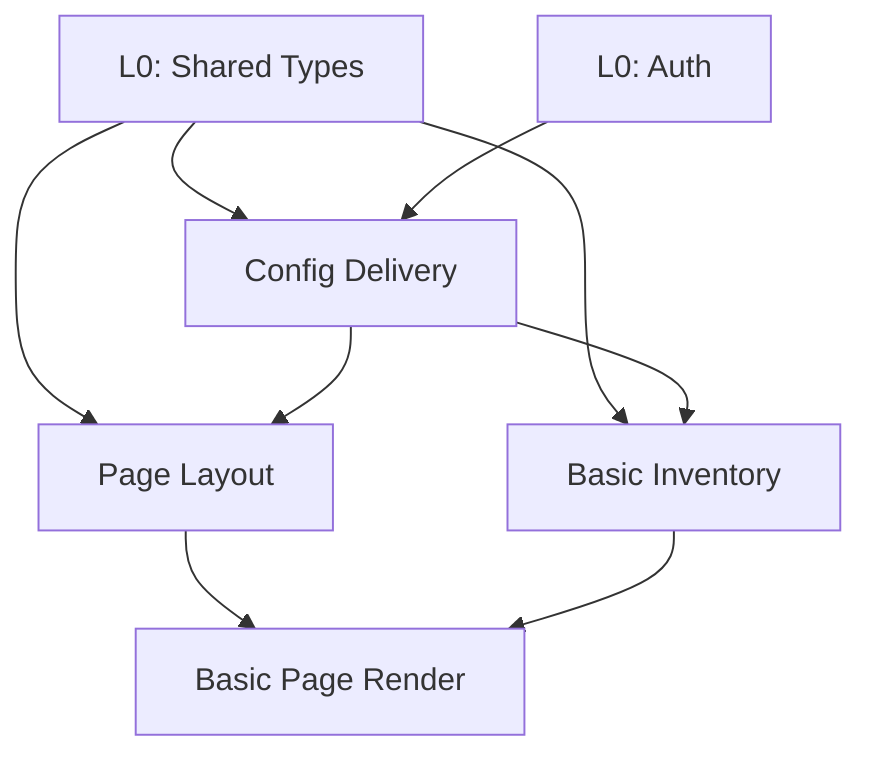
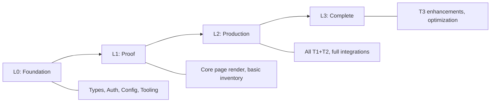

# Functionality Tiering — Phase 4 & 5 Operation

**Purpose:** Triage capabilities into implementation tiers, then assemble into layered build plan.
**Called from:** SKILL.md Phase 4 (tiering) and Phase 5 (layering)
**Output:** `pain-registry.md`, `functionality-tiers.md`, `implementation-layers.md`

---

## Overview

This operation takes the cross-system analysis (capability map, integration contracts, data architecture) and produces the actionable output: what to build, in what order, and why. It combines two analytical steps:

1. **Tiering** (Phase 4): Classify each capability as T1/T2/T3/PRUNE
2. **Layering** (Phase 5): Assemble tiered capabilities into implementation layers L0-L3

---

## Part 1: Pain Registry (Phase 4)

### Sources

Pain points come from three sources:

| Source | What | Examples |
|--------|------|---------|
| System profiles | Per-system pain (from Phase 2) | Tech debt, known bugs, performance issues |
| Cross-system analysis | Integration boundary pain (from Phase 3) | Data conflicts, missing error handling, tight coupling |
| Developer input | Human knowledge (Guided/Interactive mode) | "The worst part is...", "We always have to work around..." |

### Pain Point Classification

For each pain point:

```markdown
### PAIN-{NNN}: {Short Title}

- **Systems affected:** {list of systems}
- **Category:** {Per-System | Integration Boundary | Cross-Cutting}
- **Severity:** {Critical | Major | Minor}
  - Critical = blocks production use or causes data loss
  - Major = significantly degrades experience or productivity
  - Minor = annoyance, cosmetic, or rare occurrence
- **Description:** {what's wrong}
- **Evidence:** {where this was observed — code, config, developer input}
- **Current workaround:** {how people deal with it today}
- **Impact:** {who/what is affected and how often}
- **Innovation opportunity:** {how the new platform could solve this elegantly}
```

### Severity Criteria

| Severity | Criteria | Action |
|----------|----------|--------|
| **Critical** | Data loss, security risk, blocks core flows, no workaround | Must address in T1 |
| **Major** | Significant UX degradation, developer productivity killer, fragile workaround | Should address in T1-T2 |
| **Minor** | Cosmetic, rare, or has acceptable workaround | Address in T2-T3 or PRUNE |

### Pain Registry Format

```markdown
# Pain Registry

## Summary
- **Total pain points:** {N}
- **Critical:** {N} | **Major:** {N} | **Minor:** {N}
- **Per-system:** {N} | **Integration boundary:** {N} | **Cross-cutting:** {N}

## Critical Pain Points

### PAIN-001: Org ID type mismatch between Course Service and Auth Service
- **Systems affected:** Course Service, Auth Service, Student Portal
- **Category:** Integration Boundary
- **Severity:** Critical
- **Description:** Course Service uses string org IDs, Auth Service uses numeric. Student Portal has adapter logic that sometimes fails on edge cases.
- **Evidence:** `data-architecture.md` conflict analysis, Student Portal adapter code at `src/adapters/org-id.ts`
- **Current workaround:** Student Portal converts at runtime with try/catch
- **Impact:** ~0.1% of course page renders fail silently with wrong org data
- **Innovation opportunity:** Single canonical ID type in new platform, validated at ingestion

## Major Pain Points
...

## Minor Pain Points
...
```

---

## Part 2: Functionality Tiering (Phase 4)

### Tier Definitions

| Tier | Name | Criteria | Guidance |
|------|------|----------|----------|
| **T1** | Must Have Day 1 | Core functionality with no viable workaround. Blocks all other tiers. Users cannot use the platform without this. | Course browsing, org settings, basic lesson display, auth |
| **T2** | Needed for Production | Required for real users to adopt. Can launch internally without, but not to customers. | Advanced search, analytics, progress tracking, full billing |
| **T3** | Enhancement | Improves experience but not blocking. Can defer indefinitely. | A/B testing, advanced caching, admin power tools, reporting |
| **PRUNE** | Remove | Deprecated, unused, or superseded by new platform capabilities. Actively should NOT be rebuilt. | Legacy workarounds, dead code paths, obsolete integrations |

### Auto-Assignment Heuristics

When running in YOLO or Guided mode, auto-assign tiers using these heuristics:

**T1 indicators:**
- Capability is on the critical path for page render or core user flow
- 3+ systems depend on this capability (high fan-in from dependency matrix)
- No fallback behavior exists in current systems (failure = hard failure)
- Addresses a Critical pain point

**T2 indicators:**
- Capability is needed for production-quality experience but has workarounds
- 1-2 systems depend on this capability
- Fallback behavior exists (degraded but not broken)
- Addresses Major pain points

**T3 indicators:**
- Capability enhances experience but isn't required
- Only one system uses this capability
- Current implementation works "well enough"
- Addresses Minor pain points or no pain points

**PRUNE indicators:**
- Capability has no active consumers (dead code analysis)
- Capability is a workaround for a problem the new platform solves differently
- Capability is deprecated in current systems (marked deprecated, commented out, unused routes)
- Capability is superseded by a T1/T2 capability in the new platform

### Tiering Process

1. **List all capabilities** from the capability map
2. **Apply auto-assignment heuristics** to each
3. **Cross-reference pain registry** — Critical pain → T1, Major → T1-T2, Minor → T2-T3
4. **Check dependency chain** — if a T2 capability depends only on T1 capabilities, it could move to T2. If a T1 depends on another T1, note the ordering constraint.
5. **In Guided mode:** Present uncertain assignments for user review

### Guided Mode Questions

Present auto-assigned tiers with confidence levels, then ask about low-confidence items:

```
I've auto-assigned tiers to {N} capabilities. Here are the {M} I'm least confident about:

1. [Advanced Search] — Assigned T2, but it touches 3 systems.
   Is this needed for day 1, or can users survive with basic search?

2. [Org Branding Display] — Assigned T1, but only Student Portal uses it.
   Is this truly day-1 critical, or could it wait for T2?

3. [Legacy Report Export] — Assigned PRUNE, but I see active usage.
   Is this actually used, or can we safely drop it?
```

### Functionality Tiers Format

```markdown
# Functionality Tiers

## Summary
| Tier | Count | Coverage |
|------|-------|----------|
| T1 (Must Have Day 1) | {N} |  |
| T3 (Enhancement) | {N} |  |

## T1: Must Have Day 1

| Capability | Systems | Rationale | Dependencies | Pain Points Addressed |
|------------|---------|-----------|-------------|----------------------|
| Course page layout | Student Portal, Course Service | Core render flow, no fallback | Course data delivery | PAIN-003, PAIN-007 |
| Org settings delivery | Course Service | All systems depend on this | None (foundation) | PAIN-001 |
| Basic progress display | Analytics Service, Course Service | Primary student dashboard function | Org settings | PAIN-012 |

## T2: Needed for Production
...

## T3: Enhancement
...

## PRUNE: Remove

| Capability | Systems | Rationale |
|------------|---------|-----------|
| Legacy XML export | Student Portal | Replaced by JSON API in new platform |
| Flash video player | Student Portal | Technology deprecated, no modern equivalent |
```

---

## Part 3: Implementation Layers (Phase 5)

### Layer Definitions

| Layer | Name | Purpose | Contents |
|-------|------|---------|----------|
| **L0** | Foundation | Shared infrastructure that everything depends on | Type system, config service, auth, shared models, API contracts, dev tooling |
| **L1** | Proof | Minimum viable integration — proves the architecture works end-to-end | T1 capabilities for 1-2 key flows, touching all critical systems |
| **L2** | Production | Full T1 + T2 — ready for real users | All must-have + production-required capabilities |
| **L3** | Complete | T3 enhancements + optimization | Enhancement capabilities, performance, admin tools, analytics |

### Layer Assembly Process

1. **Start with L0** — identify capabilities that are prerequisites for everything else:
   - Shared type definitions and API contracts
   - Authentication and authorization infrastructure
   - Course service (delivers curriculum data to all consumers)
   - Core data models (organization, course, enrollment as shared types)
   - Development tooling (build, test, deploy pipeline)

2. **Build L1** — select the minimum T1 capabilities to prove end-to-end:
   - Pick 1-2 key user flows (e.g., "render a basic course page")
   - Include only the T1 capabilities needed for those flows
   - Touch all critical-path systems (proves integration works)
   - This layer should be demonstrable — "look, it works end-to-end"

3. **Build L2** — add remaining T1 and all T2:
   - All remaining T1 capabilities not in L1
   - All T2 capabilities
   - Resolve any data migration needs
   - This layer is "production ready"

4. **Build L3** — add T3 enhancements:
   - All T3 capabilities
   - Performance optimization
   - Admin tooling
   - Analytics and reporting
   - This layer is "feature complete"

### Dependency Analysis Within Layers

For each layer, build a dependency graph:

```markdown
### L1 Dependencies


```

### Coverage Tracking

For each layer, calculate:

```markdown
### Layer Coverage

| Layer | Capabilities | % of Total | % of T1 | Systems Activated |
|-------|-------------|-----------|---------|-------------------|
| L0 | 5 (foundation) | 12% | 0% | All (shared infra) |
| L1 | 8 (core T1) | 20% | 60% | Course Svc, Student Portal, Analytics Svc |
| L2 | 22 (all T1 + T2) | 55% | 100% | All |
| L3 | 40 (all) | 100% | 100% | All |
```

### Critical Path Identification

The critical path is the longest dependency chain through the layers:

```markdown
### Critical Path

1. **L0: Shared Type Definitions** (Week 1-2)
   → Blocks everything. Must be designed carefully.

2. **L0: Course Service MVP** (Week 2-4)
   → Blocks all curriculum-dependent capabilities. High fan-in.

3. **L1: Course Service Integration** (Week 4-6)
   → First real system integration. Proves the approach.

4. **L1: Basic Course Page Render** (Week 6-8)
   → End-to-end proof. Touches Student Portal + Course Service + content delivery.

5. **L2: Full Payment Integration** (Week 8-12)
   → Most complex integration. Highest risk.

**Pinch points:**
- Course Service (blocks 80% of L1 and L2)
- Course Data Integration (blocks all course page rendering)
- Shared Types (blocks everything — get this right first)
```

### Implementation Layers Format

```markdown
# Implementation Layers

## Overview



## L0: Foundation
**Goal:** Shared infrastructure that everything depends on.
**Coverage:** {N} capabilities ({%} of total)
**Systems activated:** All (shared infrastructure)
**Estimated effort:** {weeks}

### Capabilities
| Capability | Type | Rationale |
|------------|------|-----------|
| Shared type definitions | Infrastructure | All systems need shared types |
| Auth service | Infrastructure | All API calls need auth |
| Course service MVP | T1 (partial) | Delivers curriculum data to all consumers |

### Dependencies
{Mermaid diagram showing L0 internal dependencies}

### Deliverable
{What can be demonstrated when L0 is complete}

## L1: Proof
...

## L2: Production
...

## L3: Complete
...

## Dependency Matrix

{Full dependency matrix showing which L1 items depend on which L0 items, etc.}

## Critical Path

{Identified critical path with timeline estimates and pinch points}

## PRUNE List

{Capabilities intentionally NOT included in any layer, with rationale}
| Capability | Systems | Reason for Pruning |
|------------|---------|-------------------|
| Legacy XML export | Student Portal | Replaced by JSON API |
```

---

## Guided Mode: Tiering Review Questions

In Guided mode, present the auto-assigned tiers and ask 5-10 targeted questions:

### Question Categories

1. **Boundary cases** (T1 vs T2):
   - "Is {capability} needed for day 1, or can it wait for production release?"
   - "Can users get by with a simplified version of {capability} in L1?"

2. **PRUNE validation**:
   - "I flagged {capability} for pruning because {reason}. Is this safe to drop?"
   - "{Capability} appears unused — confirm it's not needed?"

3. **Pain priority**:
   - "Which of these pain points is most critical to address first?"
   - "Is {workaround} acceptable for the L1 timeframe?"

4. **Data ownership**:
   - "Both {System A} and {System B} store {entity}. Which is authoritative?"
   - "Should the new platform create a canonical {entity} or keep both?"

5. **Layer scope**:
   - "For L1 proof, which user flow best demonstrates the platform works?"
   - "How many systems should L1 integrate? All critical, or minimal viable?"

---

## Quality Checklist

### Pain Registry
- [ ] All pain points from system profiles collected
- [ ] Integration boundary pain points identified from cross-system analysis
- [ ] Each pain point has severity, evidence, workaround, and innovation opportunity
- [ ] Pain points cross-referenced with capabilities and tiers

### Functionality Tiers
- [ ] Every capability from the capability map is assigned a tier
- [ ] T1 capabilities are truly day-1 critical (no "nice to haves" snuck in)
- [ ] PRUNE items have clear rationale (not just "seems unused")
- [ ] Dependencies between tiers are identified
- [ ] In Guided mode: uncertain assignments reviewed with user

### Implementation Layers
- [ ] L0 contains only shared infrastructure (not business logic)
- [ ] L1 proves end-to-end integration (not just one system)
- [ ] L2 achieves 100% T1 coverage
- [ ] L3 achieves 100% total coverage (minus PRUNE)
- [ ] Dependency matrix shows no circular dependencies between layers
- [ ] Critical path identified with pinch points
- [ ] Coverage percentages calculated per layer
- [ ] Each layer has a clear deliverable ("what can be demonstrated")
