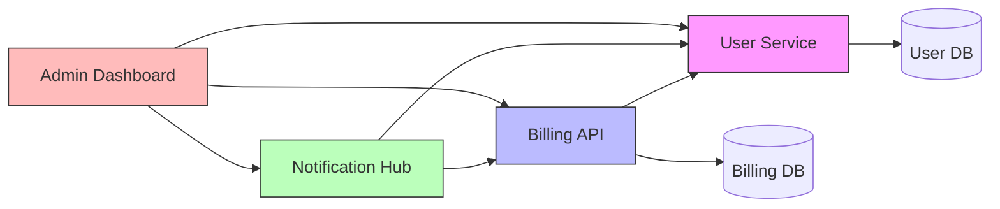

# Reimagine

**Take specs from multiple repos. Reimagine them as something new.**

**Estimated Time:** 30-60 minutes (depending on repo count and depth)
**Prerequisites:** Batch processing completed on 2+ repos, OR manually prepared reverse-engineering docs from multiple repos
**Output:** Capability map, reimagined vision, new specifications (Spec Kit or BMAD format)

---

## When to Use This Skill

Use this skill when:
- You've batch-processed multiple related repos with StackShift
- You want to consolidate or redesign multiple services/apps
- You're planning a major platform modernization
- You want to explore how existing capabilities could work together differently
- You have reverse-engineering docs from several codebases and want a fresh perspective

**Trigger Phrases:**
- "Reimagine these services as a unified platform"
- "How could these apps work together better?"
- "Consolidate these microservices"
- "Design a new system from these existing capabilities"
- "Synthesize a new vision from multiple repos"

---

## What This Skill Does

```
   Multiple Repos              Capability Map              New Vision
   ┌─────────┐                                            ┌─────────────┐
   │ Repo A   │──┐            ┌──────────────┐            │ Reimagined  │
   │ 11 docs  │  │            │ Auth: A, C   │            │ System      │
   ├─────────┤  ├──Extract──→│ Payments: B  │──Brainstorm→│             │
   │ Repo B   │  │            │ Users: A, B  │   with     │ New specs   │
   │ 11 docs  │  │            │ Reporting: C │   user     │ New arch    │
   ├─────────┤  │            │ Overlap: 40% │            │ New epics   │
   │ Repo C   │──┘            └──────────────┘            └─────────────┘
   │ 11 docs  │
   └─────────┘
```

1. **Loads** reverse-engineering docs from multiple repos
2. **Extracts** a unified capability map (what each repo does)
3. **Identifies** duplication, overlap, inconsistency, and gaps
4. **Brainstorms** with you to reimagine the system
5. **Generates** new specifications for the reimagined system

---

## Process

### Step 1: Locate Repo Documentation

**Option A: From Batch Results**
```bash
# Point to batch results directory
BATCH_DIR="~/git/stackshift-batch-results"
# OR
BATCH_DIR="~/git/my-monorepo"

# Find all repos with reverse-engineering docs
find "$BATCH_DIR" -type d -name "reverse-engineering" -path "*/docs/*"
```

**Option B: Manual Repo List**

Ask the user to provide paths to repos or their reverse-engineering docs:
```
Which repos should I analyze?

Provide paths to repos or their docs/reverse-engineering/ directories:
1. ~/git/user-service
2. ~/git/billing-api
3. ~/git/notification-hub
4. ~/git/admin-dashboard
...
```

**Option C: From Active Directory**

If in a monorepo, scan for subdirectories with reverse-engineering docs:
```bash
# Find all services in current monorepo
for dir in */; do
  if [ -d "$dir/docs/reverse-engineering" ]; then
    echo "Found: $dir"
  fi
done
```

**Validate:** Each repo should have at minimum:
- `functional-specification.md` (required)
- `integration-points.md` (required)
- `data-architecture.md` (required)
- Additional docs improve analysis quality

### Step 2: Load and Parse All Docs

For each repo, read the key documents using parallel Task agents:

**Per-repo extraction targets:**
- From `functional-specification.md`: All FRs, user stories, personas, business rules
- From `integration-points.md`: External services, APIs consumed/exposed, data flows
- From `data-architecture.md`: Data models, API contracts, domain boundaries
- From `business-context.md`: Product vision, personas, business goals (if available)
- From `decision-rationale.md`: Tech stack, ADRs, design principles (if available)
- From `technical-debt-analysis.md`: Pain points, migration priorities (if available)
- From `configuration-reference.md`: Shared config patterns (if available)
- From `operations-guide.md`: Deployment model, infrastructure (if available)

**Parallel processing:** Use Task agents to read docs from multiple repos concurrently.

### Step 3: Generate Capability Map

Synthesize all extracted information into a unified capability map:

#### 3.1 Business Capability Inventory

Group all functional requirements across repos by business domain:

```
Business Capability Map
═══════════════════════

Authentication & Identity
  ├── user-service: User registration, login, password reset, OAuth
  ├── admin-dashboard: Admin login, role management, SSO
  └── billing-api: API key authentication, webhook signatures
  Overlap: 3 separate auth implementations

Payment & Billing
  ├── billing-api: Stripe integration, invoicing, subscription management
  └── user-service: Basic payment method storage
  Overlap: Payment data in 2 services

Notifications
  ├── notification-hub: Email, SMS, push notifications
  ├── user-service: Welcome emails, password reset emails
  └── billing-api: Invoice emails, payment receipts
  Overlap: 3 services send emails independently

Data & Reporting
  ├── admin-dashboard: Usage reports, user analytics
  └── billing-api: Revenue reports, churn metrics
  Overlap: Separate analytics in 2 services

User Management
  ├── user-service: CRUD, profiles, preferences
  └── admin-dashboard: User search, impersonation, bulk operations
  Overlap: User data accessed from 2 services
```

#### 3.2 Technical Overlap Analysis

Identify where repos duplicate functionality:

```
Technical Overlap Analysis
══════════════════════════

Shared Data Models:
  User model: user-service (primary), admin-dashboard (read), billing-api (ref)
  → 3 different representations of the same entity

Duplicated Logic:
  Email sending: user-service (SendGrid), notification-hub (SendGrid), billing-api (SES)
  → 3 separate email implementations, 2 different providers

Inconsistent APIs:
  user-service: REST with camelCase
  billing-api: REST with snake_case
  notification-hub: GraphQL
  → 3 different API styles

Shared Dependencies:
  PostgreSQL: user-service, billing-api (separate databases)
  Redis: user-service (sessions), notification-hub (queue)
  → Could consolidate or keep separate based on domain boundaries
```

#### 3.3 Pain Points & Opportunities

Extract from technical debt analyses across repos:

```
Cross-Repo Pain Points
══════════════════════

1. Authentication Fragmentation (3 repos affected)
   Each service implements its own auth. No SSO. Inconsistent session handling.

2. Data Consistency Issues (2 repos affected)
   User data modified in user-service but admin-dashboard has stale cache.

3. Notification Sprawl (3 repos affected)
   Three services send emails independently. No unified template system.
   Users sometimes get duplicate notifications.

4. No Shared API Standards (all repos)
   Different naming conventions, error formats, pagination styles.

5. Operational Complexity (all repos)
   Each service deployed independently with different CI/CD pipelines.
   No shared observability. Debugging cross-service issues is painful.
```

#### 3.4 Dependency Graph

Show how repos depend on each other:



### Step 4: Present Capability Map to User

Display the capability map and ask for the user's reaction:

```
I've analyzed [N] repositories and extracted the capability map above.

Key findings:
- [X] distinct business capabilities identified
- [Y]% functional overlap between services
- [Z] pain points spanning multiple repos
- [W] different tech stacks in use

What would you like to explore?

A) Consolidation — Merge overlapping services into fewer, better ones
B) Platform — Build a unified platform that replaces all services
C) Evolution — Keep services but fix pain points and standardize
D) Hybrid — Some consolidation + some new capabilities
E) Free-form — Let's discuss what makes sense
```

### Step 5: Brainstorming Session

This is the collaborative, creative phase. Based on the user's direction:

#### Consolidation Path
- Propose which services to merge and which to keep separate
- Show data model unification strategy
- Identify shared infrastructure opportunities
- Estimate effort vs. benefit for each consolidation

#### Platform Path
- Propose a unified domain model spanning all capabilities
- Design new service boundaries based on business domains (not existing code)
- Identify the core platform vs. optional modules
- Show how current capabilities map to new architecture

#### Evolution Path
- Propose shared libraries and standards
- Design API gateway for consistent external interface
- Plan shared auth, notification, and observability services
- Keep existing services but connect them better

#### Free-form Path
- Open discussion guided by capability map
- Ask probing questions: "What if auth was a shared service?"
- Explore non-obvious combinations: "What if billing + notifications were one service?"
- Challenge assumptions: "Do you need 3 separate databases?"

**Throughout brainstorming:**
- Reference specific capabilities from the map
- Quantify overlap and duplication
- Propose concrete architectural patterns
- Draw Mermaid diagrams for proposed architectures
- Keep the user engaged with questions and options

### Step 6: Define the Reimagined Vision

Once the brainstorming converges on a direction, formalize it:

```
Reimagined Vision
═════════════════

Name: [New System Name]
Vision: [One-sentence description]

Architecture Style: [Monolith / Microservices / Modular Monolith / ...]

New Service Boundaries:
1. [Service A] — combines capabilities from [repo1, repo2]
2. [Service B] — new service for [capability]
3. [Service C] — evolved from [repo3]

Unified Data Model:
- [Entity 1] — single source of truth (replaces 3 separate models)
- [Entity 2] — new entity for [purpose]

Eliminated Duplication:
- Auth: Single shared auth service (saves ~X hours/month)
- Email: Unified notification service (eliminates 3 implementations)
- API: Consistent REST standards across all services

New Capabilities:
- [Capability that emerges from combining repos]
- [Capability enabled by shared infrastructure]

Migration Strategy:
- Phase 1: Shared infrastructure (auth, notifications, API gateway)
- Phase 2: Data model unification
- Phase 3: Service consolidation
- Phase 4: New capabilities
```

### Step 7: Generate New Specifications

Based on the reimagined vision, generate specifications in the user's preferred format:

**Ask:** "Generate specs in Spec Kit or BMAD format?"

#### Spec Kit Output
- Create `.specify/` structure for the reimagined system
- Generate constitution with new principles and tech stack
- Create feature specs for each service/module
- Include migration specs (from current → new)

#### BMAD Output
- Generate `prd.md` for the reimagined system
- Generate `architecture.md` with new service boundaries
- Generate `epics.md` with migration + new capability epics
- Generate `ux-design-specification.md` if applicable

#### Both
- Generate both formats (Spec Kit for implementation, BMAD for planning)

**Output location:**

```
reimagined-system/
├── VISION.md                           # The reimagined vision document
├── CAPABILITY_MAP.md                   # Full capability map from all repos
├── docs/
│   └── reverse-engineering/            # Synthesized from all repos
│       ├── functional-specification.md # Unified functional spec
│       ├── integration-points.md       # New integration architecture
│       ├── data-architecture.md        # Unified data model
│       ├── business-context.md         # Combined business context
│       └── decision-rationale.md       # New architectural decisions
├── .specify/                           # If Spec Kit format chosen
│   └── memory/
│       ├── constitution.md
│       └── specifications/
│           ├── 001-shared-auth/
│           ├── 002-unified-notifications/
│           └── ...
└── _bmad-output/                       # If BMAD format chosen
    └── planning-artifacts/
        ├── prd.md
        ├── architecture.md
        └── epics.md
```

---

## Example: Enterprise Microservices Consolidation

```
Input: 12 microservices from batch processing

Capability Map reveals:
- 4 services handle user data (fragmented)
- 3 services send notifications (duplicated)
- 2 services implement payment logic (inconsistent)
- Authentication is reimplemented 5 times
- 12 separate CI/CD pipelines
- 4 different API styles

Brainstorming converges on:
- Modular monolith replacing 12 microservices
- 5 modules: Identity, Commerce, Communication, Analytics, Admin
- Shared PostgreSQL with schema-per-module
- Single deployment pipeline
- Unified API gateway with consistent REST

Output:
- VISION.md: "Unified Commerce Platform"
- CAPABILITY_MAP.md: Full analysis
- 5 feature specs (one per module)
- Architecture doc with ADRs explaining consolidation decisions
- Migration plan: 4 phases over 6 months
```

---

## Example: Startup App Reimagination

```
Input: 3 related tools (CRM, email marketing, analytics)

Capability Map reveals:
- All 3 tools share customer data
- Email tool duplicates CRM contact management
- Analytics pulls from both CRM and email
- No unified customer journey view

Brainstorming converges on:
- Single "Customer Intelligence Platform"
- Core: Unified customer profile + event stream
- Modules: Outreach (email+), Insights (analytics+), Relationships (CRM+)
- New capability: AI-powered customer journey prediction (emerges from combining data)

Output:
- New PRD for "Customer Intelligence Platform"
- Architecture: Event-sourced, with unified customer event stream
- 4 epics: Core Platform, Outreach Module, Insights Module, Relationships Module
```

---

## Integration with Other Skills

### With Batch Processing (`/stackshift.batch`)
- Run batch first to generate reverse-engineering docs for all repos
- Reimagine reads the batch results
- Natural workflow: batch → reimagine → architect → implement

### With Architecture Generator (`/stackshift.architect`)
- After reimagining, use `/stackshift.architect` with user constraints
- Architecture Generator creates detailed architecture for the new vision
- Constraint questions informed by the capability map

### With BMAD Synthesize (`/stackshift.bmad-synthesize`)
- Reimagine can generate initial BMAD artifacts
- Then hand off to BMAD Synthesize for refinement
- Or hand off to full BMAD for collaborative refinement

---

## Success Criteria

- ✅ All repo docs loaded and parsed
- ✅ Capability map generated with business domains identified
- ✅ Overlap analysis shows duplication percentage and specifics
- ✅ Pain points extracted from cross-repo technical debt
- ✅ Dependency graph visualized (Mermaid)
- ✅ Brainstorming session produces a clear direction
- ✅ Reimagined vision document generated
- ✅ New specifications generated in chosen format
- ✅ Migration path from current → reimagined state included

---

## Technical Notes

- Use parallel Task agents to read docs from multiple repos simultaneously
- For large batches (10+ repos), process capability extraction in batches of 5
- Mermaid diagrams may need to be simplified for 10+ service dependency graphs
- Domain clustering for capability grouping: analyze FR titles, data models, and integration points for common themes
- The brainstorming session should be genuinely interactive — don't just present a predetermined answer
- Migration phases should be ordered by: risk (low first), value (high first), dependency (prerequisites first)
- If batch results include AST analysis, use function-level data for more precise overlap detection
